# my-calc-project

 

### 본 문서는 현재 작업 진행 중인 초안입니다.

### 목차에 포함된 항목만 정리되었으며, 내용은 지속적으로 추가 및 보완될 예정입니다. 특히 게임 관련 용어의 경우, 가독성을 위해 별도의 설명 없이 사용되었습니다.

### 프로젝트의 완전한 이해를 돕기 위한 상세한 게임 시스템 및 용어 설명은 추후 보충될 예정이니, 이 점 참고하여 주시기 바랍니다.

### 본 문서는 깃허브 기준으로 제작된 문서 입니다. 웹 사이트 형식과 일치하지 않아 오류가 있습니다. 빠른 시일 내로 수정하겠습니다.

 

## 목차

[1. 기획 의도](#planning-intention) 
[2. 시제품 개발 전 시행착오](#trial-and-error-before-prototype-developmen) 
[3. 아키텍처 개선 과정](#architectural-improvement-process) 
4.&nbsp;시제품 
&emsp;[4-1. 시제품 제작](#prototype-development) 
&emsp;[4-2. 시제품 데이터 구조](#prototype-data-structure) 
&emsp;[4-3. 시제품 결과](#prototype-result) 
[5. 프로젝트 방향성](#project-direction) 
[6. 패치 분석 보고서(25.08.21)](#patch-analysis-report-25.08.21) 
알파 프로젝트 제작 추가 예정 
알파 프로젝트 데이터 구조 추가 예정 
게임 시스템 설명 추가 예정 
참고 자료 추가 예정 

   

<h2 id="planning-intention">1. 기획 의도</h2>

- 환산주스탯(=효율분석 사이트)의 특징 
  1.&nbsp;보편적 가이드라인. 
  &emsp;- 상위권 유저의 전투 데이터를 기반으로 제작한 헥사 코어 강화 순서를 제공하여 초보자에게 보편적 가이드라인을 제시합니다. 
  2.&nbsp;사용자의 강화 효율과 불일치. 
  &emsp;- 사용자의 전투 방식이 제공된 가이드라인과 다른 경우, 실제 강화 효율에 큰 차이가 발생할 수 있습니다. 
  3.&nbsp;개인별 최적화의 부재. 
  &emsp;- 개인별 '스킬 쿨타임 감소'나 '특수 스킬 반지' 같은 변수를 반영하지 못합니다. 
  4.&nbsp;고정된 강화 순서 제공. 
  &emsp;- 헥사 코어 레벨에 따라 달라지는 강화 효율을 고려하지 않고 고정된 강화 순서 및 강화 효율만을 제공합니다. 

위의 환산주스탯의 문제점을 개선하기 위해 개인별 분석 도구를 제작하였습니다. 

- 개인별 분석 도구의 특징 
  1.&nbsp;개인별 최적화. 
  &emsp;- 이 도구는 사용자에게 데이터를 직접 받아 가장 효율적인 강화 순서를 제공합니다. 

   

<h2 id="trial-and-error-before-prototype-development">2. 시제품 개발 전 시행착오</h2>

시행착오 기간: 25.07.02 ~ 25.08.13 
 
"환산주스탯에서 제공하는 헥사코어의 100억당 최종데미지 상승율 수치는 어떻게 제공될까?"라는 생각으로 시제품 개발 전에 해보았던 시행착오입니다. 
 
가설 1.&nbsp;제가 가지고 있는 스킬 %데미지 상승율을 활용하여 엑셀 시트를 만들었습니다. 
강화 효율 측정은 가장 단순한 코어 구성을 가진 렌의 '선참VI' 코어를 기준으로 삼아 진행했습니다.

분석 및 결론: 코어별 최대 레벨이 30레벨. 레벨별 간극이 최대 30% 벌어지므로, 이에 대해 '보정 상수가 존재하나?'라고 판단했습니다. 
 
가설 1-1.&nbsp;기존 엑셀 시트에 보정 상수(1레벨당 0.01% 감소)를 추가해 보았습니다.

분석 및 결론: 보정 상수를 넣어도 간극이 생기므로, "보정 상수를 제외하고, 스킬 %데미지에만 연관이 있나?"라고 가설을 세웠습니다. 
 
가설 2.&nbsp;'점유율(변동하지 않음) * 스킬 %데미지 상승율'을 활용하여 최종데미지 상승율을 산출해보았습니다.

분석 및 결론: 점유율이 고정되어도 간극이 생기므로, "스킬 %데미지 상승율은 또한 1레벨에서 2레벨로 상승 시의 상승율로 고정인가?"라고 가설을 세웠습니다. 
 
가설 3.&nbsp;'점유율(변동하지 않음) *스킬 %데미지 상승율(변동하지 않음)'을 활용하여 최종데미지 상승율을 산출해보았습니다.

분석 및 결론: 간극이 더 크게 벌어지므로, "코어별 강화 순서가 다르면 효율이 달라지나?" 라는 새로운 가설을 세웠습니다. 
 
가설 4.&nbsp;스킬 2가지를 번갈아 강화했을 때, 강화 효율이 어떻게 변화하는지 확인했습니다.

분석 및 결론: "강화 순서가 다르면, 강화 효율이 다르다."라는 결론에 도달했습니다. 
 
하지만, 메이플스토리에 코어들이 추가되면서 하나의 코어를 연속적으로 강화하는 것보다 다른 코어도 강화하는 것이 효율이 좋게 되어 검증에 난항을 겪게 되고, '선참VI'처럼 측정에 있어 단순한 코어를 찾기 또한 어려워 한동안 효율분석을 중지하였습니다. 
 
아래 이미지의 빨간색 영역은 렌의 '선참VI' 코어입니다. 하나의 코어가 연속적으로 강화하였을 때 효율적인 구조가 아님을 확인하실 수 있습니다.

> "어센트 스킬이 없었을 당시에 '선참VI' 코어를 5레벨에서 8레벨까지 연속적으로 강화하였을 때 효율적이지 않았냐?"라고 하실 수 있겠지만, 이 4레벨 구간만으로 전체 코어 강화 로직을 일반화하기 어렵다고 판단했습니다. 
 
25.07.17, 메이플스토리에 어센트 스킬이 추가되었습니다. 오리진 스킬 1회 사용 기준으로 효율을 측정하였을 때 2레벨에서 9레벨까지 연속적으로 강화하였을 때 효율적인 구조임을 확인하였고, 위 가설에 추가 테스트를 진행해 보았습니다. 
 
아래 이미지의 빨간색 영역은 렌의 어센트 스킬인 '창룡파천검 : 일매낙화 천비인적' 코어입니다. 하나의 코어가 연속적으로 강화하였을 때 효율적인 구조임을 확인하실 수 있습니다.

가설 5.&nbsp;어센트 스킬을 기준으로 가설 1을 추가 테스트하였습니다.

분석 및 결론: 계산 과정에서 발생한 '-0.044% ~ 0.081%'의 오차는 환산주스탯의 소수점 처리 방식의 차이라는 결론에 도달하였습니다. 

   

<h2 id="architectural-improvement-process">3. 아키텍처 개선 과정</h2>

### 아키텍처 1
- 설명
  - 강화 효율 측정에 필요한 모든 데이터(현재 레벨 기준 스킬 %데미지, 다음 레벨 기준 스킬 %데미지, 스킬 1회당 공격횟수, 측정된 공격횟수 등)를 입력받아 다음 스킬 강화를 추천하는 아키텍처.
- 이점 
  1.&nbsp;외부 요인에 영향받지 않는 분석 가능. 
  &emsp;- 밸런스 패치와 관계없이 효율 계산이 가능합니다.
- 문제점 
  1.&nbsp;많은 수동 입력. 
  &emsp;- 모든 스킬 정보를 직접 입력해야 하는 높은 입력 난이도가 존재합니다. 
  &emsp;- 특히 스킬별 1회당 공격횟수 같은 세부 정보를 모두 기억하기 어려워 잘못된 정보 기입 시 잘못된 효율이 측정되는 경우가 발생합니다.

### 아키텍처 2
- 설명
  - 스킬 정보는 데이터베이스에 저장되어 있으며, 사용자에게 필수 데이터(코어별 레벨, 해당 스킬 점유율, 재화 시세)만을 입력받아 다음 스킬 강화를 추천하는 아키텍처.
- 이점 
  1.&nbsp;낮은 수동 입력. 
  &emsp;- 모든 스킬 정보를 직접 입력해야 하는 기존과는 달리, 사용자에게 필수적인 데이터만을 요구합니다.
- 문제점 
  1.&nbsp;개발자의 관리 부담이 많음. 
  &emsp;- 밸런스 패치 마다 모든 스킬의 수치를 일일이 수정해야 하는 번거로움이 있습니다. 
  2.&nbsp;데이터의 부정확성. 
  &emsp;- 개발자가 업데이트를 늦추거나 누락하면, 사용자들은 구 버전의 데이터를 기반으로 잘못된 효율을 계산하게 됩니다.
- 아키텍처를 변경한 이유
  - 많은 수동 입력은 다수의 사용자들의 진입장벽이 될 것이기 때문에, 이를 개선하고자 데이터베이스에 스킬 정보를 저장하는 아키텍처로 변경하였습니다.

### 아키텍처 3-1
- 설명
  - 넥슨에서 제공하는 API(이하 넥슨 API)를 활용하여, 사용자에게 필수 데이터(코어별 레벨, 해당 스킬 점유율, 재화 시세)만을 입력받아 다음 스킬 강화를 추천하는 아키텍처.
- 이점 
  1.&nbsp;낮은 수동 입력. 
  &emsp;- 모든 스킬 정보를 직접 입력해야 하는 기존과는 달리, 사용자에게 필수적인 정보만을 요구합니다. 
  2.&nbsp;개발자의 관리 부담이 적어짐. 
  &emsp;- 넥슨 API에 모든 스킬 정보가 기재되어 있어, 개발자가 일일이 업데이트해야 하는 관리 부담이 줄어듭니다. 
  3.&nbsp;데이터의 신뢰성 확보. 
  &emsp;- 넥슨 API를 활용함으로써, 데이터의 신뢰성을 확보하고 분석 결과의 정확성을 높였습니다. 
  4.&nbsp;데이터베이스 관리 비용 절감. 
  &emsp;- 게임 데이터를 직접 관리하는 대신 넥슨 API를 활용함으로써, 데이터베이스에 직업별 스킬 정보를 저장할 필요가 없어 데이터베이스 관리 비용을 절감했습니다.
- 문제점 
  1.&nbsp;배포 및 접근성의 한계. 
  &emsp;- 현재 구상 중인 사용방식은 python 응용 프로그램에 넥슨 API를 사용하는 방식입니다. 
  &emsp;- 사용자는 python 실행 파일을 직접 설치해야 하고, 응용 프로그램 업데이트 시마다 매번 다운로드해야 하는 번거로움이 있어 접근성이 낮다는 한계가 있습니다.
- 아키텍처를 변경한 이유
  - '아키텍처 2'를 통해 사용자의 입력 부담은 해결했지만, 밸런스 패치마다 모든 스킬 정보를 수동으로 업데이트해야하는 비효율적인 문제가 남아있었습니다. 이는 도구의 신뢰성을 떨어뜨릴 수 있다고 판단했습니다. 따라서 직접 데이터를 관리하는 대신, 넥슨 API를 통해 최신 정보를 효율적으로 수집하고 관리 부담을 해결하고자 이 아키텍처를 구상했습니다.

### 아키텍처 3-2
- 설명
  - 스킬 정보를 표기 및 수정하는 웹 사이트를 구축하여, 사용자에게 필수 데이터(코어별 레벨, 해당 스킬 점유율, 재화 시세)만을 입력받아 다음 스킬 강화를 추천하는 아키텍처.
- 이점 
  1.&nbsp;낮은 수동 입력. 
  &emsp;- 모든 스킬 정보를 직접 입력해야 하는 기존과는 달리, 사용자에게 필수적인 정보만을 요구합니다. 
  2.&nbsp;배포 및 접근성이 용이함. 
  &emsp;- 웹 사이트로 제공되는 방식은 사용자가 직접 다운로드하고 설치해야 하는 방식에 비해 접근성이 높습니다. 
  3.&nbsp;높은 가시성. 
  &emsp;- 글로 제작된 python 응용 프로그램에 비해 웹 사이트에 이미지(스킬 이미지, 강화 효율표)를 넣어 가시성을 높힐 수 있습니다. 
  4.&nbsp;스킬 정보 변경 가능. 
  &emsp;- 밸런스 패치 때 수치적 변경만 있다면, 사용자가 직접 변경하여 효율을 측정할 수 있습니다.
- 문제점 
  1.&nbsp;개발자의 관리 부담이 많음. 
  &emsp;- 밸런스 패치마다 모든 스킬의 수치를 일일이 수정해야 하는 번거로움이 있습니다. 
  2.&nbsp;데이터의 부정확성. 
  &emsp;- 개발자가 업데이트를 늦추거나 누락하면, 사용자들은 구 버전의 데이터를 기반으로 잘못된 효율을 계산하게 됩니다. 
  3.&nbsp;데이터베이스 관리 비용 상승. 
  &emsp;- 모든 스킬 정보를 저장해야하므로 데이터베이스 관리 비용이 상승합니다.
- 아키텍처를 변경한 이유
  - 넥슨 API에서 모든 스킬 정보를 주는지 명확하지 않아, 웹사이트를 제작하여 사용자가 스킬 정보를 수정할 수 있는 아키텍처를 구상했습니다.

   

## 4. 시제품
<h2 id="prototype-development">4-1. 시제품 제작</h2>

### 테스트용 데이터는 최신화 됩니다. 각각의 제품 / 프로젝트의 기준 날짜를 확인해 주시길 바랍니다.

### 제작 기한
  - 예상 기간: 영업일 기준 8.5일. 
    (5일 + 4 * 8일 + 14일) / 6 = 8.5일.
  - 시작일: 25.08.14.
  - 기한일: 25.08.26.
  - 완성일: 25.09.05.(영업일 기준 16일)

### 본 프로젝트의 완성일은 개발자가 그 당시 보고서가 완성되었다고 판단한 시점으로 작성되었습니다. 완성일 이후에 보고서 내용의 일관성을 위하여 일부 내용 추가 및 수정되었습니다.

### 기능 요구사항

  
- 전제조건 
  1.&nbsp;테스트용 데이터는 25.08.14 기준 개발자의 코어 강화 상태와 점유율임. 
  2.&nbsp;기본 스킬의 %데미지는 '쓸만한 컴뱃 오더스'가 사용 중인 상태를 기준으로 작성함. 
  3.&nbsp;'어비스 차지드라이브 스펠VI'는 스킬 레벨에 따라 '대상에게 적중 시 보스 공격 시 데미지 증가'의 효과가 증가하지만, 시제품에선 스킬 %데미지만의 효율을 측정하기 때문에 제외하고 측정함. 
  4.&nbsp;분석의 범위를 명확히 설정하기 위해서 '다가오는 죽음'은 '인피니티 스펠' 사용 시에만 발생하는 경우를 기준으로 강화 효율을 측정함. 
  5.&nbsp;마스터리 코어 효율 계산에 영향을 미치는 '강화 코어의 인피니티 스펠 사용 시 다가오는 죽음 %p 상승'은 19레벨 기준으로 계산함. 
  
>&emsp;'쓸만한 컴뱃 오더스'는 '일부 스킬만' 최대 레벨이 30레벨에서 31레벨로 상승하는 버프 스킬임. 
>&emsp;'인피니티 스펠'은 50초간 '다가오는 죽음'이 3개 추가로 생성함. 이 스킬은 강화 코어의 효과를 받아 '다가오는 죽음'의 데미지를 133%p 추가로 상승하는 버프 스킬임.

- 입력되는 데이터 
  1.&nbsp;마스터리 코어별 현재 레벨. 
  2.&nbsp;스킬별 점유율.

- 출력되어야할 데이터 
  1.&nbsp;코어 종류. 
  2.&nbsp;코어 추천 레벨. 
  3.&nbsp;최종데미지 상승율. 
  4.&nbsp;100억당 최종데미지 상승율.

### 구현 요구사항

- 데이터 구조
  - 외부 데이터(불변)
    - 기본(4차 이하 및 하이퍼) 스킬(딕셔너리)
      - 스킬 이름(딕셔너리)
        - 최대 레벨 기준 %데미지(변수)
    - 마스터리 코어1(딕셔너리)
      - 스킬 이름(딕셔너리)
        - 30레벨 기준 %데미지(변수)
        - 1레벨 상승 시 %데미지 상승량(%p)(변수)
    - 마스터리 코어2(딕셔너리)
      - 스킬 이름(딕셔너리)
        - 30레벨 기준 %데미지(변수)
        - 1레벨 상승 시 %데미지 상승량(%p)(변수)
    - 마스터리 코어3(딕셔너리)
      - 스킬 이름(딕셔너리)
        - 30레벨 기준 %데미지(변수)
        - 1레벨 상승 시 %데미지 상승량(%p)(변수)
    - 마스터리 코어4(딕셔너리)
      - 스킬 이름(딕셔너리)
        - 30레벨 기준 %데미지(변수)
        - 1레벨 상승 시 %데미지 상승량(%p)(변수)
    - 마스터리 코어 1~30레벨 재화 소모량(리스트)
    - 마스터리 코어 리스트 = [마스터리 코어1, 마스터리 코어2, 마스터리 코어3, 마스터리 코어4]

  - 내부 데이터(사용자 캐릭터 정보, 변동)
    - 마스터리 코어1(딕셔너리)
      - 현재 레벨(변수)
      - 데미지 상승율(딕셔너리)
        - 1레벨 상승 시 최종데미지 상승율(변수)
        - 1레벨 상승 시 100억당 최종데미지 상승율(변수)
        - 5레벨 상승 시 평균 최종데미지 상승율(변수)
        - 5레벨 상승 시 100억당 평균 최종데미지 증가율(변수)
      - 스킬(딕셔너리)
        - 스킬 이름(딕셔너리)
          - 현재 레벨 기준 %데미지(변수)
          - 1레벨 상승 시 %데미지 상승량(%p)(변수)
          - 점유율(변수)
    - 마스터리 코어2(딕셔너리)
      - 현재 레벨(변수)
      - 데미지 상승율(딕셔너리)
        - 1레벨 상승 시 최종데미지 상승율(변수)
        - 1레벨 상승 시 100억당 최종데미지 상승율(변수)
        - 5레벨 상승 시 평균 최종데미지 상승율(변수)
        - 5레벨 상승 시 100억당 평균 최종데미지 증가율(변수)
      - 스킬(딕셔너리)
        - 스킬 이름(딕셔너리)
          - 현재 레벨 기준 %데미지(변수)
          - 1레벨 상승 시 %데미지 상승량(%p)(변수)
          - 점유율(변수)
    - 마스터리 코어3(딕셔너리)
      - 현재 레벨(변수)
      - 데미지 상승율(딕셔너리)
        - 1레벨 상승 시 최종데미지 상승율(변수)
        - 1레벨 상승 시 100억당 최종데미지 상승율(변수)
        - 5레벨 상승 시 평균 최종데미지 상승율(변수)
        - 5레벨 상승 시 100억당 평균 최종데미지 증가율(변수)
      - 스킬(딕셔너리)
        - 스킬 이름(딕셔너리)
          - 현재 레벨 기준 %데미지(변수)
          - 1레벨 상승 시 %데미지 상승량(%p)(변수)
          - 점유율(변수)
    - 마스터리 코어4(딕셔너리)
      - 현재 레벨(변수)
      - 데미지 상승율(딕셔너리)
        - 1레벨 상승 시 최종데미지 상승율(변수)
        - 1레벨 상승 시 100억당 최종데미지 상승율(변수)
        - 5레벨 상승 시 평균 최종데미지 상승율(변수)
        - 5레벨 상승 시 100억당 평균 최종데미지 증가율(변수)
      - 스킬(딕셔너리)
        - 스킬 이름(딕셔너리)
          - 현재 레벨 기준 %데미지(변수)
          - 1레벨 상승 시 %데미지 상승량(%p)(변수)
          - 점유율(변수)
    - 마스터리 코어 리스트 = [마스터리 코어1, 마스터리 코어2, 마스터리 코어3, 마스터리 코어4]  
    
     >&emsp;주의 사항1: 기본 스킬의 스킬 이름의 하위 항목에 30레벨 기준 %데미지라고 작성하지 않은 이유는 '쓸만한 컴뱃 오더스'를 사용 시 '일부 스킬만' 최대 레벨인 30레벨에서 31레벨로 상승하기 때문에 최대 레벨이라고 작성함. 
     >&emsp;주의 사항2: 5레벨 상승 시 측정하는 이유는 특정 구간에서 효율이 급격하게 감소했다가 효율이 다시 올라가는 구조이기 때문에 구간별 소모 재화량(평균) 중 가장 좋은 효율을 기준으로 평균을 내어 작성함.

    스킬 레벨별 재화 소모량
    | 스킬 레벨 | 재화 소모량 |
    |:---:|:---:|
    | 8 -> 9 | 33 |
    | 9 -> 10 | 100 |
    | 10 -> 11 | 40 |
    | 11 -> 12 | 45 |
    | 12 -> 13 | 50 |
    | 13 -> 14 | 55 |
    | 14 -> 15 | 60 |

    구간별 재화 소모량(평균)
    | 스킬 레벨 | 재화 소모량 |
    |:---:|:---:|
    | 9 -> 13 | 총합 235 평균 58.75 |
    | 9 -> 14 | 총합 290 평균 58.00 |
    | 9 -> 15 | 총합 350 평균 58.33 |

- 메인 함수 
  1.&nbsp;사용자로부터 입력받는 함수 실행. 
  2.&nbsp;현재 레벨 기준 스킬 %데미지 조정하는 함수 실행. 
  3.&nbsp;강화효율 산출하는 함수 실행. 
  4.&nbsp;강화 추천하는 함수 실행. 
  5.&nbsp;결과 출력하는 함수 실행. + if not 리턴값: break 
  6.&nbsp;점유율 재조정하는 함수 실행. 
  7.&nbsp;데미지 업데이트하는 함수 실행. 
  8.&nbsp;위의 3~7를 반복. 

- 정의할 함수 종류
  - 사용자로부터 입력받는 함수.
    - 매개변수
      - 마스터리 코어 리스트(리스트)
    - 처리과정
      - 사용자로부터 마스터리 코어별 현재 레벨, 스킬별 점유율을 입력받음.
      - 입력받은 데이터가 정상적인 데이터인지 확인함.
      - 검증된 데이터를 마스터리 코어 리스트(리스트)에 저장함. 
    - 처리사항
      - 마스터리 코어별 현재 레벨이 int 형식이 아니라면, 다시 입력.
        - try: except Value Error:를 활용.
      - 마스터리 코어별 현재 레벨이 0이하 또는 31이상이라면, 다시 입력.
      - 스킬별 점유율이 int 형식 또는 float 형식이 아니라면, 다시 입력.
        - try: except Value Error:를 활용.
      - 스킬별 점유율이 0미만이라면, 다시 입력.
      - 스킬별 점유율 합산이 100초과하면, 다시 입력.
    - 리턴값
      - 마스터리 코어 리스트(리스트)
  
  - 현재 레벨 기준 스킬 %데미지 조정하는 함수.
    - 매개변수
      - 마스터리 코어 리스트(리스트)
    - 처리과정
      - 마스터리 코어별 딕셔너리 중 중복된 스킬이 있다면, 현재 레벨 기준 스킬 %데미지, 점유율을 조정함.
      - 조정된 현재 레벨 기준 스킬 %데미지, 점유율을 마스터리 코어 리스트(리스트)에 저장함.
      >&emsp;ex) 마스터리 코어2인 차지드라이브 변형 인스팅트 아츠 VI의 패시브 효과: 돌아오는 증오 VI 2%p 상승 효과와 마스터리 코어3인 돌아오는 증오 VI: 7%p 상승 효과가 서로에게 직접적으로 영향을 미침. 
      >&emsp;마스터리 코어2인 차지드라이브 변형 인스팅트 아츠 VI의 패시브 효과: 돌아오는 증오 VI의 현재 레벨 기준 스킬 %데미지 = 마스터리 코어3인 차지드라이브 변형 인스팅트 아츠 VI의 패시브 효과 + 강화스킬2인 돌아오는 증오 VI 
      >&emsp;마스터리 코어3인 돌아오는 증오 VI의 현재 레벨 기준 스킬 %데미지 = 마스터리 코어2인 차지드라이브 변형 인스팅트 아츠 VI의 패시브 효과: 돌아오는 증오 VI + 마스터리 코어3인 돌아오는 증오 VI
    - 처리사항
      - 두 딕셔너리 내에 중복된 키가 있는지, keys() + 교집합을 이용하여 중복된 키를 추출함.
    - 리턴값
      - 마스터리 코어 리스트(리스트)
  
  - 강화효율 산출하는 함수.
    - 매개변수
      - 마스터리 코어 리스트(리스트)
    - 설명
      - 마스터리 코어별/스킬별 최종데미지 상승율을 산출하는 과정.
    - 처리과정
      - 재화 시세, 마스터리 코어 1~30레벨 재화 소모량, 마스터리 코어 리스트(리스트)를 이용하여, 재화 효율, 스킬 최종데미지 상승율을 산출함. 
      - 1레벨 상승 시 최종데미지 상승율, 1레벨 상승 시 100억당 최종데미지 상승율, 5레벨 상승 시 평균 최종데미지 상승율, 5레벨 상승 시 100억당 평균 최종데미지 상승율을 산출함.
      - 모든 최종데미지 상승율은 마스터리 코어 리스트(리스트)에 저장함.
    - 처리사항
      - 재화 시세는 성능 향상을 위해 550만 대신 550을 사용함.
      - 재화 소모량 = 마스터리 코어 1~30레벨 재화 소모량[마스터리 코어[현재 레벨]]
      - 평균 재화 소모량은 (마스터리 코어 1~30레벨 재화 소모량에서 '현재 레벨' 부터 '현재 레벨 + 4'까지를 합산된 수치) / 5임.
      - 재화 효율은 성능 향상을 위해 100억 대신 100만을 사용함.
      - (평균)재화 효율 = 100만 / (재화 시세 * (평균)재화 소모량)
      - 스킬 데미지 상승율 = 1레벨 상승 시 %데미지 상승량(%p) / 현재 레벨 기준 %데미지
      - 평균 스킬 데미지 상승율은 (이 마스터리 코어를 5레벨 연속으로 강화했을 경우, 스킬 데미지 상승율이 합산된 수치) / 5 임.
      - (평균)최종데미지 상승율 = (평균)점유율 * (평균)스킬 데미지 상승율
      - 100억당 (평균)최종데미지 상승율 = (평균)재화 효율 * 점유율 * (평균)스킬 데미지 상승율
    - 리턴값
      - 마스터리 코어 리스트(리스트)
     
  - 강화 추천하는 함수.
    - 매개변수
      - 마스터리 코어 리스트(리스트) 
    - 처리과정
      - 마스터리 코어별로 1레벨 상승 시 100억당 최종데미지 상승율, 5레벨 상승 시 100억당 평균 최종데미지 상승율을 한 리스트에 담음.
      - 그 리스트에서 인덱스와 최댓값으로 가장 효율 좋은 마스터리 코어 번호 및 강화 횟수를 유추함.
    - 처리사항
      - 가장 효율 좋은 마스터리 코어 번호 = 최댓값 인덱스 // 2 + 1
      - 최댓값이 0이면, 0, 0을 리턴함.
        - 모든 스킬이 최대 레벨을 달성함.
      - 최댓값 인덱스 % 2가 0이면, 가장 효율 좋은 마스터리 코어 번호, 1을 리턴함.
        - 최댓값 인덱스는 0, 2, 4, 6이므로 1레벨 상승 시 100억당 최종데미지 상승율 관련 데이터가 존재함.
      - 아니라면, 가장 효율 좋은 마스터리 코어 번호, 5를 리턴함.
        - 최댓값 인덱스는 1, 3, 5, 7이므로 5레벨 상승 시 100억당 평균 최종데미지 상승율 관련 데이터가 존재함.
    - 리턴값
      - 가장 효율 좋은 마스터리 코어 번호, 강화 횟수
      
  - 결과를 출력하는 함수.
    - 매개변수
      - 마스터리 코어 번호, 강화 횟수.
    - 처리과정
      - 강화할 스킬이 있다면, 스킬 이름 및 추천 레벨 및 최종데미지 상승율을 출력함.
    - 처리사항
      - 강화 횟수가 0이라면, False를 리턴함.
        - 모든 스킬이 최대 레벨을 달성함.
      - 아니라면, True를 리턴함.
    - 리턴값
      - bool형
        
  - 점유율 조정하는 함수.
    - 매개변수
      - 마스터리 코어 리스트(리스트), 마스터리 코어 번호, 강화 횟수
    - 처리과정
      - 가장 효율 좋은 마스터리 코어 번호 및 강화 횟수를 활용하여 마스터리 코어 스킬의 현재 레벨, 점유율, 현재 레벨 기준 스킬 %데미지를 상승시킴.
      - 나머지 마스터리 코어의 점유율을 상승된 최종데미지에 비례하여 낮춤.
    - 처리사항
      - 가장 효율 좋은 마스터리 코어라면, 새로운 점유율을 '점유율 * (1 + 데미지 상승율)/ (1 + 점유율 * 데미지 상승율 / 100)'로 처리함.
        - 데미지 상승율 = 데미지 상승량(%p) / 현재 레벨 기준 스킬 %데미지
      - 나머지 마스터리 코어라면, 새로운 점유율을 '현재 점유율 / (1 + 합산된 점유율 상승량 / 100)'로 처리함.
        - 점유율 상승량 = 새로운 점유율 - 기존 점유율
    - 리턴값
      - 마스터리 코어 리스트(리스트)

  - 데미지 갱신하는 함수.
    - 매개변수
      - 마스터리 코어 리스트(리스트)
    - 처리과정
      - 서로 다른 마스터리 코어이면서 동일한 스킬의 현재 레벨 기준 %데미지가 다르다면, 높은 쪽의 점유율을 기준으로 현재 레벨 기준 스킬 %데미지와 점유율을 갱신함.
      >&emsp;ex) 마스터리 코어2인 차지드라이브 변형 인스팅트 아츠 VI의 패시브 효과: 돌아오는 증오 VI 2%p 상승 효과와 마스터리 코어3인 돌아오는 증오 VI: 7%p 상승 효과가 서로에게 직접적으로 영향을 미침. 
      >&emsp;마스터리 코어2인 차지드라이브 변형 인스팅트 아츠 VI의 패시브 효과: 돌아오는 증오 VI의 현재 레벨 기준 스킬 %데미지 = 마스터리 코어3인 차지드라이브 변형 인스팅트 아츠 VI의 패시브 효과 + 강화스킬2인 돌아오는 증오 VI  
      >&emsp;마스터리 코어3인 돌아오는 증오 VI의 현재 레벨 기준 스킬 %데미지 = 마스터리 코어2인 차지드라이브 변형 인스팅트 아츠 VI의 패시브 효과: 돌아오는 증오 VI + 마스터리 코어3인 돌아오는 증오 VI
    - 처리사항
      - 두 딕셔너리 내에 키가 중복인 키가 있는지 set()함수 + 교집합을 이용하여 확인함.
    - 리턴값
      - 마스터리 코어 리스트(리스트)

   

<h2 id="prototype-data-structure">4-2. 시제품 데이터 구조</h2>

### 스킬 1회당 공격횟수를 포함한 "총합 %데미지"입니다. 데이터 구조 확인에 참고 바랍니다.
### 자세한 설명은 기능 요구사항 문서의 전제조건을 참조 바랍니다.
[>> 전제조건 항목으로 이동](#prerequisites)

기본(4차 이하 및 하이퍼) 스킬
| 스킬 이름 | %데미지 |
|:---:|:---:|
| 플레인 차지드라이브 | 1839 |
| 플레인 스펠 | 373 |
| 스칼렛 차지드라이브 | 2118 |
| 스칼렛 스펠 | 1105 |
| 거스트 차지드라이브 | 2418 |
| 거스트 스펠 | 924 |
| 어비스 차지드라이브 | 3850 |
| 어비스 스펠 | 144 |
| 지워지지 않는 상처 | 2958 |
| 채워지지 않는 굶주림 | 3451 |
| 걷잡을 수 없는 혼돈 | 5316 |
| 멈출 수 없는 충동 | 2190 |
| 멈출 수 없는 본능 | 2778 |
| 돌아오는 증오 | 2898 |
| 황홀한 구속 | 36340 |
| 끝없는 고통 | 41400 |
| 끝나지 않는 악몽 | 2658 |
| 끝나지 않는 흉몽 | 2688 |
| 다가오는 죽음 | 906 + 266 |

> 다가오는 죽음에 추가된 '266'은 강화 코어인 인피니티 스펠의 효과로 인한 상승 수치입니다.

마스터리 코어1 스킬
| 스킬 이름 | 최대 %데미지 | %데미지 상승량(%p)|
|:---:|:---:|:---:|
| 플레인 차지드라이브VI | 3615 | 42 |
| 플레인 스펠VI | 1610 | 20 |
| 스칼렛 차지드라이브VI | 4530 | 54 |
| 스칼렛 스펠VI | 2375 | 30 |
| 거스트 차지드라이브VI | 5250 | 66 |
| 거스트 스펠VI | 1980 | 24 |
| 어비스 차지드라이브VI | 7894 | 102 |
| 어비스 스펠VI | 302 | 4 |
| 깨어난 심연(신규 패시브) | 4380 | 48 |

마스터리 코어2 스킬
| 스킬 이름 | 최대 %데미지 | %데미지 상승량(%p)|
|:---:|:---:|:---:|
| 지워지지 않는 상처VI | 8040 | 102 |
| 채워지지 않는 굶주림VI | 9268 | 112 |
| 걷잡을 수 없는 혼돈VI | 14220 | 168 |
| 멈출 수 없는 충동(패시브) | 2450 | 55 |
| 멈출 수 없는 본능(패시브) | 2940 | 66 |
| 돌아오는 증오VI(패시브) | 480 | 16 |

마스터리 코어3 스킬
| 스킬 이름 | 최대 %데미지 | %데미지 상승량(%p)|
|:---:|:---:|:---:|
| 돌아오는 증오VI | 8320 | 96 |
| 황홀한 구속VI | 82200 | 920 |
| 끝없는 고통VI | 66330 | 630 |

마스터리 코어4 스킬
| 스킬 이름 | 최대 %데미지 | %데미지 상승량(%p)|
|:---:|:---:|:---:|
| 잊혀지지 않는 악몽VI | 6685 | 84 |
| 잊혀지지 않는 흉몽VI | 797 | 84 |
| 다가오는 죽음 | 120 | 4 |

마스터리 코어 레벨별 재화 소모량
| 다음 레벨 | 재화 소모량 | 다음 레벨 | 재화 소모량 | 다음 레벨 | 재화 소모량 |
|:---:|:---:|:---:|:---:|:---:|:---:|
| 1 | 50 | 11 | 40 | 21 | 85 |
| 2 | 15 | 12 | 45 | 22 | 90 |
| 3 | 18 | 13 | 50 | 23 | 95 |
| 4 | 20 | 14 | 55 | 24 | 100 |
| 5 | 23 | 15 | 60 | 25 | 105 |
| 6 | 25 | 16 | 65 | 26 | 110 |
| 7 | 28 | 17 | 70 | 27 | 115 |
| 8 | 30 | 18 | 75 | 28 | 120 |
| 9 | 33 | 19 | 80 | 29 | 125 |
| 10 | 100 | 20 | 175 | 30 | 250 |

[>> 테스트 결과 모두 보기](#test_model_img) 

테스트용 데이터의 현재 마스터리 코어별 레벨
| 마스터리 코어 번호 | 1 | 2 | 3 | 4 |
|:---:|:---:|:---:|:---:|:---:|
| 현재 레벨 | 19 | 9 | 9 | 9 |

테스트용 데이터의 마스터리 코어1 점유율
| 스킬 이름 | 스킬별 점유율 |
|:---:|:---:|
| 플레인 차지드라이브VI | 3.84 |
| 플레인 스펠VI | 1.63 |
| 스칼렛 차지드라이브VI | 0.54 |
| 스칼렛 스펠VI | 0.27 |
| 거스트 차지드라이브VI | 0.89 |
| 거스트 스펠VI | 0.32 |
| 어비스 차지드라이브VI | 0.89 |
| 어비스 스펠VI | 0.35 |
| 깨어난 심연(신규 패시브) | 11.51 |

테스트용 데이터의 마스터리 코어2 점유율
| 스킬 이름 | 스킬별 점유율 |
|:---:|:---:|
| 지워지지 않는 상처VI | 1.61 |
| 채워지지 않는 굶주림VI | 1.93 |
| 걷잡을 수 없는 혼돈VI | 1.99 |
| 멈출 수 없는 충동(패시브) | 0.61 |
| 멈출 수 없는 본능(패시브) | 1.51 |
| 돌아오는 증오VI(패시브) | 12.14 |

테스트용 데이터의 마스터리 코어3 점유율
| 스킬 이름 | 스킬별 점유율 |
|:---:|:---:|
| 돌아오는 증오VI | 12.14 |
| 황홀한 구속VI | 2.32 |
| 끝없는 고통VI | 2.0 |

테스트용 데이터의 마스터리 코어4 점유율
| 스킬 이름 | 스킬별 점유율 |
|:---:|:---:|
| 잊혀지지 않는 악몽VI | 0.96 |
| 잊혀지지 않는 흉몽VI | 8.42 |
| 다가오는 죽음 | 27.1 |

   

<h2 id="prototype-result">4-3. 시제품 결과</h2>

1. 프로젝트 이름: 아크 마스터리 코어 효율 시뮬레이션(시제품 프로젝트).
2. 개발 목표: 아크 직업의 마스터리 코어 효율을 정밀하게 분석하여 최적의 스킬 강화 순서를 도출합니다.
3. 주요 기능: 현재 스킬 레벨과 점유율을 바탕으로 강화 효율을 측정하여, 어떤 코어를 강화하는 것이 가장 효율적인지 추천합니다.
4. 전제조건: 기능 요구사항 문서를 참조 바랍니다. [>> 전제조건 항목으로 이동](#prerequisites)
5. 사용한 언어: python.
6. 프로그램 구조: test_model_main.py은 메인 스크립트이며, 사용자가 입력한 데이터를 토대로 스킬 정보를 담고 있습니다. test_model.py은 데이터 처리 로직을 모듈화한 스크립트 및 아크 직업 스킬 정보를 담고 있습니다.
7. 핵심 로직 및 공식: 구현 요구사항 문서를 참조 바랍니다. [>> 핵심 로직 및 공식 항목으로 이동](#logic)
8. 시제품 사용 방법: 
   1.&nbsp;프로그램 실행을 위해 python 환경이 필요합니다. 
   2.&nbsp;시제품을 다운로드합니다. [>> 시제품 다운로드 하기](https://github.com/jji1442/my-calc-project/releases/download/ver.1.0/test_model.zip) 
   3.&nbsp;test_model_main을 실행합니다. 
     - 테스트용 데이터 사용 시: test_model_main 스크립트 내에 아래와 같이 수정하면 데이터를 입력하지 않아도 개발자의 테스트용 데이터가 자동으로 입력됩니다.
     >&emsp;mastery_core_list = test_model.input_data(mastery_core_list)  ->  #mastery_core_list = test_model.input_data(mastery_core_list) 
     >&emsp;#mastery_core_list = test_model.test_data(mastery_core_list)  ->  mastery_core_list = test_model.test_data(mastery_core_list)  
     >&emsp;주의사항: test_data(mastery_core_list) 함수에는 데이터 검증 기능이 없습니다.
     >                테스트용 데이터에 비정상적인 데이터 종류 또는 값을 넣을 경우, 정확하지 않은 효율 측정 또는 오류를 일으킬 수 있으니 데이터를 변경하시는 경우 이 점을 주의해 주시기 바랍니다.
9. 시제품 이미지: 
&emsp;아래의 시제품 이미지는 사용자가 데이터를 입력하는 과정을 보여줍니다. 첫 사진의 파란색 영역을 보시면, 입력 형식이 다르거나 원하는 범위를 벗어난 값을 입력하면 재입력을 요구하도록 설정하여 프로그램의 안정성을 높였습니다. 그 아래 빨간색 영역은 특정 구간에서 5레벨 상승 시 코어 효율이 크게 증가한다는 것을 나타냅니다. 마지막 사진의 초록색 영역은 각 코어의 현재 레벨부터 최대 레벨까지의 모든 효율을 측정하여 최종 결과를 도출한 것을 보여줍니다.

10. 시제품 제작 후기: 
&emsp;문서화 과정과 코드 최적화에 총 16일이 소요되었고, 그중 약 13일을 문서화에 할애했습니다. 저는 이 문서화 작업을 단순한 기록이 아닌 설명서라 생각하고, 다른 개발자가 프로젝트를 한눈에 이해할 수 있도록 만드는 데 집중했습니다. 

   

<h2 id="project-direction">5. 프로젝트 방향성</h2>

- 알파 버전: 기반 확장 - '합리적인 부분 내에서' 모든 스킬을 자동으로 강화 추천.
- 알파 버전: 기능 확장 - 다양한 기능 추가.
  - 개인 pc 내에 데이터 저장하는 기능.
  - 개발자가 코어를 추천해주는 기능.
  - 스킬별 상세보기 기능.
  - 원하는 스킬 강화 수준 까지 최종데미지 상승율 및 재화 소모량을 측정해주는 기능 등.
- 베타 버전: 정밀 분석 - '논리적인 부분 내에서' 모든 스킬의 효율을 재검토 및 기능 추가.
  - 간편 모드(합리적인 부분) / 상세 모드(논리적인 부분) 기능.
- 릴리즈 버전: 공식 출시 - 웹 사이트 및 데이터베이스를 이용하여 스크립트 재구축함. 웹 사이트용 이미지 추가.

> 합리적인 부분과 논리적인 부분의 차이. 
> 스킬A: 40초 동안 공격력 483 증가(쿨타임 120초) 
> 합리적인 부분: '가동율'을 기준으로 계산함. -> 공격력 * 지속 시간 / 쿨타임 = 483 * 40 / 120 = 161 
> 논리적인 부분: '시간적 딜 지분율'을 기준으로 계산함.(스킬A 가동 중 전체 딜량의 75%를 차지) 
> -> 공격력 * 가동시간 동안 전제 딜량 중 차지하는 비율 = 483 * 0.75 = 362.25

   

<h2 id="patch-analysis-report-25.08.21">6. 패치 분석 보고서(25.08.21)</h2>

1. 보고서 작성 기간 
   25.09.09 ~ 25.09.18.
2. 패치 내용 
   게임사에서 전투 경험 개선(임시 방편) 목적으로 아크에게 '링 익스체인지' 스킬과 '최종데미지 6% 증가' 패시브를 추가하였습니다.
3. 분석 보고서 
  <b><<보고서 간단 설명>></b> 
  &emsp;'링 익스체인지'로 인한 코어 강화 효율 변화를 보려고 합니다. 
  &emsp;'최종데미지 6% 증가' 패시브의 경우 모든 스킬에 동일하게 적용되는 상시로 증가하는 효과이므로, 스킬 간의 상대적인 효율을 측정하는 데에는 영향이 없습니다. 
  &emsp;- 25.09.13 기준으로 잊혀지지 않는 악몽VI/잊혀지지 않는 흉몽VI/다가오는 죽음의 코어가 기존 9레벨에서 19레벨로 변경되었습니다. 
  <b><<테스트 종류>></b> 
  &emsp;1. 허수아비형 보스 기준 링 익스체인지 '없이' 6분 주기 
  &emsp;2. 허수아비형 보스 기준 링 익스체인지 '있이' 6분 주기 
  <b><<테스트 전제 조건>></b> 

  &emsp;1. 직업별 가장 강력한 스킬인 오리진 스킬(쿨타임 6분)이 기준으로 측정. 
  &emsp;2. 6분 주기 측정에 적합하지 않은 스킬인 '스파이더 인 미러', '크레스트 오브 더 솔라'(쿨타임 4분) 미사용. 
  &emsp;3. 허수아비형 보스에선 효용 가치가 없는 '일리움 링크' 제외. 
  &emsp;4. 서버렉으로 인하여 데미지 편차가 심한 '일격필살' 제외. 
  &emsp;5. 확률형 버프인 '컨택트 카라반' 제외. 
  &emsp;6. 실전성 없으며, 돌아오는 증오VI의 징표 생성량 편차가 심한 '끝없는 고통VI' 스킬 미사용. 
  &emsp;7. 메르세데스 유니온 효과(200레벨과 250레벨의 평균값)를 적용하여 오리진 스킬(360초)의 실제 쿨타임은 340.2초. 
  &emsp;&emsp;- 대부분의 유저들이 메르세데스 200레벨 유니온 효과(5%)를 가지고 있지만, 250레벨 유니온 효과(6%)는 비교적 소수의 유저들이 사용하므로 평균값(5.5%)으로 측정. 
  &emsp;&emsp;- 스킬 쿨타임 감소 효과를 지닌 모자는 유효가 아닌 직업군도 존재하고, 사용하는 직업군들 조차도 사용하지 않거나 쿨타임 감소 수치가 다른 아이템을 사용하기 때문에 평균을 내기 어려움. 
  &emsp;8. 특수한 경우가 아닌 보편적인 경우를 기준으로 측정. 
  &emsp;&emsp;- ex) 개발자의 아크는 스킬 쿨타임 2초 감소인 모자를 착용 중. 
  &emsp;&emsp;- 340.2초 기준으로 측정 시, 4회차 쿨타임 2분인 버프 및 스킬을 8초 가량 사용할 수 있으니 쿨타임 2분인 스킬은 3회로 제한. 
  &emsp;9. 어센트 스킬은 시간 내에 가장 데미지 손해가 적은 구간에서 1회 사용. 
  &emsp;10. 개발자가 사용하는 실제 도핑. 필드는 어센틱 포스 요구치 1. 보스는 레벨 250, 방어율 380%, 체력 무한, 대형, 반감 기준으로 측정. 
  &emsp;11. 총 3회 측정하고, 평균값 낸 수치를 작성. 
  &emsp;12. 자석펫 착용하여 측정함. 
  <b><<테스트 결과>></b> (평균값 기준 1% 내외)
  
| 전투 횟수 | 링 익스체인지 미사용 | 링 익스체인지 사용 |
|:---:|:---:|:---:|
| 1 | 291조 8943억 | 298조 3490억 |
| 2 | 290조 7569억 | 298조 3167억 |
| 3 | 294조 7781억 | 298조 7237억 |
| 4 | 294조 7847억 | 297조 9079억 |
| 5 | 292조 5329억 | - |
| 평균 | 292조 9493억 | 298조 3243억 |
    
  &emsp;&emsp;- 링 익스체인지 미사용의 측정된 값 중 평균적인 범위에서 벗어나는 데이터가 확인되어, 총 2번의 추가 측정을 통해 데이터의 일관성을 확보했습니다. 
  &emsp;&emsp;- 추가적으로 링 익스체인지 사용으로 1번의 추가 측정을 통해 기존 데이터 무결성을 확인하였습니다. [>> 테스트 결과 모두 보기](#unused_and_used_ring_exchange_img) 
  
  &emsp;링 익스체인지 사용으로 인한 데미지 상승량은 "1.83%"이며, 이로 인한 아크의 일부 스킬별 점유율 변화는 다음과 같습니다. 
  
  &emsp;1. 링 익스체인지에 영향이 미치는 스킬들 - 다가오는 죽음, 깨어난 심연, 돌아오는 증오VI, 잊혀지지 않는 흉몽VI. 
  &emsp;2. 링 익스체인지에 영향이 미치지 않는 스킬들 - 영원히 굶주리는 짐승, 근원의 기억, 끝없는 고통VI, 플레인 차지드라이브VI. 
  
 | 스킬 이름 | 링 익스체인지 미사용(평균) | 링 익스체인지 사용(평균) | 비교 |
 |:---:|:---:|:---:|:---:|
 | 다가오는 죽음 | 27.13% | 27.14% | 100.03% |
 | 깨어난 심연 | 11.08% | 11.03% | 99.50% |
 | 돌아오는 증오VI | 11.73% | 12.09% | 103.09% |
 | 잊혀지지 않는 흉몽VI | 9.81% | 9.87% | 100.61% |
 | 영원히 굶주리는 짐승 | 4.49% | 4.39% | 97.66% |
 | 근원의 기억 | 1.87% | 1.84% | 98.53% |
 | 끝없는 고통VI | 1.92% | 1.89% | 98.31% |
 | 플레인 차지드라이브VI | 3.54% | 3.39% | 95.76% |
  
  &emsp;이를 통해, 높은 스킬 %데미지를 가진 '돌아오는 증오VI'는 링 익스체인지의 시너지로 인해 유일하게 유의미한 딜 점유율 상승을 보였습니다.  
  &emsp;반면, 링 익스체인지에 영향이 미치지 않는 스킬들(근원의 기억, 끝없는 고통VI 등)은 전체 딜량이 늘어남에 따라 상대적으로 점유율이 감소하는 결과를 보였습니다. 
    
  &emsp;이 중 주목할 점은 아크의 핵심 스킬인 '잊혀지지 않는 흉몽VI'는 점유율에 큰 변화가 없었으나, 또 다른 핵심 스킬인 '플레인 차지드라이브VI'는 딜 점유율이 감소했다는 점입니다. 
  &emsp;이 점을 미루아 보아, '잊혀지지 않는 흉몽VI'과 연계되는 스킬들은 점유율이 기존과 동일한 대신 '플레인 차지드라이브VI'과 연계되는 스킬들은 점유율은 하락했을 것이라고 추측할 수 있습니다.('잊혀지지 않는 흉몽VI'는 스펙터 모드일 때 사용, '플레인 차지드라이브VI'는 레프 모드일 때 사용) 
    
  &emsp;다음은 '잊혀지지 않는 흉몽VI'과 연계되는 스킬들의 점유율 합산과 '플레인 차지드라이브VI'과 연계되는 스킬들의 점유율 합산입니다.
  
| 연계되는 종류 | 링 익스체인지 미사용(평균) | 링 익스체인지 사용(평균) | 비교 |
|:---:|:---:|:---:|:---:|
| 잊혀지지 않는 흉몽VI | 6.38% | 6.50% | 101.88% |
| 플레인 차지드라이브VI | 4.95% | 4.84% | 97.78% |
    
  &emsp;&emsp;- 위와 같이 처리한 이유는 사용 횟수에 따른 스킬별 점유율 편차가 심하기 때문에 합산 수치로 처리하였습니다. [>> 관련 세부항목 보기](#detail_table) 
    
  &emsp;위 표를 보아, '잊혀지지 않는 흉몽VI'과 연계되는 스킬들의 점유율이 소폭 상승을, '플레인 차지드라이브VI'과 연계되는 스킬들의 점유율이 소폭 하락을 보였습니다. 
  <b><<테스트 결론>></b> 
  &emsp;이를 통해, 링 익스체인지의 영향을 미치는 시간에는 스킬들의 점유율은 유지 ~ 상승함을 알 수 있었고, 영향을 미치지 않는 스킬들은 점유율이 하락함을 알 수 있었습니다. 
  &emsp;추가적으로 이 패치로 인해 아크는 '링 익스체인지' 스킬과 '최종데미지 6% 증가' 효과가 중첩(곱연산)되어 도합 "7.94% 증가"함을 알 수 있었습니다. 

  &emsp;측정된 데이터를 기반으로 한 개인적인 분석임을 알려드립니다. 

   

## 7. 패치 분석 보고서(25.09.18)

1. 보고서 작성 기간 
9월 17일 ~

2. 패치 내용 

3. 분석 보고서 
게임사에서 아크의 직업 전투 경험 개선을 하여 개선 이전에 아크의 구조와 문제점을 작성하고, 개선 이후 아크의 직업 전투 경험 개선이 어떻게 수정되었는지 확인해보려고 합니다.

<보고서 1편 구조 변경에 대한 설명>
<<아크의 구조>>
아크는 기본적으로 연계 직업입니다.
제 자리에서 사용이 가능한 스킬과 이동형 스킬(이하 연계형 스킬)을 연계하여 사용합니다.

그리고 변신 직업입니다.
변신하지 않은 상태가 레프 상태, 변신한 상태가 스펙터 상태입니다.
레프 상태에서는 적중 시 아크에게 버프를 주는 '스펠'이 사출되며, 스펙터 상태에선 '다가오는 죽음'이 사출됩니다.

아크는 극딜 버프 있을 때 스펙터, 없을 때 레프로 게이지 채웁니다.
크게 보면 2분 기준으로 60초 스펙터, 60초 레프 구조입니다.

<'다가오는 죽음'에 대한 설명>
아크는 '다가오는 죽음'이 메인 컨셉입니다.
모든 스펙터 상태의 스킬들을 적중 시 '다가오는 죽음'이 사출되며, 딜 점유율 또한 27% 가량으로 되게 높게 설정되어 있습니다.
흔히 사람들은 아크 모든 스킬들을 보고, "다가오는 죽음 발사대(다가오는 죽음을 사출하기 위한 사전 작업)다." 라고 설명할 정도입니다.

<'돌아오는 증오'에 대한 설명>
'다가오는 죽음'이 사출되어 적에게 적중하였을 때 20% 확률로 적중한 그 '위치'에 '징표'가 새겨집니다.
이 '징표'를 아크에게 회수되면서 그 사이의 적을 공격하는 스킬이 '돌아오는 증오' 입니다.
'징표' 최대치 도달 시 기존 '징표'가 사라지고 새로 새겨지는 방식이 아닌 기존의 '징표'가 일정시간되어 사라지면 재생성이 가능하게 설정되어 있습니다.
추가적으로 징표 회수 최대 거리가 제한되어 있습니다.

<제가 생각하는 아크의 문제점>
1. 연계형 스킬 단일로 사용 시 시전/후 딜레이 감소
  - 문제점: 연계형 스킬들을 단일로 사용 시 긴 시전/후 딜레이로 인해, 보스 패턴을 피하는데 어려움이 존재합니다.
  - 개선 방안: 연계형 스킬들을 단일로 사용 시 시전/후 딜레이를 감소시키는 개선이 필요합니다.
2. 상시 '전투광란'
  - '전투광란': 스킬을 연계할 때마다, 연계속도 1단계 상승(20초 지속, 최대 3중첩)
  - 문제점: 전투광란 때문에 연계속도가 변화하여 스킬 연계 실패를 유발합니다. 스킬 연계 실패 시, 보스 패턴에 취약해집니다.
  - 개선 방안: 전투광란을 최대 중첩 및 상시로 적용되도록 변경하는 것이 필요합니다.
3. '기어다니는 공포' 시전 중 체력 감소 현상 삭제 및 공격 가능하게 변경.
  - '기어다니는 공포': 최대 5초간 키다운 가능한 스킬, 키다운 중 HP를 지속적으로 소모 및 무적 상태, 키다운 중 공격 불가능(쿨타임 60초)
  - 문제점: '기어다니는 공포' 키다운 중 아무것도 하지 못한다는 것과 HP 소모가 불가능할 경우 무적이 풀려버리는 불편함이 존재합니다.
  - 개선 방안: 다른 일부 직업군들과 동일하게 시전 시 2초간 무적 상태 및 공격 가능하게 변경하는 것이 필요합니다. 소모방식 또한 HP에서 MP로 변경하는 것이 필요합니다.
4. '차지 스펠 앰플리피케이션' 시전 시 바로 파티원에게 버프 제공되게 변경.
  - '차지 스펠 앰플리피케이션': 스펠 버프를 발동 시 지속시간 동안 파티원에게 제공. 자신은 지속시간 동안 스펠 버프를 2배로 적용(60초 지속, 쿨타임 120초)
  - 문제점: 시전 후 레프 상태에서 버프를 가진 스킬을 재발동 후 스펠이 적중해야 파티 버프 지급되는 방식인데 굉장히 불편합니다.
  - 개선 방안: 시전 시 아크에게 버프가 있다면 자동으로 파티원에게 줄 수 있도록 개선이 필요합니다.
5. '돌아오는 증오' 변경.
  - 이 스킬은 20% 확률로 생성되며, 그 위치에 고정되고, 시전 범위 제한되어 있으며, 돌아오는 시간이 어느정도 걸려 굉장히 불쾌한 구조이므로, 스킬 자체를 변경했으면 좋겠습니다.
6. '영원히 굶주리는 짐승(설치기)' 스킬 시퀀스(버프 순차적으로 사용하는 단축키)에 추가.
  - 스킬 스퀀스에 설치기 넣어도 무방하다고 생각합니다.
7. '영원히 굶주리는 짐승' 사용 후 캐릭터 사망 시 짐승이 사라지지 않게 수정.
  - 캐릭터가 사망 시 설치한 짐승이 사라지는 현상이 있어 없어지지 않도록 변경하는게 맞다고 봅니다.
8. '끝없는 고통' 쿨타임 2분화.
  - 쿨타임 1분 스킬인데, 준극딜에 사용해도 딜 상승량은 1.5%채 되지 않아 극딜 직업에 맞게 쿨타임을 2분으로 변경했으면 좋겠습니다.
9. 스킬 사용 시 체력 소모량 감소.
  - 극딜을 사용할 때 마다 최대 체력의 23% + 체력 3000(개발자 아크 기준 최대 체력의 4%) 소모.

<게임사가 내준 대책>

개선 사항 중 일부만 포함함을 알립니다.
개선 항목과 변경항목으로 나눠보자면.
<개선항목>
1. 스킬 딜레이 감소 + 상시 '전투광란'
  - '전투광란': 스킬 연계할 때마다, 연계 속도 1단계 상승(20초 지속, 최대 3중첩)
2. '기어다니는 공포' 키다운 중 HP 소모에서 MP 소모로 변경.
3. '끝없는 고통' 2분화
4. '영원히 굶주리는 짐승' 스킬 시퀀스 추가 가능.

<변경항목>
1. 인피니티 스펠 지속시간을 50초에서 30초로 변경.
2. 신규스킬 1분 증오의 연쇄.
3. 스펙터 연계스킬 중 혼돈VI, 굶주림VI %데미지 대폭 상승.
4. 레프 연계스킬 중 거스트, 어비스 %데미지 소폭 상승.
5. 영굶짐 총 %데미지 감소, 참격횟수 감소.
6. 끝없는 고통 총 %데미지 감소, 참격횟수 감소.?

일단, 아크의 기본 구조가 바뀌었습니다.

110초 기준으로
55초 스펙터, 55초 레프 -> 34초 스펙터, 21초 레프, 23초 스펙터, 22초 레프.
(게이지 부족 시 중간에 끊어줘야함.)

전투 구조가 간단한 구조(극딜 구조)에서 다른 직업과 유사한 전투구조(극딜 - 준극딜 구조)로 바뀌었고.

가장 큰 문제인 '근원의 기억(18초간 게이지 소모하지 않음 + 시전 중 무적)'을 극딜 사이클에 추가해야한다는 점이 문제점으로 작용되었습니다.
사실상 기존에는 전투 중 유도리 있게(37초 내에 사용) 사용하면 되었지만, 변경된 이후에는 16초 내에 넣어야하기 때문에 전투 중 무적기 하나가 없어진 꼴이 되었습니다.

'극딜 - 준극딜 구조'로 변경할 거였으면, '근원의 기억'의 게이지 소모되지 않는 방식에서 기본적인 게이지통을 늘리는 방식으로 전환했어야한다고 봅니다.
추가적으로 사용 중 게이지 소모되지 않게 수정해야한다고 생각합니다.

전투 경험 개선에서 안정성 부분이 굉장히 하락했음을 알 수 있었습니다.

그리고, 인피니티 스펠 50초 지속에서 30초 지속으로 변경 및 증오의 연쇄 버프 스킬 추가에 대해 굉장히 부정적으로 바라보고 있습니다.

이 결과가 예상컨데, "다른 직업도 극딜 압축해줬는데, 아크는 안해줄 수 없으니 30초로 압축해주고.
유저들이 끝없는 고통도 2분화 원하니 해줬더니 아크에게 남는 스킬은 '돌아오는 증오'?
그 딜량을 올릴 수 있는 '증오의 연쇄' 버프를 추가."하는 형식이 된 느낌 같습니다.

'증오의 연쇄'
1. 사용 시, '돌아오는 증오' 쿨타임 초기화.
2. '돌아오는 증오' 최대 징표 개수 12개 -> 15개.
3. 징표 생성확률 20% -> 100%.
4. 쿨타임 60초, 지속시간 20초.

하지만, 그 결과 실전 딜량이 처참해졌습니다.
어느 보스가 아크의 딜 사이클을 5번 이상(3 ~ 4초) 맞아줄 리가 없었고.
맞았다 한들, 다가오는 죽음의 사출 속도도 느려 보스가 텔레포트를 사용 시 증발되는 경우가 다반사였습니다.(칼로스 파티 플레이 한정)
'돌아오는 증오' 또한 적중율이 낮았습니다.

추가적으로 인피니티 스펠은 지속시간이 짧아져 인피니티 스펠 효율 자체도 낮아지는 결과를 초래했습니다.
적어도 %데미지라도 10% 올려줬다면, 인피니티 스펠의 효율은 떨어지지 않았을 거라고 판단이 되었지만,
그 조차 a/s를 해주지 않았다는 점이 문제였습니다.

증오의 연쇄 사용 시, '돌아오는 증오'의 쿨타임이 초기화 때문에도 스킬 구조가 더 박살났습니다.
기존 극딜 사이클은 '극딜 버프 시퀀스 - 바인드 - 영원히 굶주리는 짐승 - 끝없는 고통 - 돌아오는 증오 - 스킬 연계 - 가장 오래된 심연(오리진) - 스킬 연계'
이런 깔끔한 구조 였다면,
변경된 이후에는
'극딜 버프 시퀀스 - 바인드 - 끝없는 고통 - 돌아오는 증오 - 증오의 연쇄 - 영원히 굶주리는 짐승 - 스킬 연계 - 돌아오는 증오 - 가장 오래된 심연(오리진) - 스킬 연계'
구조로 변경되어 난이도가 굉장히 높아졌습니다.

하지만, 이 구조는 파티에서 사용이 불가능했습니다.
그 이유가 파티 시너지인 '차지 앰플리피케이션' 때문에 파티원에게 버프를 넣기 위해선 이 스킬을 사용하고 레프 상태로 스킬 2가지(스칼렛 차지드라이브, 어비스 차지드라이브)를 적에게 적중해야 버프가 들어가는 방식입니다.
스킬 시전 도중 보스가 텔레포트를 하면 스킬 쿨타임을 기다려야하기 때문에 바인드(10초간 경직)로 보스를 묶고 파티 시너지를 넣게 되는데,
변경된 구조를 사용하려면 최소 9초가 걸립니다.
스킬 시전 시간 생각하면 불가능의 영역입니다.
이 파티 시너지가 굉장히 좋은 것도 맞습니다. 그러니 어느정도의 단점도 있어야한다는 것도 인정합니다.
그러면 적어도 극딜 사이클이 7초 이내에 끝낼 수 있도록 해야하는 것 아닌지 생각이 듭니다.

극딜 사이클 말한 시점에서 한 가지 더.
영원히 굶주리는 짐승과 끝없는 고통의 참격횟수 조정.
이것으로 인해 아크의 극딜 재미가 완전히 사라졌습니다.
참격횟수라는 무엇이냐. 총 공격횟수는 스킬의 1회 횟수 * 참격횟수입니다.
아크의 극딜의 재미는 영원히 굶주리는 짐승이 나오면서 '다가오는 죽음'이 사출되는 재미로 하는데.
이 '다가오는 죽음' 사출 기준이 참격횟수 기준입니다.
참격 횟수가 적어짐으로써 극딜의 재미 또한 반감되었습니다.

다음으로 스펙터 연계스킬 중 혼돈VI, 굶주림VI %데미지 대폭 상승과
레프 연계스킬 중 거스트, 어비스 %데미지 소폭 상승.
다가오는 죽음의 딜 점유율 낮아진 만큼 보정해준 느낌인데, 마스터리 코어의 강화효율 올려준 것은 좋습니다.
혼돈VI, 굶주림VI의 시전 시간 보다 상처VI, 본능이 짧아 사출용으로 우선적으로 사용했지만, 이제는 쿨 돌 때마다 혼돈VI, 굶주림VI를 우선적으로 사용해도 무방하여 사이클의 정상화를 해주었습니다.
하지만 혼돈VI, 굶주림VI의 %데미지 상승으로 인해, "아크의 어빌리티를 스킬 사용 시 20% 확률로 쿨타임 초기화(일부 스킬 한정)을 사용해야하나?"라는 말까지 나오고 있습니다.
최근 제 아크는 4년 만에 어빌리티를 종결했는데 다시 어빌리티를 맞춰야하는 상황이 왔습니다.
이 부분 또한 문제 있다고 봅니다.

결론
아크를 처음해본 사람이 "아크의 전투경험개선은 해야겠고, 이렇게 수정하면 되지 않을까?"라는 생각으로 만든 구조 같습니다.
모든 구조가 깔끔하지 않고. 어떻게든 끼워맞추는 듯한 느낌이 강하게 들었습니다.

전투 경험 개선에 있어서, 가장 간단한 방법이 있습니다.

1. 극딜 직업이다? 극딜 시간을 줄이면 됩니다.
2. 평딜 직업이다? 평딜하는 족쇄(적중율은 낮은데 점유율은 높은 스킬)를 줄이면 됩니다.

아크를 예로 들자면,(쿨타임 2분 스킬 포함)
스펙터 상태에서는 극딜 + 평딜 구조로 혼합되어 있습니다.
레프 상태에서는 평딜이지만, 평딜하기 힘든 구조로 되어있습니다.

이 구조에선 평딜하는 족쇄만 풀어주면 됩니다.

하지만, 운영진은 극딜에도 족쇄를 준극딜에도 족쇄를 달아버리는 만행을 저질렀습니다.

모든 버프 스킬별로 쿨타임 달랐던 그 시절도 견뎌냈지만,
이번 아크의 패치는 직업 자체를 불쾌하게 만든 것이므로, 더 이상 이 직업을 할 수 없다고 판단했고 다른 직업으로 강화효율을 계산하는 것으로 변경했습니다.

돌아오는 증오가 이 개선에서 가장 중요하다고 생각했습니다.

<'돌아오는 증오'의 족쇄>
1. '다가오는 죽음' 적중 시 20% 확률로 그 '위치'에 '징표'가 새겨짐.
2. '징표' 최대 12개 까지 생성 가능.(지속시간이 되면 자동으로 사라짐)
3. '징표' 회수 최대 사거리 제한

파티 플레이에선 스킬 '위치' 고정이 굉장한 단점이고.
이 징표 회수하는 거리 제한 + 시전시간 까지 생각하면 스킬 자체를 뜯어 고쳐야한다고 생각합니다.

징표를 보스에게 새기는 방식으로 변경하고,
다수의 보스전에서는 이 효용가치가 압도적으로 높을 수 있기에 이 스택의 최대치를 8스택으로 제한하는
대신 징표를 없애는 것에 사거리 제한을 둬서 너무 먼 대상에게는 적용되지 않도록 설계하면 되지 않을까라는 생각을 해보았습니다.

구조 개선

4. 분석 보고서 2편 
  <b><<보고서 간단 설명>></b> 
  &emsp;이번 전투 경험 개선은 신규 보스(이하 최초의 대적자)에 의해 패치된 것으로 보여 맞는지 확인해보려고 합니다. 
  &emsp;- 25.09.13 기준으로 잊혀지지 않는 악몽VI/잊혀지지 않는 흉몽VI/다가오는 죽음의 코어가 기존 9레벨에서 19레벨로 변경되었습니다. 
  <b><<테스트 종류>></b> 
  &emsp;1. 허수아비형 보스 기준 링 익스체인지 '없이' 6분 주기. + '최종데미지 6% 증가' 제외 
  &emsp;2. 노말 난이도의 '최초의 대적자' 기준 링 익스체인지 '있이' 힘의 순환 3번(6분 주기) 
  <b><<테스트 전제 조건>></b> 
  &emsp;1. 테스트 종류 1번은 위와 같은 동일한 전제 조건. [>> 전제조건 보러가기](#25.08.21.prerequisites) 
  &emsp;2. 2분 주기 기준으로 피해량 차이를 작성하려고 했으나, 보스 패턴 운에 치우치지 않은 평균적인 데이터를 얻기 위해서 6분 주기 기준으로 측정. 
  &emsp;3. 신규 보스의 '힘의 순환' 주기가 2분 15초 마다 이므로, 메인 패턴(검 소나기 패턴, 본체 찾기 패턴)에는 공격하지 않는 것으로 시간 차에 의한 피해량 편차를 줄이도록 노력함. 
  &emsp;&emsp;- '힘의 순환'의 1주기 당 공격이 가능한 시간은 약 1분 59초. 
  &emsp;4. 총 3회 측정하고, 평균값 낸 수치를 작성. 
  <b><<테스트 결과>></b> 
  테스트 종류 1번. 
  허수아비형 보스 기준 링 익스체인지 '있이' 6분 주기 = 298조 3243억(이전 테스트 데이터 평균값 가져옴) 
  실전 기준 평균적으로 허수아비형 보스의 85 ~ 90% 피해를 입힘.
  -> 253조 5757억 ~ 268조 4919억
  
  테스트 종류 2번. 
  
| 전투 횟수 | 최초의 대적자 실전(링 익스체인지 사용) |
|:---:|:---:|
| 1 | 260조 0963억 |
| 2 | 255조 0030억 |
| 3 | 257조 1521억 |
| 평균 | 257조 4171억 |

  &emsp;[>> 테스트 결과 모두 보기](#the_first_adversary_test_img) 
  
  &emsp;제 아크는 허수아비형 보스에게 평균 298조 3243억을 기록했습니다. 
  &emsp;최초의 대적자에서 허수아비형 보스 딜량의 86.29% 수준인 257조 4171억을 기록했습니다. 

  &emsp;이러한 데이터를 미루어 보았을 때, '링 익스체인지' 스킬 추가 및 '최종데미지 6% 증가' 패시브 추가는 최초의 대적자의 실전 딜량과 허수아비형 보스 딜량의 괴리율을 줄이기 위한 의도였을 가능성이 높습니다. 
  &emsp;아크는 실전에서 허수아비형 보스에게 입히는 피해량의 86.29%를 뽑아냈지만, 이번의 패치가 없었다면 신규 보스에서는 79.67%로 실전 딜량이 크게 하락했을 것으로 추정됩니다. 
  84.74%
  &emsp;측정된 데이터를 기반으로 한 개인적인 분석임을 알려드립니다. 

<<보고서 2편 전체 딜 점유율 분석>>

테스트 종류
1. 55초 스펙터 / 55초 레프 구조 -> 35초 스펙터 / 20초 레프 / 25초 스펙터 / 30초 레츠

테스트 결과

| 전투 횟수 | 허수아비 딜량 |
|:---:|:---:|
| 1 | 301조 6915억 |
| 2 | 299조 9225억 |
| 3 | 303조 0137억 |
| 평균 | 301조 5426억 |

위의 표를 보아, 기존 딜량(298조 3243억)에 비해 허수아비형 보스 기준 '1.08% 증가'함을 알 수 있었습니다.
스킬 점유율은 다음과 같이 큰 폭으로 변화했습니다.

| 스킬 이름 | 링 익스체인지 사용(평균) | 전투 경험 개선 후(평균) | 비교 |
|:---:|:---:|:---:|:---:|
| 다가오는 죽음 | 27.14% | 19.14% | 70.55% |
| 깨어난 심연 | 11.03% | 10.28% | 93.21% |
| 돌아오는 증오VI | 12.09% | 11.21% | 91.93% |
| 잊혀지지 않는 흉몽VI | 9.87% | 13.54% | 137.15% |
| 영원히 굶주리는 짐승 | 4.39% | 2.91% | 66.44% |
| 근원의 기억 | 1.84% | 1.67% | 90.64% |
| 끝없는 고통VI | 1.89% | 2.43% | 128.57% |
| 플레인 차지드라이브VI | 3.39% | 4.15% | 122.42% |

스킬 점유율들이 상당하게 변화된 것을 볼 수 있습니다.
'다가오는 죽음'의 점유율이 8%p 줄었고, 그 데미지의 상당 부분(3.67%p)이 '잊혀지지 않는 흉몽VI'로 이관 되었음을 알 수 있었습니다.

다음은 연계 스킬 점유율을 종합한 결과를 확인해 보겠습니다.

| 연계되는 종류 | 링 익스체인지 사용(평균) | 전투 경험 개선 후(평균) | 비교 |
|:---:|:---:|:---:|:---:|
| 잊혀지지 않는 흉몽VI | 6.50% | 11.75% | 180.89% |
| 플레인 차지드라이브VI | 4.84% | 5.44% | 112.58% |

[>> 상세 정보 보러가기(하이퍼링크 제작 예정)](#)

'잊혀지지 않는 흉몽VI'과 연계되는 스킬들의 밸류가 상당히 높아졌습니다. '플레인 차지드라이브VI' 또한 '다가오는 죽음'의 점유율을 일부 가져간 모습을 확인해 볼 수 있습니다.

이 데이터는 특정 스킬의 비중을 줄이고 다른 스킬들의 효율을 높여 강화 효율을 개선하려는 게임사의 의도를 명확하게 보여줍니다.

   

## 8. 알파 프로젝트 제작

- 용어 정리 해야함

### 기존 프로젝트 개선

1. 개선점.
기존: 19레벨 기준 5레벨 상승 시 기준으로 효율 측정 
변경: 19레벨 기준으로는 6레벨 상승 시 기준으로 효율 측정 
설명: 19레벨 기준 5레벨 상승 시 평균 재화 소모량 보다 6레벨 상승 시 평균 재화 소모량이 더 낮았습니다. 
 
2.  9레벨, 19레벨에서 5, 6레벨 상승 시 평균 최종데미지 상승율을 측정하면 
기존: 9레벨, 19레벨에서 5, 6레벨 상승 시 평균 최종데미지 상승율을 측정하면 기존보다 처리속도가 더 빨라졌습니다.
변경: 9레벨, 19레벨에서 5, 6레벨 상승 시 평균 최종데미지 상승율을 측정하도록 변경하였습니다.
최적화 결과: 아직 측정되지 않음

### 테스트용 데이터는 최신화 됩니다. 각각의 제품 / 프로젝트의 기준 날짜를 확인해 주시길 바랍니다.

### 제작 기한
  - 예상 기간: 영업일 기준 17.33일. 
    (13일 + 4 * 17일 + 23일) / 6 = 17.33일.
  - 시작일: 25.09.09. 일정 변경됨.
  - 기한일: 25.10.02.
  - 완성일:

### 기능 요구사항

  
- 전제조건 
  1.&nbsp; 
  2.&nbsp; 
  3.&nbsp; 
  4.&nbsp; 
  5.&nbsp; 
  
- 입력되는 데이터 
  1.&nbsp;모든 코어별 현재 레벨. 
  2.&nbsp;스킬별 점유율. 
  3.&nbsp;방어율 무시율. 
  4.&nbsp;데미지%. 
  5.&nbsp;보스 공격 시 데미지%.

- 출력되어야할 데이터 
  1.&nbsp;코어 종류. 
  2.&nbsp;코어 추천 레벨. 
  3.&nbsp;최종데미지 상승율. 
  4.&nbsp;100억당 최종데미지 상승율.

## 자세한 시스템 설명

- ['헥사코어' 및 '코어' 란?]
- ['특수 스킬 반지' 란?]
- ['최종데미지' 란?]
- ['점유율' 이란?]
- ['어센트 스킬' 이란?]
  - 어센트 스킬은 한 보스에서 '쿨타임과 상관없이 스킬을 최대 3번을 연속으로 사용 가능'합니다. 
- ['오리진 스킬' 이란?]
- ['링 익스체인지' 란?]
-  
'링 익스체인지' 스킬이 추가되기 전, 아크의 전투 방식. 
아크는 리스트레인트 링(특수 스킬 반지 중 하나) 단일로 사용했었습니다.
스킬 쿨타임 6% 감소(메르세데스의 유니온 효과, 먼저 적용) + 쿨타임 2초 감소 모자로 인해 쿨타임 60초인 스킬이 54.4초가 되어,
인피니티 스펠 지속시간인 50초 이후 웨폰퍼프 링(특수 스킬 반지 중 하나)으로 변경하기 위해서 5초 동안 공격하지 않는다고(게임적 시스템임) 가정해도 스킬 쿨타임이 밀리는 현상이 발생하므로 사용하지 않았습니다.
그리고 웨폰퍼프 링을 변경한다고 해도 높은 피해량 또는 생존적인 이점 없었기 때문에 변경하지 않았고, 인피니티 스펠(2분 주기 버프)의 효용가치(점유율 대략 27%)가 매우 높아 지속시간 중 웨폰퍼프 링으로 변경하지 않았습니다.
 
'링 익스체인지'의 사용 방식. 
리스트레인트 링을 착용된 상태에서 2분 및 1분 주기 버프(리스트레인트 링 포함)들을 전부 사용하고, 리스트레인트 링 지속시간 동안 보스에게 공격을 가합니다. 
이후, '링 익스체인지' 스킬 사용 시 리스트레인트 링에서 웨폰퍼프 링으로 변경되며 10초의 쿨타임이 생깁니다. 10초 뒤 웨폰퍼프 링을 사용하여 추가 공격을 가합니다. 
 
'링 익스체인지'라는 스킬 추가로 인해 아크는 2분 주기 버프의 지속시간 중에 특수 스킬 반지 2개를 사용할 수 있게 되어, 테스트용 데이터를 재측정하려고 합니다. 

## 참고 자료

- 시제품 6분 주기.

- 허수아비형 보스 기준 링 익스체인지 '없이' 6분 주기.(1)

 
- 허수아비형 보스 기준 링 익스체인지 '없이' 6분 주기.(2)

 
- 허수아비형 보스 기준 링 익스체인지 '없이' 6분 주기.(3)

 
- 허수아비형 보스 기준 링 익스체인지 '없이' 6분 주기.(4)

 
- 허수아비형 보스 기준 링 익스체인지 '없이' 6분 주기.(5)

 
 
- 허수아비형 보스 기준 링 익스체인지 '있이' 6분 주기.(1)

 
- 허수아비형 보스 기준 링 익스체인지 '있이' 6분 주기.(2)

 
- 허수아비형 보스 기준 링 익스체인지 '있이' 6분 주기.(3)

 
- 허수아비형 보스 기준 링 익스체인지 '있이' 6분 주기.(4)

 
 

링 익스체인지 미사용 + '잊혀지지 않는 흉몽VI'과 연계되는 스킬들의 점유율 테이블
| 스킬 이름 \ 전투 횟수 | 1 | 2 | 3 | 4 | 5 |
|:---:|:---:|:---:|:---:|:---:|:---:|
| 지워지지 않는 상처VI | 1.77% | 1.89% | 1.89% | 1.83% | 1.74% |
| 걷잡을 수 없는 혼돈VI | 1.77% | 1.62% | 1.57% | 1.52% | 1.41% |
| 채워지지 않는 굶주림VI | 1.46% | 1.41% | 1.47% | 1.59% | 1.41% |
| 멈출 수 없는 본능 | 1.37% | 1.51% | 1.53% | 1.55% | 1.59% |

링 익스체인지 미사용 + '플레인 차지드라이브VI'과 연계되는 스킬들의 점유율 테이블
| 스킬 이름 \ 전투 횟수 | 1 | 2 | 3 | 4 | 5 |
|:---:|:---:|:---:|:---:|:---:|:---:|
| 잊혀지지 않는 악몽VI | 1.74% | 1.91% | 1.96% | 2.03% | 1.98% |
| 스칼렛 차지드라이브VI | 0.62% | 0.83% | 0.82% | 0.89% | 0.78% |
| 어비스 차지드라이브VI | 0.74% | 0.81% | 0.75% | 0.75% | 0.80% |
| 거스트 차지드라이브VI | 0.77% | 0.77% | 0.80% | 0.77% | 0.77% |
| 멈출 수 없는 충동 | 0.58% | 0.69% | 0.69% | 0.58% | 0.61% |

링 익스체인지 사용 + '잊혀지지 않는 흉몽VI'과 연계되는 스킬들의 점유율 테이블
| 스킬 이름 \ 전투 횟수 | 1 | 2 | 3 | 4 |
|:---:|:---:|:---:|:---:|:---:|
| 지워지지 않는 상처VI | 1.87% | 1.81% | 1.84% | 1.84% |
| 걷잡을 수 없는 혼돈VI | 1.57% | 1.67% | 1.66% | 1.53% |
| 채워지지 않는 굶주림VI | 1.60% | 1.59% | 1.43% | 1.41% |
| 멈출 수 없는 본능 | 1.47% | 1.55% | 1.64% | 1.51% |

링 익스체인지 사용 + '플레인 차지드라이브VI'과 연계되는 스킬들의 점유율 테이블
| 스킬 이름 \ 전투 횟수 | 1 | 2 | 3 | 4 |
|:---:|:---:|:---:|:---:|:---:|
| 잊혀지지 않는 악몽VI | 1.73% | 1.90% | 1.85% | 1.98% |
| 스칼렛 차지드라이브VI | 0.76% | 0.84% | 0.77% | 0.84% |
| 어비스 차지드라이브VI | 0.73% | 0.73% | 0.75% | 0.80% |
| 거스트 차지드라이브VI | 0.77% | 0.74% | 0.80% | 0.80% |
| 멈출 수 없는 충동 | 0.64% | 0.61% | 0.64% | 0.66% |

'잊혀지지 않는 흉몽VI'과 연계되는 스킬들의 점유율(평균) 비교
| 스킬 이름 \ 테스트 종류 | 링 익스체인지 미사용 | 링 익스체인지 사용 | 비교 |
|:---:|:---:|:---:|:---:|
| 지워지지 않는 상처VI | 1.82% | 1.84% | 100.88% |
| 걷잡을 수 없는 혼돈VI | 1.58% | 1.61% | 101.87% |
| 채워지지 않는 굶주림VI | 1.47% | 1.51% | 102.69% |
| 멈출 수 없는 본능 | 1.51% | 1.54% | 102.15% |

'플레인 차지드라이브VI'과 연계되는 스킬들의 점유율(평균) 비교
| 스킬 이름 \ 테스트 종류 | 링 익스체인지 미사용 | 링 익스체인지 사용 | 비교 |
|:---:|:---:|:---:|:---:|
| 잊혀지지 않는 악몽VI | 1.98% | 1.87% | 96.93% |
| 스칼렛 차지드라이브VI | 0.79% | 0.8% | 101.84% |
| 어비스 차지드라이브VI | 0.77% | 0.75% | 97.73% |
| 거스트 차지드라이브VI | 0.78% | 0.78% | 100.19% |
| 멈출 수 없는 충동 | 0.63% | 0.64% | 101.19% |

- 최초의 대적자 실전(링 익스체인지 사용).(1)
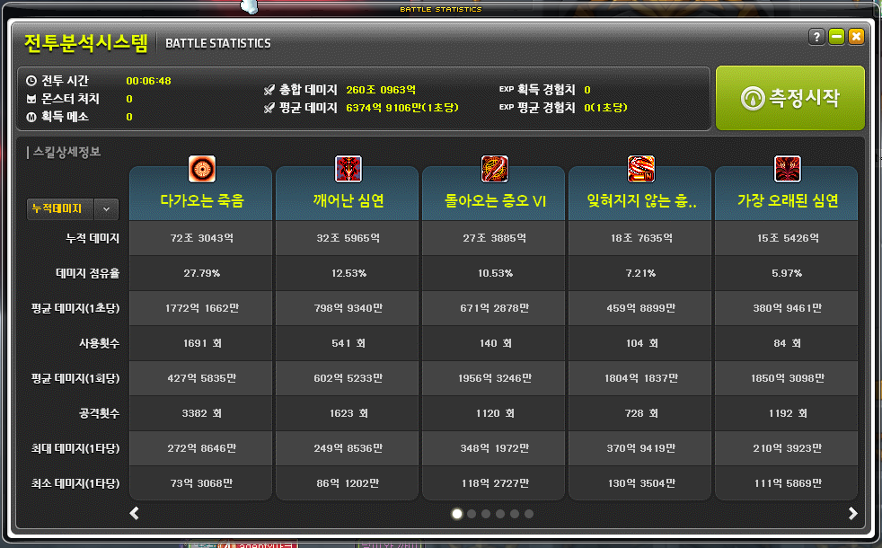
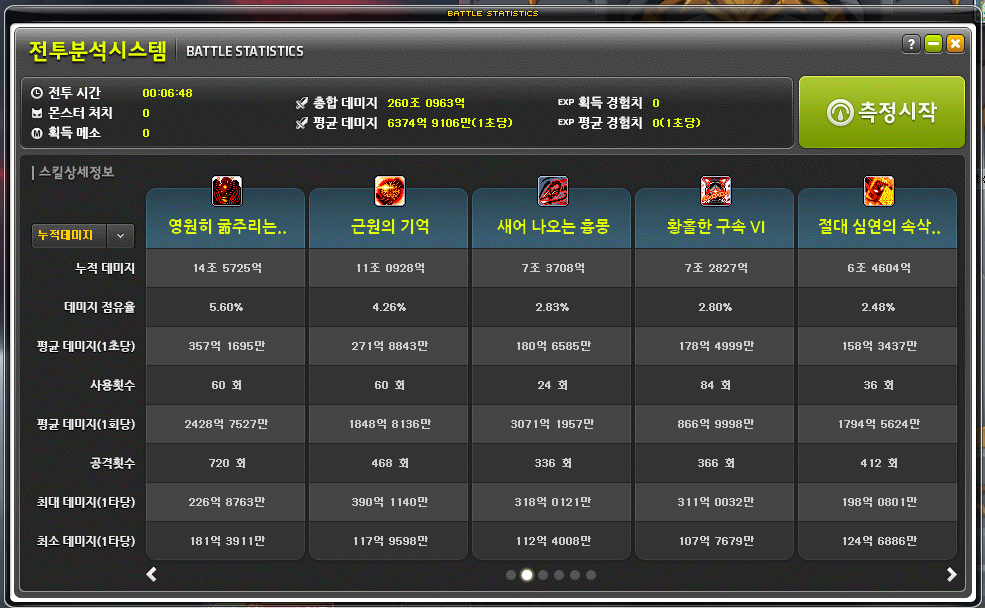
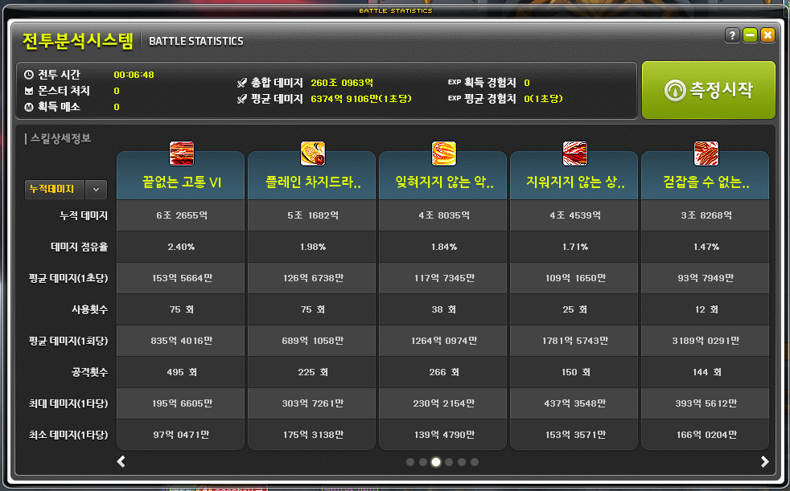
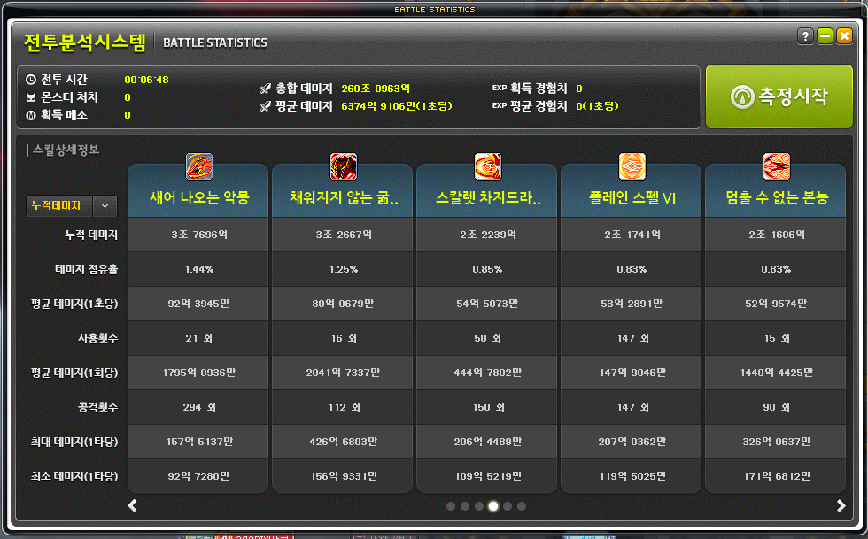

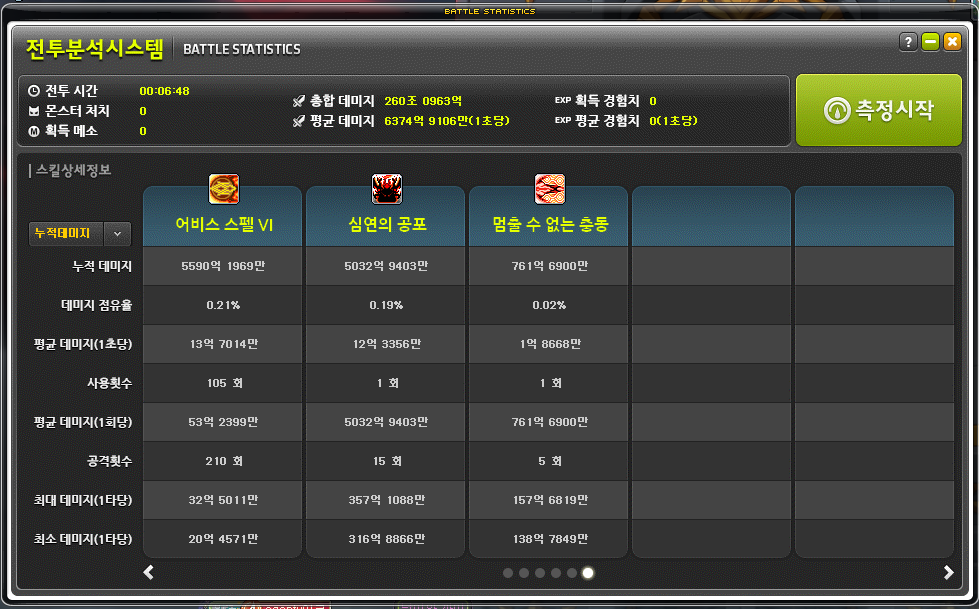
- 최초의 대적자 실전(링 익스체인지 사용).(2)
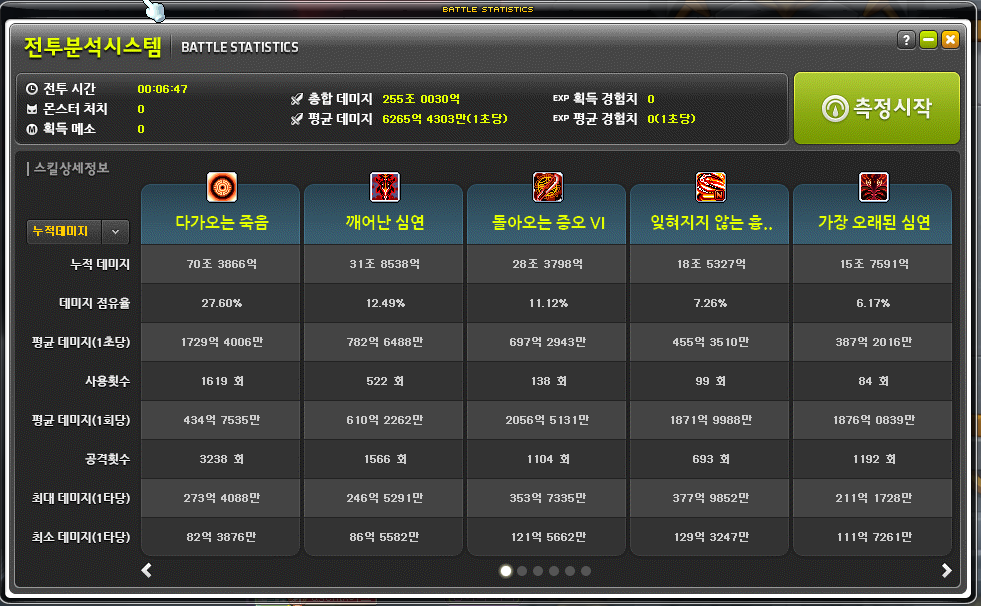
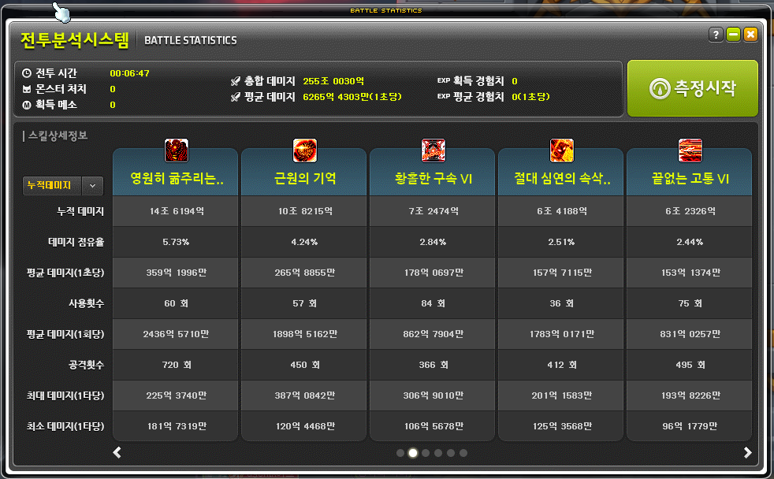
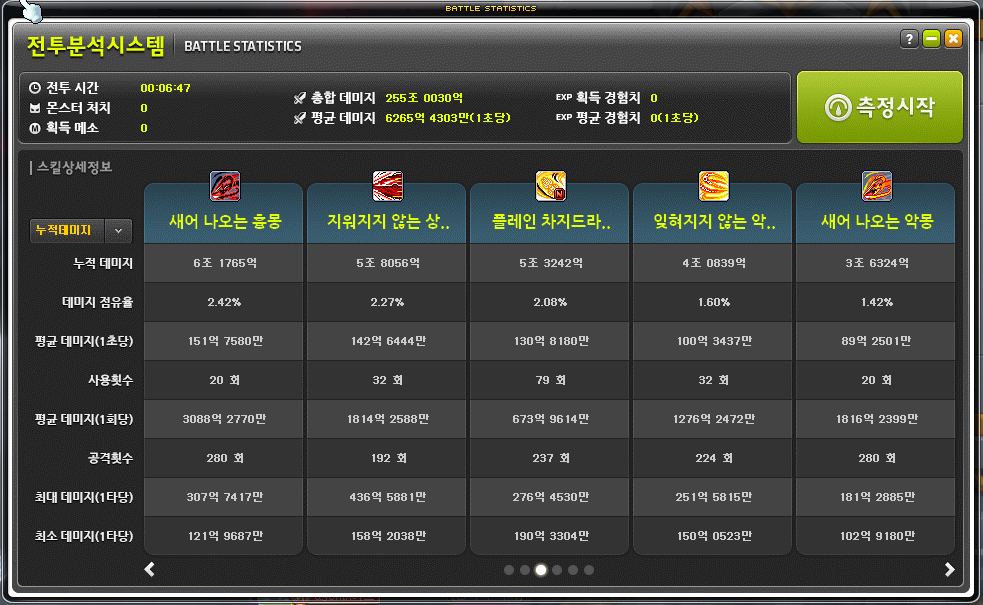
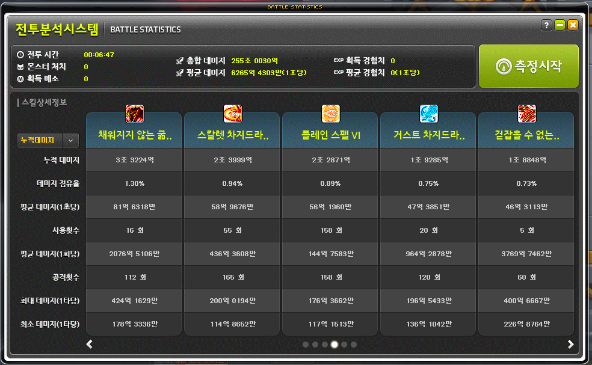
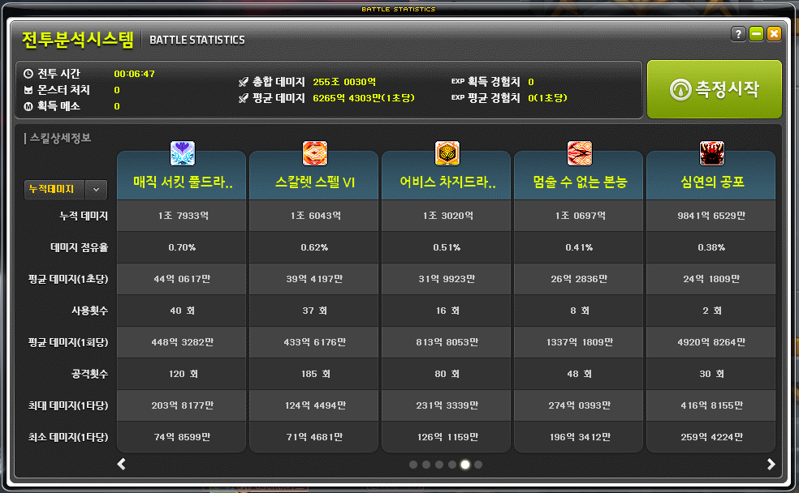

- 최초의 대적자 실전(링 익스체인지 사용).(3)
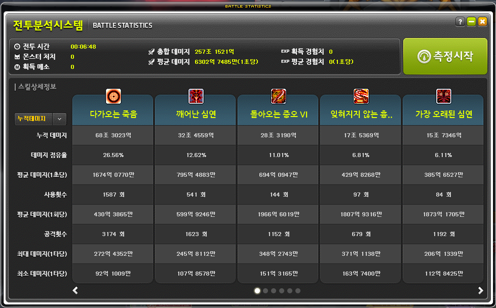
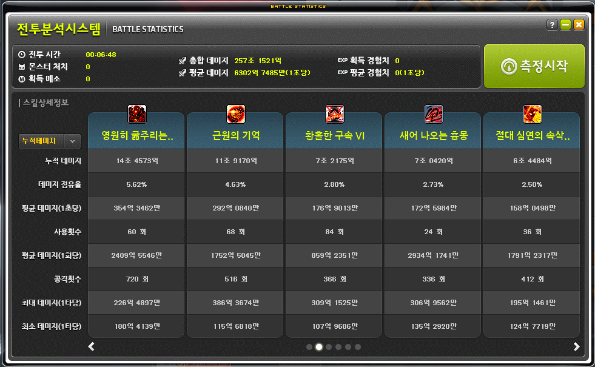
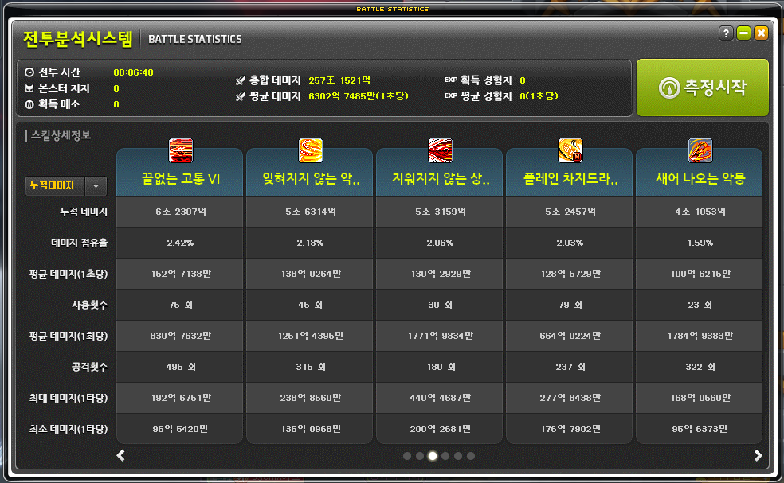
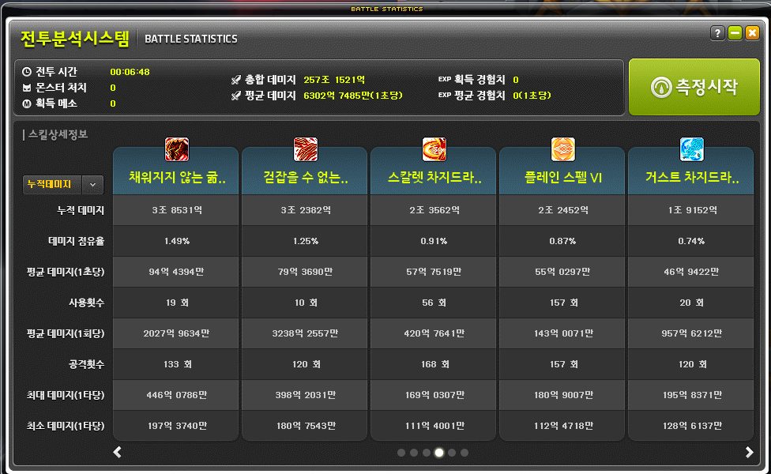
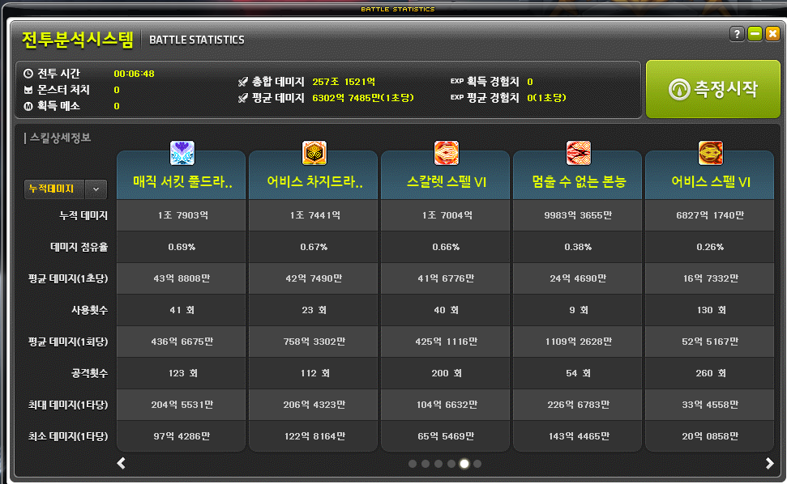
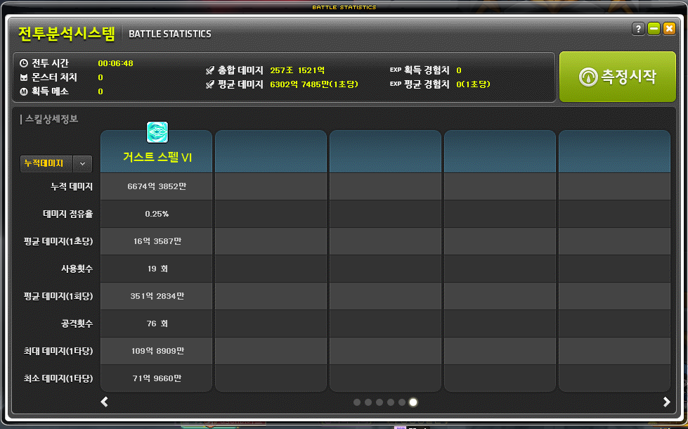
