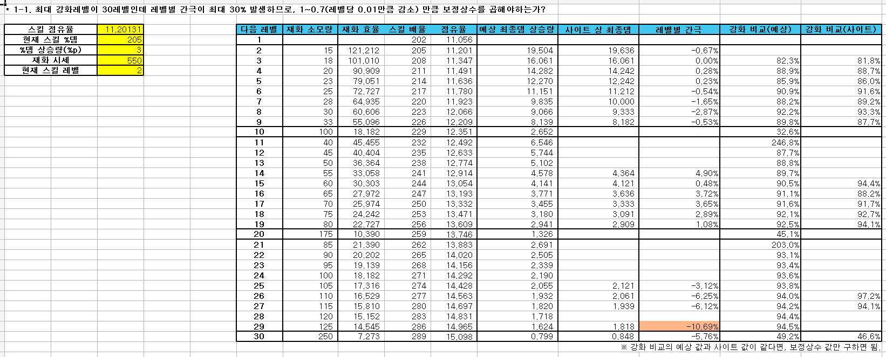
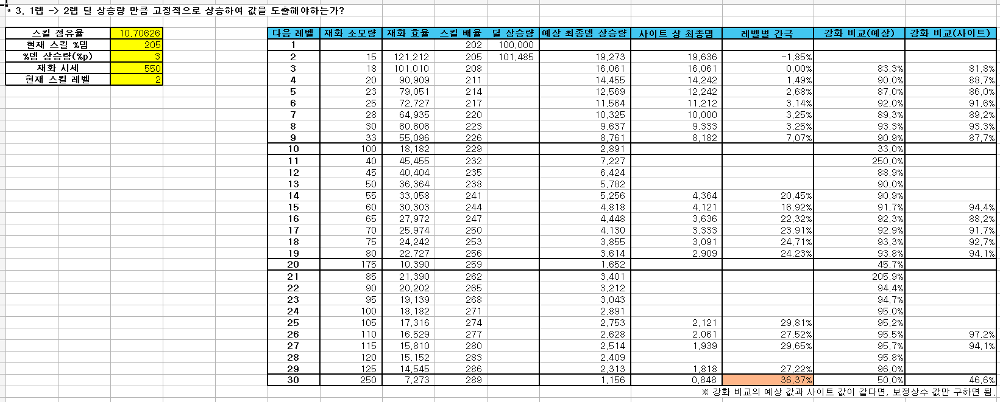
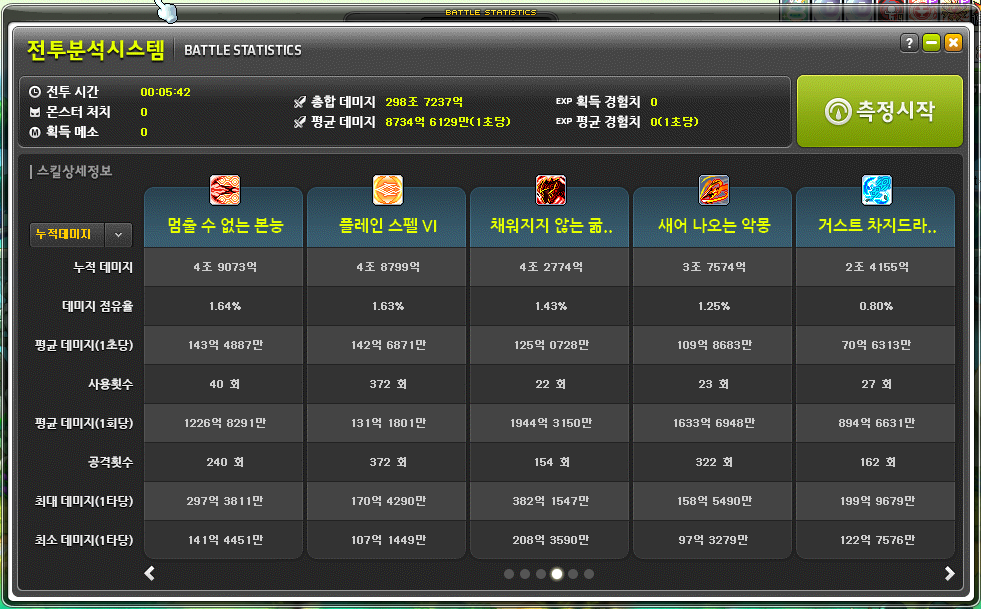

# my-calc-project(가칭: 개인별 분석 도구)

 

### 내용은 지속적으로 추가 및 보완될 예정입니다. 특히 게임 관련 용어의 경우, 가독성을 위해 별도의 설명 없이 사용되었습니다.

### 프로젝트의 완전한 이해를 돕기 위한 상세한 게임 시스템 및 용어 설명은 추후 보충될 예정이니, 이 점 참고하여 주시기 바랍니다.

 

## 목차

[1. 기획 의도](#planning_intention) 
[2. 시제품 개발 전 시행착오](#trial_and_error_before_prototype_development) 
[3. 아키텍처 개선 과정](#architectural_improvement_process) 
4.&nbsp;시제품 
&emsp;[4-1. 시제품 기획](#prototype_planning) 
&emsp;[4-2. 시제품 설계](#prototype_architecture) 
&emsp;[4-3. 시제품 구현 설명](#prototype_implementation_explanation) 
&emsp;[4-4. 시제품 결과](#prototype_result) 
[5. 프로젝트 방향성](#project_direction) 
[6. 패치 분석 보고서(25.08.21)](#patch_analysis_report_25.08.21) 
[7. 패치 분석 보고서(25.09.18)](#patch_analysis_report_25.09.18) 
기존 제품 개선 및 변동 사항 추가 예정 
알파 프로젝트 제작 추가 예정 
알파 프로젝트 데이터 구조 추가 예정 
[게임 시스템 설명](#game_system_explan) 
[참고 자료](#references) 

   

<h2 id="planning_intention">1. 기획 의도</h2>

### 환산주스탯(=효율분석 사이트)의 특징
1. 보편적 가이드라인.
   - 상위권 유저의 전투 데이터를 기반으로 제작한 강화 순서를 제공하여 초보자에게 보편적 가이드라인을 제시합니다.
2. 사용자의 강화 효율과 불일치.
   - 사용자의 전투 방식이 제공된 가이드라인과 다른 경우, 실제 강화 효율에 큰 차이가 발생할 수 있습니다.
3. 사용자별 최적화의 부재.
   - 사용자별로 '스킬 쿨타임 감소' 및 '특수 스킬 반지' 같은 변수를 반영하지 못합니다.
4. 고정된 강화 순서 및 효율 제공.
   - 사용자의 헥사 코어 레벨에 따라 달라지는 강화 효율을 고려하지 않고 고정된 강화 순서 및 효율을 제공합니다.

### 환산주스탯의 문제점을 개선하기 위해 개인별 분석 도구를 제작하였습니다.

### 개인별 분석 도구의 특징
1. 개인별 최적화.
   - 사용자에게 데이터를 직접 받아 가장 효율적인 강화 순서를 제공합니다.

   

<h2 id="trial_and_error_before_prototype_development">2. 시제품 개발 전 시행착오</h2>

### 시행착오 기간
25.07.02 ~ 25.08.13

### 제작한 이유
"환산주스탯에서 제공하는 헥사코어의 100억당 최종데미지 상승율 수치는 어떻게 제공될까?"라는 생각으로 제작해보았습니다.

### 가설 설계 및 분석
#### 가설 1
스킬 %데미지 상승율을 활용하여 엑셀 시트를 만들었습니다. 
강화 효율 측정은 가장 단순한 코어 구성을 가진 렌의 '선참VI' 코어를 기준으로 삼아 진행했습니다.

#### 분석 및 결론
코어별 최대 레벨이 30레벨이고 레벨별 간극이 최대 30% 벌어지므로, 이에 대해 '보정 상수가 존재하나?'라고 판단했습니다. 
 
#### 가설 1-1
기존 엑셀 시트에 보정 상수(1레벨당 0.01% 감소)를 추가해 보았습니다.

#### 분석 및 결론
보정 상수를 넣어도 간극이 생기므로, "보정 상수를 제외하고, 스킬 %데미지에만 연관이 있나?"라고 가설을 세웠습니다. 
 
#### 가설 2
'점유율(변동하지 않음) * 스킬 %데미지 상승율'을 활용하여 최종데미지 상승율을 산출해 보았습니다.

#### 분석 및 결론
점유율이 고정되어도 간극이 생기므로, "스킬 %데미지 상승율은 또한 1레벨에서 2레벨로 상승 시의 상승율로 고정인가?"라고 가설을 세웠습니다. 
 
#### 가설 3
'점유율(변동하지 않음) *스킬 %데미지 상승율(변동하지 않음)'을 활용하여 최종데미지 상승율을 산출해 보았습니다.

#### 분석 및 결론
간극이 더 크게 벌어지므로, "코어별 강화 순서가 다르면 효율이 달라지나?" 라는 새로운 가설을 세웠습니다. 
 
#### 가설 4
스킬 2가지를 번갈아 강화했을 때, 강화 효율을 산출해 보았습니다.

#### 분석 및 결론
"강화 순서가 다르면, 강화 효율이 다르다."라는 결론에 도달했습니다. 
 
#### 가설 탐색 중지
메이플스토리에 코어들이 추가되면서 하나의 코어를 연속적으로 강화하는 것보다 다른 코어도 강화하는 것이 효율이 좋게 되어 강화효율 검증에 난항을 겪게 되고, '선참VI'처럼 측정에 있어 단순한 코어를 찾기 또한 어려워 한동안 효율분석을 중지하였습니다. 
 
아래 이미지의 빨간색 영역은 렌의 '선참VI' 코어입니다. 하나의 코어가 연속적으로 강화하였을 때 효율적인 구조가 아님을 확인하실 수 있습니다.

> "어센트 스킬이 없었을 당시에 '선참VI' 코어를 5레벨에서 8레벨까지 연속적으로 강화하였을 때 효율적이지 않았냐?"라고 하실 수 있겠지만, 이 4레벨 구간만으로 전체 코어 강화 로직을 일반화하기 어렵다고 판단했습니다. 

25.07.17, 메이플스토리에 어센트 스킬이 추가되었습니다. 오리진 스킬 1회 사용 기준으로 효율을 측정하였을 때 2레벨에서 9레벨까지 연속적으로 강화하였을 때 효율적인 구조임을 확인하였고, 위 가설에 추가 테스트를 진행해 보았습니다. 
 
아래 이미지의 빨간색 영역은 렌의 어센트 스킬인 '창룡파천검 : 일매낙화 천비인적' 코어입니다. 하나의 코어가 연속적으로 강화하였을 때 효율적인 구조임을 확인하실 수 있습니다.

#### 가설 5
어센트 스킬을 기준으로 가설 1을 추가 테스트했습니다.

#### 분석 및 결론
계산 과정에서 발생한 '-0.044% ~ 0.081%'의 오차는 환산주스탯의 소수점 처리 방식의 차이라는 결론에 도달하였습니다. 

   

<h2 id="architectural_improvement_process">3. 아키텍처 개선 과정</h2>

### 아키텍처 Ver.1.0
#### 설명
강화 효율 측정에 필요한 모든 데이터(현재 레벨 기준 스킬 %데미지, 다음 레벨 기준 스킬 %데미지, 스킬 1회당 공격횟수, 측정된 공격횟수 등)를 입력받아 다음 스킬 강화를 추천하는 아키텍처.

#### 이점
1. 외부 요인에 영향받지 않는 분석 가능. 
&emsp;- 밸런스 패치와 관계없이 효율 계산이 가능합니다.

#### 문제점
1. 많은 수동 입력. 
&emsp;- 모든 스킬 정보를 직접 입력해야 하는 높은 입력 난이도가 존재합니다. 
&emsp;- 특히 스킬별 1회당 공격횟수 같은 세부 정보를 모두 기억하기 어려워 잘못된 정보 기입 시 잘못된 효율이 측정되는 경우가 발생합니다.

### 아키텍처 Ver.2.0
#### 설명
스킬 정보는 데이터베이스에 저장되어 있으며, 사용자에게 필수 데이터(코어별 레벨, 해당 스킬 점유율, 재화 시세)만을 입력받아 다음 스킬 강화를 추천하는 아키텍처.

#### 이점
1. 낮은 수동 입력. 
&emsp;- 모든 스킬 정보를 직접 입력해야 하는 기존과는 달리, 사용자에게 필수적인 데이터만을 요구합니다.

#### 문제점
1. 개발자의 관리 부담이 많음. 
&emsp;- 밸런스 패치 마다 모든 스킬의 수치를 일일이 수정해야 하는 번거로움이 있습니다. 
2. 데이터의 부정확성. 
&emsp;- 개발자가 업데이트를 늦추거나 누락하면, 사용자들은 구 버전의 데이터를 기반으로 잘못된 효율을 계산하게 됩니다.

#### 아키텍처를 변경한 이유
많은 수동 입력은 다수의 사용자들의 진입장벽이 될 것이기 때문에, 이를 개선하고자 데이터베이스에 스킬 정보를 저장하는 아키텍처로 변경하였습니다.

### 아키텍처 Ver.3.0
#### 설명
넥슨에서 제공하는 API(이하 넥슨 API)를 활용하여, 사용자에게 필수 데이터(코어별 레벨, 해당 스킬 점유율, 재화 시세)만을 입력받아 다음 스킬 강화를 추천하는 아키텍처.

#### 이점
1. 낮은 수동 입력. 
&emsp;- 모든 스킬 정보를 직접 입력해야 하는 기존과는 달리, 사용자에게 필수적인 정보만을 요구합니다. 
2. 개발자의 관리 부담이 적어짐. 
&emsp;- 넥슨 API에 모든 스킬 정보가 기재되어 있어, 개발자가 일일이 업데이트해야 하는 관리 부담이 줄어듭니다. 
3. 데이터의 신뢰성 확보. 
&emsp;- 넥슨 API를 활용함으로써, 데이터의 신뢰성을 확보하고 분석 결과의 정확성을 높였습니다. 
4. 데이터베이스 관리 비용 절감. 
&emsp;- 게임 데이터를 직접 관리하는 대신 넥슨 API를 활용함으로써, 데이터베이스에 직업별 스킬 정보를 저장할 필요가 없어 데이터베이스 관리 비용을 절감했습니다.

#### 문제점
1. 배포 및 접근성의 한계. 
&emsp;- 현재 구상 중인 사용방식은 python 응용 프로그램에 넥슨 API를 사용하는 방식입니다. 
&emsp;- 사용자는 python 실행 파일을 직접 설치해야 하고, 응용 프로그램 업데이트 시마다 매번 다운로드해야 하는 번거로움이 있어 접근성이 낮다는 한계가 있습니다.

#### 아키텍처를 변경한 이유
'아키텍처 2'를 통해 사용자의 입력 부담은 해결했지만, 밸런스 패치마다 모든 스킬 정보를 수동으로 업데이트해야하는 비효율적인 문제가 남아있었습니다. 이는 도구의 신뢰성을 떨어뜨릴 수 있다고 판단했습니다. 따라서 직접 데이터를 관리하는 대신, 넥슨 API를 통해 최신 정보를 효율적으로 수집하고 관리 부담을 해결하고자 이 아키텍처를 구상했습니다.

### 아키텍처 Ver.3.1
#### 설명
스킬 정보를 표기 및 수정하는 웹 사이트를 구축하여, 사용자에게 필수 데이터(코어별 레벨, 해당 스킬 점유율, 재화 시세)만을 입력받아 다음 스킬 강화를 추천하는 아키텍처.

#### 이점
1. 낮은 수동 입력. 
&emsp;- 모든 스킬 정보를 직접 입력해야 하는 기존과는 달리, 사용자에게 필수적인 정보만을 요구합니다. 
2. 배포 및 접근성이 용이함. 
&emsp;- 웹 사이트로 제공되는 방식은 사용자가 직접 다운로드하고 설치해야 하는 방식에 비해 접근성이 높습니다. 
3. 높은 가시성. 
&emsp;- 글로 제작된 python 응용 프로그램에 비해 웹 사이트에 이미지(스킬 이미지, 강화 효율표)를 넣어 가시성을 높힐 수 있습니다. 
4. 스킬 정보 변경 가능. 
&emsp;- 밸런스 패치 때 수치적 변경만 있다면, 사용자가 직접 변경하여 효율을 측정할 수 있습니다.

#### 문제점
1. 개발자의 관리 부담이 많음. 
&emsp;- 밸런스 패치마다 모든 스킬의 수치를 일일이 수정해야 하는 번거로움이 있습니다. 
2. 데이터의 부정확성. 
&emsp;- 개발자가 업데이트를 늦추거나 누락하면, 사용자들은 구 버전의 데이터를 기반으로 잘못된 효율을 계산하게 됩니다. 
3. 데이터베이스 관리 비용 상승. 
&emsp;- 모든 스킬 정보를 저장해야하므로 데이터베이스 관리 비용이 상승합니다.

#### 아키텍처를 변경한 이유
넥슨 API에서 모든 스킬 정보를 주는지 명확하지 않아, 웹사이트를 제작하여 사용자가 스킬 정보를 수정할 수 있는 아키텍처를 구상했습니다.

   

## 4. 시제품

<h2 id="prototype_planning">4-1. 시제품 기획</h2>

### 사용된 데이터는 최신화 됩니다. 각각의 제품 / 프로젝트의 기준 날짜를 확인해 주시길 바랍니다.
### 본 프로젝트의 완성일은 개발자가 그 당시 보고서가 완성되었다고 판단한 시점으로 작성되었습니다.
### 완성일 이후에 보고서 내용의 일관성을 위하여 일부 내용 추가 및 수정되었습니다.

### 제작 기한
- 예상 기간: 영업일 기준 8.5일. 
  (5일 + 4 * 8일 + 14일) / 6 = 8.5일.
- 시작일: 25.08.14.
- 기한일: 25.08.26.
- 완성일: 25.09.05.(영업일 기준 16일)

### 기능 요구사항
#### 전제조건

1. 시제품용 데이터는 25.08.14 개발자의 코어 강화 상태 및 허수아비형 보스 상대로 측정한 스킬별 점유율을 기준으로 측정함. 
2. 기본 스킬의 %데미지는 '쓸만한 컴뱃 오더스'가 사용 중인 상태를 기준으로 측정함. 
3. '어비스 차지드라이브 스펠VI'는 스킬 레벨에 따라 '적에게 적중 시 보스 공격 시 데미지 증가'의 효과가 증가하지만, 시제품에선 스킬 %데미지만 효율 측정하기 때문에 제외하고 측정함. 
4. 분석의 범위를 명확히 설정하기 위해서 '다가오는 죽음'은 '인피니티 스펠' 사용 시에만 발생하는 경우를 기준으로 강화 효율을 측정함. 
5. 마스터리 코어 효율 계산에 영향을 미치는 '강화 코어인 인피니티 스펠의 지속시간 중 다가오는 죽음 %p 상승'은 19레벨 기준으로 측정함. 
 

> '쓸만한 컴뱃 오더스'는 '일부 스킬만' 최대 레벨이 30레벨에서 31레벨로 상승하는 버프 스킬임. 
> '인피니티 스펠'은 50초간 '다가오는 죽음'이 3개 추가로 생성함. 이 스킬은 강화 코어의 효과를 받아 '다가오는 죽음'의 데미지를 133%p 추가로 상승하는 버프 스킬임. 

#### 입력하는 데이터
1. 마스터리 코어별 현재 레벨. 
2. 스킬별 점유율.

#### 출력되어야하는 데이터
1. 코어 종류. 
2. 코어 추천 레벨. 
3. 최종데미지 상승율. 
4. 100억당 최종데미지 상승율.

<h2 id="prototype_architecture">4-2. 시제품 설계</h2>

### 구현 요구사항
#### 데이터 구조
##### 외부 데이터(불변)
- 기본(4차 이하 및 하이퍼) 스킬(딕셔너리)
  - 스킬 이름(딕셔너리)
    - 최대 레벨 기준 %데미지(변수)
- 마스터리 코어1(딕셔너리)
  - 스킬 이름(딕셔너리)
    - 30레벨 기준 %데미지(변수)
    - 1레벨 상승 시 %데미지 상승량(%p)(변수)
- 마스터리 코어2(딕셔너리)
  - 스킬 이름(딕셔너리)
    - 30레벨 기준 %데미지(변수)
    - 1레벨 상승 시 %데미지 상승량(%p)(변수)
- 마스터리 코어3(딕셔너리)
  - 스킬 이름(딕셔너리)
    - 30레벨 기준 %데미지(변수)
    - 1레벨 상승 시 %데미지 상승량(%p)(변수)
- 마스터리 코어4(딕셔너리)
  - 스킬 이름(딕셔너리)
    - 30레벨 기준 %데미지(변수)
    - 1레벨 상승 시 %데미지 상승량(%p)(변수)
- 마스터리 코어 1~30레벨 재화 소모량(리스트)
- 마스터리 코어 리스트 = [마스터리 코어1, 마스터리 코어2, 마스터리 코어3, 마스터리 코어4]

##### 내부 데이터(사용자 캐릭터 정보, 변동)
- 마스터리 코어1(딕셔너리)
  - 현재 레벨(변수)
  - 데미지 상승율(딕셔너리)
    - 1레벨 상승 시 최종데미지 상승율(변수)
    - 1레벨 상승 시 100억당 최종데미지 상승율(변수)
    - 5레벨 상승 시 평균 최종데미지 상승율(변수)
    - 5레벨 상승 시 100억당 평균 최종데미지 증가율(변수)
  - 스킬(딕셔너리)
    - 스킬 이름(딕셔너리)
      - 현재 레벨 기준 %데미지(변수)
      - 1레벨 상승 시 %데미지 상승량(%p)(변수)
      - 점유율(변수)
- 마스터리 코어2(딕셔너리)
  - 현재 레벨(변수)
  - 데미지 상승율(딕셔너리)
    - 1레벨 상승 시 최종데미지 상승율(변수)
    - 1레벨 상승 시 100억당 최종데미지 상승율(변수)
    - 5레벨 상승 시 평균 최종데미지 상승율(변수)
    - 5레벨 상승 시 100억당 평균 최종데미지 증가율(변수)
  - 스킬(딕셔너리)
    - 스킬 이름(딕셔너리)
      - 현재 레벨 기준 %데미지(변수)
      - 1레벨 상승 시 %데미지 상승량(%p)(변수)
      - 점유율(변수)
- 마스터리 코어3(딕셔너리)
  - 현재 레벨(변수)
  - 데미지 상승율(딕셔너리)
    - 1레벨 상승 시 최종데미지 상승율(변수)
    - 1레벨 상승 시 100억당 최종데미지 상승율(변수)
    - 5레벨 상승 시 평균 최종데미지 상승율(변수)
    - 5레벨 상승 시 100억당 평균 최종데미지 증가율(변수)
  - 스킬(딕셔너리)
    - 스킬 이름(딕셔너리)
      - 현재 레벨 기준 %데미지(변수)
      - 1레벨 상승 시 %데미지 상승량(%p)(변수)
      - 점유율(변수)
- 마스터리 코어4(딕셔너리)
  - 현재 레벨(변수)
  - 데미지 상승율(딕셔너리)
    - 1레벨 상승 시 최종데미지 상승율(변수)
    - 1레벨 상승 시 100억당 최종데미지 상승율(변수)
    - 5레벨 상승 시 평균 최종데미지 상승율(변수)
    - 5레벨 상승 시 100억당 평균 최종데미지 증가율(변수)
  - 스킬(딕셔너리)
    - 스킬 이름(딕셔너리)
      - 현재 레벨 기준 %데미지(변수)
      - 1레벨 상승 시 %데미지 상승량(%p)(변수)
      - 점유율(변수)
- 마스터리 코어 리스트 = [마스터리 코어1, 마스터리 코어2, 마스터리 코어3, 마스터리 코어4]
 

> 주의 사항1: 기본 스킬의 스킬 이름의 하위 항목에 30레벨 기준 %데미지라고 작성하지 않은 이유는 '쓸만한 컴뱃 오더스'를 사용 시 '일부 스킬만' 최대 레벨인 30레벨에서 31레벨로 상승하기 때문에 최대 레벨이라고 작성함. 
> 주의 사항2: 5레벨 상승 시 측정하는 이유는 특정 구간에서 효율이 급격하게 감소했다가 효율이 다시 올라가는 구조이기 때문에 구간별 소모 재화량(평균) 중 가장 좋은 효율을 기준으로 평균을 내어 작성함.
 

스킬 레벨별 재화 소모량
<table>
  <thead><tr>
      <th> 스킬 레벨 </th>
      <th> 재화 소모량 </th>
  </tr></thead>
  <tbody>  
    <tr><td> 8 -> 9 </td><td> 33 </td></tr>
    <tr><td> 9 -> 10 </td><td> 100 </td></tr>
    <tr><td> 10 -> 11 </td><td> 40 </td></tr>
    <tr><td> 11 -> 12 </td><td> 45 </td></tr>
    <tr><td> 12 -> 13 </td><td> 50 </td></tr>
    <tr><td> 13 -> 14 </td><td> 55 </td></tr>
    <tr><td> 14 -> 15 </td><td> 60 </td></tr>
  </tbody>
</table>

구간별 재화 소모량(평균)
<table>
  <thead><tr>
      <th> 스킬 레벨 </th>
      <th> 재화 소모량 </th>
  </tr></thead>
  <tbody>
    <tr><td> 9 -> 13 </td><td> 총합 235 평균 58.75 </td></tr>
    <tr><td> 9 -> 14 </td><td> 총합 290 평균 58.00 </td></tr>
    <tr><td> 9 -> 15 </td><td> 총합 350 평균 58.33 </td></tr>
  </tbody>
</table>

##### 메인 함수
1. 사용자로부터 입력받는 함수 실행. 
2. 현재 레벨 기준 스킬 %데미지 조정하는 함수 실행. 
3. 강화효율 산출하는 함수 실행. 
4. 강화 추천하는 함수 실행. 
5. 결과 출력하는 함수 실행. + if not 리턴값: break 
6. 점유율 재조정하는 함수 실행. 
7. 데미지 업데이트하는 함수 실행. 
8. 위의 3~7를 반복. 

##### 정의할 함수 종류
- 사용자로부터 입력받는 함수.
  - 매개변수
    - 마스터리 코어 리스트(리스트)
  - 처리과정
    - 사용자로부터 마스터리 코어별 현재 레벨, 스킬별 점유율을 입력받음.
    - 입력받은 데이터가 정상적인 데이터인지 확인함.
    - 검증된 데이터를 마스터리 코어 리스트(리스트)에 저장함. 
  - 처리사항
    - 마스터리 코어별 현재 레벨이 int 형식이 아니라면, 다시 입력.
      - try: except Value Error:를 활용.
    - 마스터리 코어별 현재 레벨이 0이하 또는 31이상이라면, 다시 입력.
    - 스킬별 점유율이 int 형식 또는 float 형식이 아니라면, 다시 입력.
      - try: except Value Error:를 활용.
    - 스킬별 점유율이 0미만이라면, 다시 입력.
    - 스킬별 점유율 합산이 100초과하면, 다시 입력.
  - 리턴값
    - 마스터리 코어 리스트(리스트)
  
- 현재 레벨 기준 스킬 %데미지 조정하는 함수.
  - 매개변수
    - 마스터리 코어 리스트(리스트)
  - 처리과정
    - 마스터리 코어별 딕셔너리 중 중복된 스킬이 있다면, 현재 레벨 기준 스킬 %데미지, 점유율을 조정함.
    - 조정된 현재 레벨 기준 스킬 %데미지, 점유율을 마스터리 코어 리스트(리스트)에 저장함.
    > ex) 마스터리 코어2인 차지드라이브 변형 인스팅트 아츠 VI의 패시브 효과: 돌아오는 증오 VI 2%p 상승 효과와 마스터리 코어3인 돌아오는 증오 VI: 7%p 상승 효과가 서로에게 직접적으로 영향을 미침. 
    > 마스터리 코어2인 차지드라이브 변형 인스팅트 아츠 VI의 패시브 효과: 돌아오는 증오 VI의 현재 레벨 기준 스킬 %데미지 = 마스터리 코어3인 차지드라이브 변형 인스팅트 아츠 VI의 패시브 효과 + 강화스킬2인 돌아오는 증오 VI 
    > 마스터리 코어3인 돌아오는 증오 VI의 현재 레벨 기준 스킬 %데미지 = 마스터리 코어2인 차지드라이브 변형 인스팅트 아츠 VI의 패시브 효과: 돌아오는 증오 VI + 마스터리 코어3인 돌아오는 증오 VI
  - 처리사항
    - 두 딕셔너리 내에 중복된 키가 있는지, keys() + 교집합을 이용하여 중복된 키를 추출함.
  - 리턴값
    - 마스터리 코어 리스트(리스트)
  
- 강화효율 산출하는 함수.
  - 매개변수
    - 마스터리 코어 리스트(리스트)
  - 설명
    - 마스터리 코어별/스킬별 최종데미지 상승율을 산출하는 과정.
  - 처리과정
    - 재화 시세, 마스터리 코어 1~30레벨 재화 소모량, 마스터리 코어 리스트(리스트)를 이용하여, 재화 효율, 스킬 최종데미지 상승율을 산출함. 
    - 1레벨 상승 시 최종데미지 상승율, 1레벨 상승 시 100억당 최종데미지 상승율, 5레벨 상승 시 평균 최종데미지 상승율, 5레벨 상승 시 100억당 평균 최종데미지 상승율을 산출함.
    - 모든 최종데미지 상승율은 마스터리 코어 리스트(리스트)에 저장함.
  - 처리사항
    - 재화 시세는 성능 향상을 위해 550만 대신 550을 사용함.
    - 재화 소모량 = 마스터리 코어 1~30레벨 재화 소모량[마스터리 코어[현재 레벨]]
    - 평균 재화 소모량은 (마스터리 코어 1~30레벨 재화 소모량에서 '현재 레벨' 부터 '현재 레벨 + 4'까지를 합산된 수치) / 5임.
    - 재화 효율은 성능 향상을 위해 100억 대신 100만을 사용함.
    - (평균)재화 효율 = 100만 / (재화 시세 * (평균)재화 소모량)
    - 스킬 데미지 상승율 = 1레벨 상승 시 %데미지 상승량(%p) / 현재 레벨 기준 %데미지
    - 평균 스킬 데미지 상승율은 (이 마스터리 코어를 5레벨 연속으로 강화했을 경우, 스킬 데미지 상승율이 합산된 수치) / 5 임.
    - (평균)최종데미지 상승율 = (평균)점유율 * (평균)스킬 데미지 상승율
    - 100억당 (평균)최종데미지 상승율 = (평균)재화 효율 * 점유율 * (평균)스킬 데미지 상승율
  - 리턴값
    - 마스터리 코어 리스트(리스트)
   
- 강화 추천하는 함수.
  - 매개변수
    - 마스터리 코어 리스트(리스트) 
  - 처리과정
    - 마스터리 코어별로 1레벨 상승 시 100억당 최종데미지 상승율, 5레벨 상승 시 100억당 평균 최종데미지 상승율을 한 리스트에 담음.
    - 그 리스트에서 인덱스와 최댓값으로 가장 효율 좋은 마스터리 코어 번호 및 강화 횟수를 유추함.
  - 처리사항
    - 가장 효율 좋은 마스터리 코어 번호 = 최댓값 인덱스 // 2 + 1
    - 최댓값이 0이면, 0, 0을 리턴함.
      - 모든 스킬이 최대 레벨을 달성함.
    - 최댓값 인덱스 % 2가 0이면, 가장 효율 좋은 마스터리 코어 번호, 1을 리턴함.
      - 최댓값 인덱스는 0, 2, 4, 6이므로 1레벨 상승 시 100억당 최종데미지 상승율 관련 데이터가 존재함.
    - 아니라면, 가장 효율 좋은 마스터리 코어 번호, 5를 리턴함.
      - 최댓값 인덱스는 1, 3, 5, 7이므로 5레벨 상승 시 100억당 평균 최종데미지 상승율 관련 데이터가 존재함.
  - 리턴값
    - 가장 효율 좋은 마스터리 코어 번호, 강화 횟수
    
- 결과를 출력하는 함수.
  - 매개변수
    - 마스터리 코어 번호, 강화 횟수.
  - 처리과정
    - 강화할 스킬이 있다면, 스킬 이름 및 추천 레벨 및 최종데미지 상승율을 출력함.
  - 처리사항
    - 강화 횟수가 0이라면, False를 리턴함.
      - 모든 스킬이 최대 레벨을 달성함.
    - 아니라면, True를 리턴함.
  - 리턴값
    - bool형
      
- 점유율 조정하는 함수.
  - 매개변수
    - 마스터리 코어 리스트(리스트), 마스터리 코어 번호, 강화 횟수
  - 처리과정
    - 가장 효율 좋은 마스터리 코어 번호 및 강화 횟수를 활용하여 마스터리 코어 스킬의 현재 레벨, 점유율, 현재 레벨 기준 스킬 %데미지를 상승시킴.
    - 나머지 마스터리 코어의 점유율을 상승된 최종데미지에 비례하여 낮춤.
  - 처리사항
    - 가장 효율 좋은 마스터리 코어라면, 새로운 점유율을 '점유율 * (1 + 데미지 상승율)/ (1 + 점유율 * 데미지 상승율 / 100)'로 처리함.
      - 데미지 상승율 = 데미지 상승량(%p) / 현재 레벨 기준 스킬 %데미지
    - 나머지 마스터리 코어라면, 새로운 점유율을 '현재 점유율 / (1 + 합산된 점유율 상승량 / 100)'로 처리함.
      - 점유율 상승량 = 새로운 점유율 - 기존 점유율
  - 리턴값
    - 마스터리 코어 리스트(리스트)

- 데미지 갱신하는 함수.
  - 매개변수
    - 마스터리 코어 리스트(리스트)
  - 처리과정
    - 서로 다른 마스터리 코어이면서 동일한 스킬의 현재 레벨 기준 %데미지가 다르다면, 높은 쪽의 점유율을 기준으로 현재 레벨 기준 스킬 %데미지와 점유율을 갱신함.
    > ex) 마스터리 코어2인 차지드라이브 변형 인스팅트 아츠 VI의 패시브 효과: 돌아오는 증오 VI 2%p 상승 효과와 마스터리 코어3인 돌아오는 증오 VI: 7%p 상승 효과가 서로에게 직접적으로 영향을 미침. 
    > 마스터리 코어2인 차지드라이브 변형 인스팅트 아츠 VI의 패시브 효과: 돌아오는 증오 VI의 현재 레벨 기준 스킬 %데미지 = 마스터리 코어3인 차지드라이브 변형 인스팅트 아츠 VI의 패시브 효과 + 강화스킬2인 돌아오는 증오 VI  
    > 마스터리 코어3인 돌아오는 증오 VI의 현재 레벨 기준 스킬 %데미지 = 마스터리 코어2인 차지드라이브 변형 인스팅트 아츠 VI의 패시브 효과: 돌아오는 증오 VI + 마스터리 코어3인 돌아오는 증오 VI
  - 처리사항
    - 두 딕셔너리 내에 키가 중복인 키가 있는지 set()함수 + 교집합을 이용하여 확인함.
  - 리턴값
    - 마스터리 코어 리스트(리스트)

   

<h2 id="prototype_implementation_explanation">4-3. 시제품 구현 설명</h2>

### 데이터 구조

### 스킬 1회당 "총합 %데미지"입니다.
### 자세한 %데미지 계산방식은 기능 요구사항의 전제조건을 참조 바랍니다. [>> 전제조건 보러가기](#prototype_prerequisites)

기본(4차 이하 및 하이퍼) 스킬
<table>
  <thead><tr>
     <th> 스킬 이름 </th><th> %데미지 </th>
  </tr></thead>
  <tbody>
     <tr><td> 플레인 차지드라이브 </td><td> 1839 </td></tr>
     <tr><td> 플레인 스펠 </td><td> 373 </td></tr>
     <tr><td> 스칼렛 차지드라이브 </td><td> 2118 </td></tr>
     <tr><td> 스칼렛 스펠 </td><td> 1105 </td></tr>
     <tr><td> 거스트 차지드라이브 </td><td> 2418 </td></tr>
     <tr><td> 거스트 스펠 </td><td> 924 </td></tr>
     <tr><td> 어비스 차지드라이브 </td><td> 3850 </td></tr>
     <tr><td> 어비스 스펠 </td><td> 144 </td></tr>
     <tr><td> 지워지지 않는 상처 </td><td> 2958 </td></tr>
     <tr><td> 채워지지 않는 굶주림 </td><td> 3451 </td></tr>
     <tr><td> 걷잡을 수 없는 혼돈 </td><td> 5316 </td></tr>
     <tr><td> 멈출 수 없는 충동 </td><td> 2190 </td></tr>
     <tr><td> 멈출 수 없는 본능 </td><td> 2778 </td></tr>
     <tr><td> 돌아오는 증오 </td><td> 2898 </td></tr>
     <tr><td> 황홀한 구속 </td><td> 36340 </td></tr>
     <tr><td> 끝없는 고통 </td><td> 41400 </td></tr>
     <tr><td> 끝나지 않는 악몽 </td><td> 2658 </td></tr>
     <tr><td> 끝나지 않는 흉몽 </td><td> 2688 </td></tr>
     <tr><td> 다가오는 죽음 </td><td> 906 + 266 </td></tr>
  </tbody>
</table>

> 다가오는 죽음에 추가된 '266'은 강화 코어인 인피니티 스펠의 효과로 인한 상승 수치입니다.

마스터리 코어1 스킬
<table>
  <thead><tr>
     <th> 스킬 이름 </th><th> 최대 %데미지 </th><th> %데미지 상승량(%p) </th>
  </tr></thead>
  <tbody>
     <tr><td> 플레인 차지드라이브VI </td><td> 3615 </td><td> 42 </td></tr>
     <tr><td> 플레인 스펠VI </td><td> 1610 </td><td> 20 </td></tr>
     <tr><td> 스칼렛 차지드라이브VI </td><td> 4530 </td><td> 54 </td></tr>
     <tr><td> 스칼렛 스펠VI </td><td> 2375 </td><td> 30 </td></tr>
     <tr><td> 거스트 차지드라이브VI </td><td> 5250 </td><td> 66 </td></tr>
     <tr><td> 거스트 스펠VI </td><td> 1980 </td><td> 24 </td></tr>
     <tr><td> 어비스 차지드라이브VI </td><td> 7894 </td><td> 102 </td></tr>
     <tr><td> 어비스 스펠VI </td><td> 302 </td><td> 4 </td></tr>
     <tr><td> 깨어난 심연(신규 패시브) </td><td> 4380 </td><td> 48 </td></tr>
  </tbody>
</table>

마스터리 코어2 스킬
<table>
  <thead><tr>
     <th> 스킬 이름 </th><th> 최대 %데미지 </th><th> %데미지 상승량(%p) </th>
  </tr></thead>
  <tbody>
     <tr><td> 지워지지 않는 상처VI </td><td> 8040 </td><td> 102 </td></tr>
     <tr><td> 채워지지 않는 굶주림VI </td><td> 9268 </td><td> 112 </td></tr>
     <tr><td> 걷잡을 수 없는 혼돈VI </td><td> 14220 </td><td> 168 </td></tr>
     <tr><td> 멈출 수 없는 충동(패시브) </td><td> 2450 </td><td> 55 </td></tr>
     <tr><td> 멈출 수 없는 본능(패시브) </td><td> 2940 </td><td> 66 </td></tr>
     <tr><td> 돌아오는 증오VI(패시브) </td><td> 480 </td><td> 16 </td></tr>
  </tbody>
</table>

마스터리 코어3 스킬
<table>
  <thead><tr>
     <th> 스킬 이름 </th><th> 최대 %데미지 </th><th> %데미지 상승량(%p) </th>
  </tr></thead>
  <tbody>
     <tr><td> 돌아오는 증오VI </td><td> 8320 </td><td> 96 </td></tr>
     <tr><td> 황홀한 구속VI </td><td> 82200 </td><td> 920 </td></tr>
     <tr><td> 끝없는 고통VI </td><td> 66330 </td><td> 630 </td></tr>
  </tbody>
</table>

마스터리 코어4 스킬
<table>
  <thead><tr>
     <th> 스킬 이름 </th><th> 최대 %데미지 </th><th> %데미지 상승량(%p) </th>
  </tr></thead>
  <tbody>
     <tr><td> 잊혀지지 않는 악몽VI </td><td> 6685 </td><td> 84 </td></tr>
     <tr><td> 잊혀지지 않는 흉몽VI </td><td> 6797 </td><td> 84 </td></tr>
     <tr><td> 다가오는 죽음 </td><td> 120 </td><td> 4 </td></tr>
  </tbody>
</table>

마스터리 코어 레벨별 재화 소모량
<table>
  <thead><tr>
     <th> 다음 레벨 </th><th> 재화 소모량 </th><th> 다음 레벨 </th><th> 재화 소모량 </th><th> 다음 레벨 </th><th> 재화 소모량 </th>
  </tr></thead>
  <tbody>
     <tr><td> 1 </td><td> 50 </td><td> 11 </td><td> 40 </td><td> 21 </td><td> 85 </td></tr>
     <tr><td> 2 </td><td> 15 </td><td> 12 </td><td> 45 </td><td> 22 </td><td> 90 </td></tr>
     <tr><td> 3 </td><td> 18 </td><td> 13 </td><td> 50 </td><td> 23 </td><td> 95 </td></tr>
     <tr><td> 4 </td><td> 20 </td><td> 14 </td><td> 55 </td><td> 24 </td><td> 100 </td></tr>
     <tr><td> 5 </td><td> 23 </td><td> 15 </td><td> 60 </td><td> 25 </td><td> 105 </td></tr>
     <tr><td> 6 </td><td> 25 </td><td> 16 </td><td> 65 </td><td> 26 </td><td> 110 </td></tr>
     <tr><td> 7 </td><td> 28 </td><td> 17 </td><td> 70 </td><td> 27 </td><td> 115 </td></tr>
     <tr><td> 8 </td><td> 30 </td><td> 18 </td><td> 75 </td><td> 28 </td><td> 120 </td></tr>
     <tr><td> 9 </td><td> 33 </td><td> 19 </td><td> 80 </td><td> 29 </td><td> 125 </td></tr>
     <tr><td> 10 </td><td> 100 </td><td> 20 </td><td> 175 </td><td> 30 </td><td> 250 </td></tr>
  </tbody>
</table>

[>> 시제품용 데이터 보러가기](#test_model_img) 

시제품용 데이터의 현재 마스터리 코어별 레벨
<table>
  <thead><tr>
     <th> 마스터리 코어 번호 </th><th> 1 </th><th> 2 </th><th> 3 </th><th> 4 </th>
  </tr></thead>
  <tbody>
     <tr><td> 현재 레벨 </td><td> 19 </td><td> 9 </td><td> 9 </td><td> 9 </td></tr>
  </tbody>
</table>

시제품용 데이터의 마스터리 코어1 점유율
<table>
  <thead><tr>
     <th> 스킬 이름 </th><th> 스킬별 점유율 </th>
  </tr></thead>
  <tbody>
     <tr><td> 플레인 차지드라이브VI </td><td> 3.84 </td></tr>
     <tr><td> 플레인 스펠VI </td><td> 1.63 </td></tr>
     <tr><td> 스칼렛 차지드라이브VI </td><td> 0.54</td></tr>
     <tr><td> 스칼렛 스펠VI </td><td> 0.27 </td></tr>
     <tr><td> 거스트 차지드라이브VI </td><td> 0.89 </td></tr>
     <tr><td> 거스트 스펠VI </td><td> 0.32 </td></tr>
     <tr><td> 어비스 차지드라이브VI </td><td> 0.89 </td></tr>
     <tr><td> 어비스 스펠VI </td><td> 0.35 </td></tr>
     <tr><td> 깨어난 심연(신규 패시브) </td><td> 11.51 </td></tr>
  </tbody>
</table>

시제품용 데이터의 마스터리 코어2 점유율
<table>
  <thead><tr>
     <th> 스킬 이름 </th><th> 스킬별 점유율 </th>
  </tr></thead>
  <tbody>
     <tr><td> 지워지지 않는 상처VI </td><td> 1.61 </td></tr>
     <tr><td> 채워지지 않는 굶주림VI </td><td> 1.93 </td></tr>
     <tr><td> 걷잡을 수 없는 혼돈VI </td><td> 1.99 </td></tr>
     <tr><td> 멈출 수 없는 충동(패시브) </td><td> 0.61 </td></tr>
     <tr><td> 멈출 수 없는 본능(패시브) </td><td> 1.51 </td></tr>
     <tr><td> 돌아오는 증오VI(패시브) </td><td> 12.14 </td></tr>
  </tbody>
</table>

시제품용 데이터의 마스터리 코어3 점유율
<table>
  <thead><tr>
     <th> 스킬 이름 </th><th> 스킬별 점유율 </th>
  </tr></thead>
  <tbody>
     <tr><td> 돌아오는 증오VI </td><td> 12.14 </td></tr>
     <tr><td> 황홀한 구속VI </td><td> 2.32 </td></tr>
     <tr><td> 끝없는 고통VI </td><td> 2.00 </td></tr>
  </tbody>
</table>

시제품용 데이터의 마스터리 코어4 점유율
<table>
  <thead><tr>
     <th> 스킬 이름 </th><th> 스킬별 점유율 </th>
  </tr></thead>
  <tbody>
     <tr><td> 잊혀지지 않는 악몽VI </td><td> 0.96 </td></tr>
     <tr><td> 잊혀지지 않는 흉몽VI </td><td> 8.42 </td></tr>
     <tr><td> 다가오는 죽음 </td><td> 27.10 </td></tr>
  </tbody>
</table>

# 자랑하고 싶은 스크립트 및 설명

# 시제품 구현 내부에 시제품 데이터 구조와 시제품 함수 구조에 대한 설명.

# 코드 블록으로 스크립트를 스크랩하여 가져올 것. 핵심 로직.

   

<h2 id="prototype_result">4-4. 시제품 결과</h2>

### 프로젝트 이름
아크 헥사코어 효율 시뮬레이션(시제품)

### 개발 목표
아크 직업의 마스터리 코어 효율을 오직 스킬 %데미지로만 분석하여 최적의 스킬 강화 순서를 도출합니다.

### 주요 기능
현재 스킬 레벨과 점유율을 바탕으로 강화 효율을 측정하여, 어떤 코어를 강화하는 것이 가장 효율적인지 추천합니다.

### 개발 환경
python

### 시제품 사용 방법
1. 프로그램 실행을 위해 python 환경이 필요합니다.
2. 시제품을 다운로드합니다. [>> 시제품 다운로드 하기](https://github.com/jji1442/my-calc-project/releases/download/ver.1.0/test_model.zip)
3. test_model_main.py을 실행합니다.

### 시제품용 데이터 사용하는 방법
test_model_main.py 스크립트 내를 다음과 같이 수정하면 데이터를 입력하지 않아도 자동으로 개발자의 시제품용 데이터가 입력됩니다. 

<code>mastery_core_list = test_model.input_data(mastery_core_list) 
#mastery_core_list = test_model.test_data(mastery_core_list)</code>

위 스크립트를 아래 스크립트로 변경. 

<code>#mastery_core_list = test_model.input_data(mastery_core_list) 
mastery_core_list = test_model.test_data(mastery_core_list)</code>

#### ※ test_data(mastery_core_list) 함수에는 데이터 검증 기능이 없습니다.
#### ※ 시제품용 데이터에 비정상적인 데이터 종류 또는 값을 넣을 경우, 오류 또는 정확하지 않은 효율 측정될 수 있습니다.

### 시제품 이미지
아래의 시제품 이미지는 사용자가 데이터를 입력하는 과정을 보여줍니다. 첫 사진의 파란색 영역을 보시면, 입력 형식이 다르거나 원하는 범위를 벗어난 값을 입력하면 재입력을 요구하도록 설정하여 프로그램의 안정성을 높였습니다. 그 아래 빨간색 영역은 특정 구간에서 5레벨 상승 시 코어 효율이 크게 증가한다는 것을 나타냅니다. 마지막 사진의 초록색 영역은 각 코어의 현재 레벨부터 최대 레벨까지의 모든 효율을 측정하여 최종 결과를 도출한 것을 보여줍니다.

### 시제품 제작 후기
문서화 과정과 코드 최적화에 총 16일이 소요되었고, 그중 약 13일을 문서화에 할애했습니다. 저는 이 문서화 작업을 단순한 기록이 아닌 설명서라 생각하고, 다른 개발자가 프로젝트를 한눈에 이해할 수 있도록 만드는 데 집중했습니다. 

   

<h2 id="project_direction">5. 프로젝트 방향성</h2>

- 알파 버전: 기반 확장 - '합리적인 부분 내에서' 모든 스킬을 자동으로 강화 추천.
- 알파 버전: 기능 확장 - 다양한 기능 추가.
  - 개인 pc 내에 데이터 저장하는 기능.
  - 개발자가 코어를 추천해주는 기능.
  - 스킬별 상세보기 기능.
  - 원하는 스킬 강화 수준 까지 최종데미지 상승율 및 재화 소모량을 측정해주는 기능 등.
- 베타 버전: 정밀 분석 - '논리적인 부분 내에서' 모든 스킬의 효율을 재검토 및 기능 추가.
  - 간편 모드(합리적인 부분) / 상세 모드(논리적인 부분) 기능.
- 릴리즈 버전: 공식 출시 - 웹 사이트 및 데이터베이스를 이용하여 스크립트 재구축함. 웹 사이트용 이미지 추가.

> 합리적인 부분과 논리적인 부분의 차이. 
> 스킬A: 40초 동안 공격력 483 증가(쿨타임 120초) 
> 합리적인 부분: '가동율'을 기준으로 계산함. -> 공격력 * 지속 시간 / 쿨타임 = 483 * 40 / 120 = 161 
> 논리적인 부분: '시간적 딜 지분율'을 기준으로 계산함.(스킬A 가동 중 전체 딜량의 75%를 차지) 
> -> 공격력 * 가동시간 동안 전제 딜량 중 차지하는 비율 = 483 * 0.75 = 362.25

   

<h2 id="patch_analysis_report_25.08.21">6. 패치 분석 보고서(25.08.21)</h2>

### 작성 기간
25.09.09. ~ 25.09.18.

### 패치 내용
게임사에서 전투 경험 개선(임시 방편) 목적으로 아크에게 '링 익스체인지' 스킬과 '최종데미지 6% 증가' 패시브를 추가하였습니다.

### 분석 보고서 - 점유율 편
#### 개요
'링 익스체인지'로 인한 코어 강화 효율 변화를 보려고 합니다. 
'최종데미지 6% 증가' 패시브의 경우 모든 스킬에 동일하게 적용되는 상시로 증가하는 효과이므로, 스킬 간의 상대적인 효율을 측정하는 데에는 영향이 없습니다. 
- 25.09.13 기준으로 잊혀지지 않는 악몽VI/잊혀지지 않는 흉몽VI/다가오는 죽음의 코어가 기존 9레벨에서 19레벨로 변경되었습니다. 

#### 분석 방법
##### 분석 종류
1. 허수아비형 보스 기준 링 익스체인지 '없이' 6분 주기
2. 허수아비형 보스 기준 링 익스체인지 '있이' 6분 주기

##### 분석 전제조건

1. 직업별 가장 강력한 스킬인 오리진 스킬(쿨타임 6분)이 기준으로 측정.
2. 6분 주기 측정에 적합하지 않은 스킬인 '스파이더 인 미러', '크레스트 오브 더 솔라'(쿨타임 4분) 미사용.
3. 허수아비형 보스에선 효용 가치가 없는 '일리움 링크' 제외.
4. 서버렉으로 인하여 데미지 편차가 심한 '일격필살' 제외.
5. 확률형 버프인 '컨택트 카라반' 제외.
6. 실전성 없으며, 돌아오는 증오VI의 징표 생성량 편차가 심한 '끝없는 고통VI' 스킬 미사용.
7. 메르세데스 유니온 효과(200레벨과 250레벨의 평균값)를 적용하여 오리진 스킬(360초)의 실제 쿨타임은 340.2초.
   - 대부분의 유저들이 메르세데스 200레벨 유니온 효과(5%)를 가지고 있지만, 250레벨 유니온 효과(6%)는 비교적 소수의 유저들이 사용하므로 평균값(5.5%)으로 측정.
   - 스킬 쿨타임 감소 효과를 지닌 모자는 유효가 아닌 직업군도 존재하고, 사용하는 직업군들 조차도 사용하지 않거나 쿨타임 감소 수치가 다른 아이템을 사용하기 때문에 평균을 내기 어려움.
8. 특수한 경우가 아닌 보편적인 경우를 기준으로 측정.
   - ex) 개발자의 아크는 스킬 쿨타임 2초 감소인 모자를 착용 중.
   - 340.2초 기준으로 측정 시, 4회차 쿨타임 2분인 버프 및 스킬을 8초 가량 사용할 수 있으니 쿨타임 2분인 스킬은 3회로 제한.
9. 어센트 스킬은 시간 내에 가장 데미지 손해가 적은 구간에서 1회 사용.
10. 개발자가 보스전에서 사용하는 물약 설정. 필드는 어센틱 포스 요구치 1. 보스는 레벨 250, 방어율 380%, 체력 무한, 대형, 반감 기준으로 측정.
11. 총 3회 측정하고, 평균값 낸 수치를 작성.
12. 자석펫 착용하여 측정.

#### 분석 결과
  
| 시행횟수 \ 분석 종류 | 링 익스체인지 미사용 | 링 익스체인지 사용 |
|:---:|:---:|:---:|
| 1 | 291조 8943억 | 298조 3490억 |
| 2 | 290조 7569억 | 298조 3167억 |
| 3 | 294조 7781억 | 298조 7237억 |
| 4 | 294조 7847억 | 297조 9079억 |
| 5 | 292조 5329억 | - |
| 평균 | 292조 9493억 | 298조 3243억 |
    
   - 링 익스체인지 미사용의 측정된 값 중 평균적인 범위에서 벗어나는 데이터가 확인되어, 2번 더 측정하여 데이터의 일관성을 확보했습니다.
   - 링 익스체인지 사용을 1번 더 측정하여 기존 데이터 무결성을 확인하였습니다.
   - [>> 링 익스체인지 '미사용' 분석 결과 자세히 보러가기](#unused_ring_exchange_img)
   - [>> 링 익스체인지 '사용' 분석 결과 자세히 보러가기](#used_ring_exchange_img)

링 익스체인지 사용으로 인한 평균 데미지 상승량은 "1.83%"이며, 이로 인한 아크의 일부 스킬별 점유율 변화는 다음과 같습니다.

스킬 분류
   1. 링 익스체인지에 영향이 미치는 스킬들 - 다가오는 죽음, 깨어난 심연, 돌아오는 증오VI, 잊혀지지 않는 흉몽VI.
   2. 링 익스체인지에 영향이 미치지 않는 스킬들 - 영원히 굶주리는 짐승, 근원의 기억, 끝없는 고통VI, 플레인 차지드라이브VI.
  
 | 스킬 이름 \ 분석 종류 | 링 익스체인지 미사용(평균) | 링 익스체인지 사용(평균) | 비교 |
 |:---:|:---:|:---:|:---:|
 | 다가오는 죽음 | 27.13% | 27.14% | 100.03% |
 | 깨어난 심연 | 11.08% | 11.03% | 99.50% |
 | 돌아오는 증오VI | 11.73% | 12.09% | 103.09% |
 | 잊혀지지 않는 흉몽VI | 9.81% | 9.87% | 100.61% |
 | 영원히 굶주리는 짐승 | 4.49% | 4.39% | 97.66% |
 | 근원의 기억 | 1.87% | 1.84% | 98.53% |
 | 끝없는 고통VI | 1.92% | 1.89% | 98.31% |
 | 플레인 차지드라이브VI | 3.54% | 3.39% | 95.76% |
  
이를 통해, 높은 스킬 %데미지를 가진 '돌아오는 증오VI'는 링 익스체인지의 시너지로 인해 유일하게 유의미한 딜 점유율 상승을 보였습니다. 반면, 링 익스체인지에 영향이 미치지 않는 스킬들(근원의 기억, 끝없는 고통VI 등)은 전체 딜량이 늘어남에 따라 상대적으로 점유율이 감소하는 결과를 보였습니다.
    
이 중 주목할 점은 아크 연계의 핵심 스킬인 '잊혀지지 않는 흉몽VI'는 점유율에 큰 변화가 없었으나, 또 다른 연계의 핵심 스킬인 '플레인 차지드라이브VI'의 점유율이 감소했다는 점입니다. 이 점을 미루아 보아, '잊혀지지 않는 흉몽VI'과 연계되는 스킬들은 점유율이 기존과 동일한 대신 '플레인 차지드라이브VI'과 연계되는 스킬들은 점유율은 하락했을 것이라고 추측할 수 있습니다.(레프 상태에선 '플레인 차지드라이브VI'를 사용, 스펙터 상태에선 '잊혀지지 않는 흉몽VI'를 사용)
    
다음은 '잊혀지지 않는 흉몽VI'과 연계되는 스킬들의 점유율 합산과 '플레인 차지드라이브VI'과 연계되는 스킬들의 점유율 합산입니다.
  
| ~와 연계되는 종류 \ 분석 종류 | 링 익스체인지 미사용(평균) | 링 익스체인지 사용(평균) | 비교 |
|:---:|:---:|:---:|:---:|
| 잊혀지지 않는 흉몽VI | 6.38% | 6.50% | 101.88% |
| 플레인 차지드라이브VI | 4.95% | 4.84% | 97.78% |
    
   - 위와 같이 처리한 이유는 사용 횟수에 따른 스킬별 점유율 편차가 심하기 때문에 합산 수치로 처리하였습니다.
   - [>> 상세정보 보러가기](#25.08.21_detail_info)

위 표를 보아, '잊혀지지 않는 흉몽VI'과 연계되는 스킬들의 점유율이 소폭 상승을, '플레인 차지드라이브VI'과 연계되는 스킬들의 점유율이 소폭 하락을 보였습니다.

#### 분석 결론
이를 통해, 링 익스체인지의 영향을 미치는 시간에는 스킬들의 점유율은 유지 ~ 상승함을 알 수 있었고, 영향을 미치지 않는 스킬들은 점유율이 하락함을 알 수 있었습니다. 추가적으로 이 패치로 인해 아크는 '링 익스체인지' 스킬과 '최종데미지 6% 증가' 효과가 중첩(곱연산)되어 도합 "7.94% 증가"함을 알 수 있었습니다.

측정된 데이터를 기반으로 한 개인적인 분석임을 알려드립니다.

   

<h2 id="patch_analysis_report_25.09.18">7. 패치 분석 보고서(25.09.18)</h2>

### 작성 기간
25.09.17. ~ 25.09.29.

### 패치 내용
#### 개선 항목
1. 스킬 딜레이 감소 + '전투광란' 상시로 변경.
2. 최대 '징표' 개수 달성 시 재생성 가능.
3. '기어다니는 공포' 키다운 중 HP 소모에서 MP 소모로 변경.
4. '끝없는 고통'의 쿨타임 60초에서 120초로 변경.
5. '영원히 굶주리는 짐승' 스킬 시퀀스에 추가 가능.
  
#### 변경 항목
1. '인피니티 스펠' 지속시간을 50초에서 30초로 변경.
2. 신규 버프 스킬 '증오의 연쇄' 추가.
3. '영원히 굶주리는 짐승'의 총 %데미지 30% 감소, 해당 스킬로 인한 '다가오는 죽음' 사출횟수 감소.
4. '끝없는 고통'의 총 %데미지 40% 증가, 해당 스킬로 인한 '다가오는 죽음' 사출횟수 감소.
5. '플레인 차지드라이브VI' %데미지 33% 상승, '거스트 차지드라이브VI' %데미지 40% 상승, '어비스 차지드라이브VI' %데미지 6% 상승.
6. '걷잡을 수 없는 혼돈VI', '채워지지 않는 굶주림VI' %데미지 140% 상승.
7. '새어 나오는 악몽', '새어 나오는 흉몽' %데미지 35% 상승.
8. '깨어난 심연' %데미지 4% 상승.

#### 호불호 개선 항목
1. '황홀한 구속' 사용 시, 적에게 돌진하지 않는 커맨드 기능 추가.
2. '돌아오는 증오' 사용 시 스킬 시전 위치로 돌아오지 않고 캐릭터를 따라오도록 기능 변경.

### 분석 보고서 - 전투 구조 편
#### 개요
게임사에서 아크의 전투경험을 개선하여 개선 이전에 아크의 구조와 문제점을 작성하고, 개선 이후 아크의 전투경험이 어떻게 개선되었는지 확인해보려고 합니다.

#### 분석 방법
##### 분석 종류
1. 기존 아크 구조.
2. 기존 아크의 구조적 문제점과 개선 방안.
3. 전투경험 개선 후 아크 구조.

#### 분석 결과
##### 1. 기존 아크 구조.
아크는 변신을 통해(게이지 소모하는 방식) 전투 형태가 전환되는 직업입니다. 변신 전을 레프 상태, 변신 후를 스펙터 상태라고 합니다. 레프 상태에서는 공격 시 '적중 시 아크에게 버프를 부여하는 스펠'이 사출되며, 스펙터 상태에선 공격 시 '다가오는 죽음'이 사출됩니다.

아크의 전투 방식은 '극딜 버프'가 활성화된 동안은 스펙터 상태를 유지하고, 버프가 없을 때는 레프 상태로 전환하여 게이지를 회복하는 구조입니다. 110초 기준으로 55초간 스펙터 상태, 55초간 레프 상태를 유지하는 것이 핵심입니다.

아크는 특정 스킬을 기반으로 다른 스킬을 연계하는 직업입니다. 이러한 스킬 연계 시스템은 크게 두 가지로 나뉩니다. 레프 상태에선 '플레인 차지드라이브'을 기반으로 '거스트 차지드라이브', '스칼렛 차지드라이브', '어비스 차지드라이브', '멈출 수 없는 충동', '잊혀지지 않는 악몽' 스킬과 연계합니다. 스펙터 상태에선 '잊혀지지 않는 흉몽'을 기반으로 '채워지지 않는 굶주림', '지워지지 않는 상처', '걷잡을 수 없는 혼돈', '멈출 수 없는 본능' 스킬과 연계합니다.

'다가오는 죽음'은 아크의 핵심적인 컨셉입니다. 스펙터 상태에서 적에게 공격 시 '다가오는 죽음'이 사출되며, 이 '다가오는 죽음'은 전체 딜량의 27%를 차지할 정도로 비중이 높습니다. 많은 아크 유저들은 '다가오는 죽음'에 대한 높은 의존도 때문에, 스펙터 상태에서 사용하는 스킬들을 '다가오는 죽음'을 사출하기 위한 사전 작업이라 표현하곤 합니다.
  
'돌아오는 증오'는 '다가오는 죽음'이 사출되어 적에게 적중 시 20% 확률로 '징표'가 생성되며, 이 '징표'를 회수하여 경로에 있는 적들을 공격하는 스킬입니다. 이 '징표'는 최대치에 도달하더라도 기존 '징표'가 사라지기 전까지 새로 생성되지 않습니다. 또한, '징표'를 회수할 수 있는 거리에 제한이 있습니다.

##### 2. 기존 아크의 구조적 문제점과 개선 방안.
1. 연계가 가능한 스킬을 단일로 사용 시 시전/후 딜레이 감소.
   - 문제점: 연계가 가능한 스킬을 단일로 사용 시 긴 시전/후 딜레이로 인해, 보스 패턴을 피하는데 어려움이 존재합니다.
   - 개선 방안: 긴 시전/후 딜레이는 캐릭터의 유연한 전투를 방해하는 주요 원인으로, 연계가 가능한 스킬을 단일로 사용 시 시전/후 딜레이를 감소시키는 개선이 필요합니다.
2. 상시 '전투광란'
   - '전투광란': 스킬을 연계할 때마다, 연계속도 1단계 상승(20초 지속, 최대 3중첩)
   - 문제점: 스킬 연계에 따라 연계 속도를 변화시켜 플레이의 일관성을 해칩니다. 이로 인해 스킬 연계 실패 시 캐릭터가 강제로 이동하며 보스 패턴에 피격될 확률이 높아집니다.
   - 개선 방안: '전투광란'을 최대 중첩 기준 상시로 적용되도록 변경하여 안정적인 플레이를 보장해야 합니다.
3. '기어다니는 공포' 시전 중 체력 감소 현상 삭제 및 공격 가능하게 변경.
   - '기어다니는 공포': 키다운 중 무적상태지만 HP를 지속적으로 소모하며 키다운 중 공격이 불가능(최대 5초간 키다운 가능, 쿨타임 60초)
   - 문제점: '기어다니는 공포'는 키다운 중 공격을 못할 뿐만 아니라, HP 소모가 불가능할 경우 무적 상태가 해제되는 구조적 문제를 가지고 있습니다.
   - 개선 방안: 다른 직업들과 유사하게 2초간 무적 상태와 동시에 공격이 가능하도록 개선이 필요합니다.
4. '차지 스펠 앰플리피케이션' 사용 시 바로 파티원에게 버프 제공되게 변경.
   - '차지 스펠 앰플리피케이션': 스펠이 적중되면 지속시간 동안 파티원에게 60초 동안 버프 제공. 자신은 지속시간 동안 스펠의 버프 효과가 2배로 적용(60초 지속, 쿨타임 120초)
   - 문제점: '차지 스펠 앰플리피케이션'은 스펠이 적에게 적중해야만 파티원에게 버프가 적용됩니다. 이는 실전에서 버프 적용을 지연시키고 활용성을 크게 떨어뜨립니다.
   - 개선 방안: 사용 시 아크가 스펠 버프가 있다면 파티원에게 자동으로 적용될 수 있도록 개선이 필요합니다.
5. '돌아오는 증오' 스킬 변경.
   - 문제점: '돌아오는 증오'는 20%의 낮은 확률로 징표가 생성되며, 스킬의 시전 범위와 후 딜레이로 인해 비효율적인 구조를 가지고 있습니다.
   - 개선 방안: 보스에게 표식을 부여하고, 해당 표식을 제거하는 방식의 스킬로 변경하여 사용의 편의성을 높일 필요가 있습니다.
6. '영원히 굶주리는 짐승(설치기)' 스킬 시퀀스(버프를 순차적 및 자동으로 사용하는 단축키)에 추가.
   - 문제점: '영원히 굶주리는 짐승' 스킬을 시퀀스에 추가할 수 없어 다른 직업들의 설치기에 비해 사용 편의성이 떨어집니다.
   - 개선 방안: 스킬 시퀀스에 설치기를 추가할 수 있도록 변경하여 다른 직업과의 형평성을 맞출 필요가 있습니다.
7. '영원히 굶주리는 짐승' 사용 후 캐릭터 사망 시 짐승이 사라지지 않게 수정.
   - 문제점: '영원히 굶주리는 짐승'은 설치 후 캐릭터가 사망하면 사라져 데미지 손실이 발생합니다.
   - 개선 방안: 캐릭터의 사망 여부와 관계없이 설치된 '영원히 굶주리는 짐승'이 사라지지 않도록 변경해야 합니다.
8. '끝없는 고통' 쿨타임 2분화.
   - 문제점: 끝없는 고통은 현재 쿨타임 1분 스킬로, 준극딜에 사용되지만 데미지 상승량이 1.5%에도 미치지 못해 효율이 굉장히 낮습니다.
   - 개선 방안: 아크가 '극딜 직업'이라는 정체성을 고려할 때, 쿨타임을 2분으로 변경하여 메인 극딜 주기에 맞추는 것이 더 효과적입니다.
9. 극딜 버프 사용 시 체력 소모량 감소. 
   - 문제점: 극딜 버프를 사용할 때 마다 최대 HP의 23% + HP 3000(개발자 아크 기준으로 최대 체력의 4%)를 소모합니다. 이는 캐릭터의 생존력을 낮춥니다.
   - 개선 방안: 안정적인 플레이를 위해 극딜 버프 사용 시 소모되는 HP양을 절반으로 줄이는 개선이 필요합니다.

##### 3. 전투경험 개선 후 아크 구조.
가장 먼저, 아크의 기본적인 구조가 바뀌었습니다. 기존 구조인 55초 스펙터 - 55초 레프 형식에서 34초 스펙터 - 21초 레프 - 24초 스펙터 - 31초 레프인 구조로 바뀌었습니다. (위 구조는 고점 기준으로 작성되었으며, 게이지 부족 현상 시 레프 상태로 변경해야 합니다.) 전투 구조가 간단한 구조(극딜 구조)에서 다른 직업과 유사한 전투구조(극딜 - 준극딜 구조)로 바뀜으로 인해, 핵심 버프를 효율적으로 활용하지 못하는 상황으로 이어졌습니다.

아크의 핵심 버프
   1. 레이스 오브 더 갓(아크 버프) 60초 지속.
   2. 차지 앰플리피케이션(아크 버프) 60초 지속.
   3. 매직 서킷 풀드라이브(종족 공용 버프) 60초 지속.
   4. 그란디스 여신의 축복(종족 공용 버프) 40초 지속.
  
'인피니티 스펠'의 지속시간은 30초로 변경으로 인해, 위의 핵심 버프들의 지속시간과 맞지 않아 버프 효과를 온전히 활용하지 못하는 상황이 생겼습니다.

또한, '근원의 기억'을 극딜 사이클에 강제적으로 추가해야 한다는 점이 문제점으로 작용되었습니다.

   - '근원의 기억': 18초간 게이지 소모하지 않으며, 시전 중 무적.

기존 구조에는 전투 중 유도리 있게 사용(극딜 버프 사용 후 37초 내에 사용)하면 되었지만, 변경된 구조는 극딜 버프 사용 후 16초 내에 사용해야 하므로 극딜 사이클에 강제적으로 추가되었습니다. '극딜 - 준극딜 구조'로 변경할 예정이었다면, '근원의 기억'의 게이지 소모되지 않는 방식을 삭제하고 기본적인 게이지 양을 늘리는 방식으로 변경했어야 하며 '근원의 기억' 사용 중 게이지를 소모되지 않게 수정해야 한다고 생각합니다. 전투경험 개선이라는 명목으로 구조 개선을 했지만, 캐릭터의 안정성이 굉장히 하락했음을 알 수 있었습니다.

그리고, '인피니티 스펠'의 지속시간 50초에서 30초로 변경 및 '증오의 연쇄' 버프 스킬 추가에 대해 굉장히 부정적인 시각으로 바라보고 있습니다. 이 결과는 아마, "다른 직업도 극딜 압축해줬는데, 아크는 안할 수 없으니 '인피니티 스펠'의 지속시간을 30초로 변경(압축 아님)해주고. 유저들이 '끝없는 고통VI'도 2분화 원하니 변경하고 보니 아크에게 남은 스킬은 '돌아오는 증오VI'이므로, 그 데미지를 올릴 수 있는 '증오의 연쇄' 버프를 추가하자." 한 느낌이 듭니다.
  
'증오의 연쇄'
   1. 사용 시, '돌아오는 증오' 쿨타임 초기화.
   2. '돌아오는 증오' 최대 징표 개수: 12개 -> 15개.
   3. 징표 생성확률: 20% -> 100%.
   4. 지속시간 20초, 쿨타임 60초.
  
하지만, 그 결과 실전 데미지는 처참해졌습니다. 허수아비형 보스들의 경우 '돌아오는 증오'의 징표를 15스택 쌓기 수월했지만, 이동형 보스를 상대로는 15스택 조차 쌓기 어려웠습니다. 또한 이동형 보스의 '텔레포트', '돌진'으로 인해 '돌아오는 증오'의 적중율이 낮습니다.

증오의 연쇄 사용 시, '돌아오는 증오'의 쿨타임이 초기화되게 설계된 의도는 고점을 위한 설계인 것 같습니다. 게임사에서 아크를 변경한 의도대로 하면, 스펙터 유지시간이 최소 50초(극딜 30초, 준극딜 20초)가 됩니다. 여기서, 돌아오는 증오의 쿨타임 초기화 시스템을 넣었다는건 이 시간보다 더 많은 시간을 스펙터로 지내라는 말인데, 시스템적으로 불가능합니다. 110초 기준 스펙터 유지시간은 최대 55 ~ 60초입니다. 실전에서 5 ~ 10초 안에 징표를 12개를 생성하여 '돌아오는 증오'의 쿨타임 초기화 시스템을 사용할 수 있는 경우는 '인피니티 스펠' 지속시간 중에만 사용이 가능합니다. 그러면 "그렇게 사용하면 되지 않냐?"라고 말씀하시겠지만, 준극딜이 밀리는 현상이 생깁니다. 하지만, 스킬 쿨타임 감소 4초 모자 + 리스트레인트 링 5레벨(전투 스킬 반지)을 사용하면 이 현상들이 해결됩니다.
  
   - 리스트레인트 링 4레벨: 지속시간 동안 및 영역 내에 있을 경우, 공격력이 80% 증가(15초 지속, 쿨타임 120초)
   - 리스트레인트 링 5레벨: 지속시간 동안 및 영역 내에 있을 경우, 공격력이 80% 증가(20초 지속, 쿨타임 120초)
   - 리스트레인트 링 4레벨 기준, '돌아오는 증오'의 쿨타임이 초기화를 활용하기엔 빡빡한 구조.
   - (오리진 시전 애니메이션인 7초 제외하고 8초 안에 극딜 사이클 굴려야 함)
   - 리스트레인트 링 5레벨 기준, '돌아오는 증오'의 쿨타임이 초기화를 활용하기에 큰 지장 없는 구조.
   - (바인드 시간 10초 내에 극딜 사이클 굴리면 됨)
  
쿨타임 밀림 현상 또한 메르세데스 유니온 효과로 스킬 쿨타임 6% 감소로 인해 쿨타임이 120초, 60초 스킬들이 각각 112.8초, 56.4초로 감소됩니다. 추가적으로 스킬 쿨타임 4초 감소 효과 모자가 적용되는데, 각각 108.8초, 52.4초로 감소하므로 준극딜의 여유시간이 4초가 생깁니다. 신규 극딜 사이클로 인해 '증오의 연쇄' 쿨타임이 4초 가량 밀리는 것을 생각해보면, 고점을 위한 설계라고 봅니다.

극딜 중 '영원히 굶주리는 짐승'의 충돌횟수과 '끝없는 고통'의 참격횟수 조정으로 인해 '다가오는 죽음'의 사출횟수가 줄어 극딜하는 재미가 사라졌습니다. '다가오는 죽음'의 타격에 의한 소리, 이로 인한 보스의 체력이 감소되는 시각적 재미. 이 2가지를 놓쳤다고 볼 수 있습니다.

다음으로 '플레인 차지드라이브VI' %데미지 33% 상승, '거스트 차지드라이브VI' %데미지 40% 상승, '어비스 차지드라이브VI' %데미지 6% 상승, '걷잡을 수 없는 혼돈VI', '채워지지 않는 굶주림VI' %데미지 140% 상승,'새어 나오는 악몽', '새어 나오는 흉몽' % 데미지 35% 상승, '깨어난 심연' %데미지 4% 상승은 다가오는 죽음의 점유율 낮아진 만큼 보정해준 느낌인데, 마스터리 코어의 강화효율 올려준 것은 좋습니다. '걷잡을 수 없는 혼돈', '채워지지 않는 굶주림'의 시전시간 보다 '지워지지 않는 상처', '멈출 수 없는 본능'의 시전시간이 짧아 '다가오는 죽음'의 사출용으로 먼저 사용했지만, '걷잡을 수 없는 혼돈', '채워지지 않는 굶주림'이 먼저 사용하도록 변경되었습니다.

호불호 갈리는 개선으로는 '황홀한 구속' 사용 시, 적에게 돌진하지 않는 커맨드 ON/OFF 기능이 추가되었습니다. 이 기능은 기존의 문제를 해소하는 효과적인 개선책으로 평가됩니다. 과거에는 해당 스킬이 높은 점유율(2.3% + 1타당 '깨어난 심연' 발동)을 차지하여 사용이 필수적이었으나, 시전 중 강제 돌진 기능 + 바닥에서만 사용 가능으로 인해 맵 패턴이나 보스 패턴에 노출되어 위험이 매우 컸습니다. 그러나 기능 변경 후에는 조작 안정성이 확보되었으며, 다른 파티원의 바인드 타이밍에 안전하게 데미지 넣는 용도로 활용할 수 있게 되어 실전에서의 효율성이 크게 증대되었습니다.

'돌아오는 증오' 사용 시 스킬 시전 위치로 돌아오지 않고 캐릭터를 따라오도록 기능 변경한 것은 플레이 스타일에 따라 호불호가 가장 갈립니다. 이 변경으로 인해 돌진 범위가 긴 보스들을 상대할 경우 징표 회수 자체를 못하기 때문에 이 징표를 회수하면서 보스에게 다가가 적중하게 만드는 플레이가 강제됩니다. 이는 데미지를 유지할 수 있다는 측면에서 장점이 있지만, 생존을 위협하는 패턴이 등장했을 때 치명적인 단점을 발생시킵니다.

생존을 위해 보스에게서 떨어지게 되면 '돌아오는 증오'의 적중(전체 딜량의 2 ~ 3%)을 포기해야 합니다. "생존을 위해서라면, 전체 딜량의 2 ~ 3%는 포기할만하지 않나?" 생각을 하신 분들도 있을겁니다. 하지만, 보스의 위험한 패턴을 잠깐(1초 가량) 회피하기 위해 전체 딜량의 2 ~ 3%를 포기해야 하는 구조는 딜 손실이 과도하게 높다고 판단됩니다.

#### 분석 결론
아크에 대한 충분한 이해 없이, 유저들의 편의성 개선 요구와 극딜 압축이라는 패치 기조를 절충하려 한 결과로 보입니다.
  
캐릭터의 전투 경험을 개선하는 방법은 간단합니다. 극딜형 직업의 경우 데미지를 압축하고, 평딜형 직업의 경우 데미지를 넣는 과정에서 방해하는 요소를 제거하면 됩니다. 아크의 경우, '인피니티 스펠'의 지속시간이 길지만 다른 직업이 사용하는 준극딜 버프를 극딜 버프 하나에 몰아서 사용한다고 생각하면, 극딜 압축은 필수적인 요소가 아닙니다. 아크는 데미지를 넣는 과정에서 방해하는 요소를 제거하는 것이 가장 합리적인 개선 방향이었습니다. 하지만 게임사는 이와 반대로, 아크의 극딜에는 조건형 스킬에 추가적인 제약을 더했고, 준극딜에는 조건형 스킬이 메인인 방식으로 변경하여 불합리한 구조를 만들었습니다.

이는 아크의 전투경험을 불쾌하게 변경한 패치로 판단됩니다. 이로 인해 해당 직업의 핵심적인 재미가 훼손되었다고 판단하였습니다.

#### 주관적인 평가
개발자는 스킬 사용하는 타격감과 우월한 유틸로 보스들을 유린시키는 재미. 이 2가지가 어우려져 아크를 내려놓지 못했습니다.
하지만, 극딜 타격감 및 '인피니티 스펠'의 지속시간이 짧아짐으로 인한 스펙터 스킬의 타격감 둘 다 없어졌으며 캐릭터 안정성 또한 없애는 패치하여 아크에 대한 애정이 사라졌습니다.
10월달 밸런스 패치에서 롤백 또는 만족할만한 패치가 들어오지 않는다면 강화효율 측정하기 위한 대상을 아크에서 엔젤릭버스터로 변경할 예정입니다.

#### 후기(추가 작성, 주관적인 내용)
아크가 본 서버에 업데이트 된 지 4주차 기준으로 이 패치에 대한 평가는 게임사에서 "전투경험개선"이라는 명목 하에 패치하였지만, 체감상 "전투경험개악"에 가까웠습니다.

스킬 빌드를 이것저것 연구해 보았지만, 스킬 쿨타임 2초 감소 모자 + 리스트레인트 링 4레벨 세팅으로는 유의미한 데미지 차이를 내기 어렵다고 판단하였습니다.

이 패치에 단점만 있지 않았습니다. 극딜 시간을 줄이고, 준극딜을 만들었으니 준극딜에 유효한 경우가 있겠죠. 예를 들어,

   1. 보스 체력이 애매하게 남은 보스를 처리하는 경우.
   2. 하위 보스의 페이즈 별로 처리하기 위하여 준극딜 사용하는 경우.
   3. 극딜 사용 후 다음 페이즈로 넘어가는 상위 보스들에선 극딜 지속시간 손해를 덜 볼 수 있게된 경우.

위와 같은 장점들이 있었지만, 나머지들이 다 단점이었습니다.

실전 데미지 부분에서 큰 체감을 한 부분이 칼로스 2페이즈입니다. 눈금 1칸을 파티원과 같이 오리진 스킬을 포함하여 극딜을 넣으면 50초 만에 다음 눈금이 열렸지만, 개선 이후에는 준극딜까지 넣어도 딜이 부족한 상황까지 생겼습니다. 칼로스의 잦은 텔레포트로 인해 '돌아오는 증오' 스택도 쌓이지도 않고, 스킬 자체 적중율 또한 낮습니다. 이 말은 즉슨, 실전 데미지가 떨어졌다는 겁니다.
   - 눈금: 보스의 체력이 일정 수준 도달하면 체력이 깎이지 않고 보스 패턴이 나옴. 이 보스 패턴 파훼 시 다음 눈금 까지 체력을 감소시킬 수 있음. 파훼 실패 시 일정 체력 회복함.

사실상 허수아비형 보스를 제외하고는 8월달 패치 총 데미지 기준으로 현 시점에서 총 데미지가 떨어졌다고 봐도 무방합니다.

이 데미지가 감소된 원인은 '돌아오는 증오'의 매커니즘 변화 때문이라고 생각합니다. 스킬 시전 위치에서 캐릭터에게 돌아오도록 변경하였는데, 이 패치는 세렌, 카링 3페이즈에서는 좋았습니다. 맵 중앙에서 전투 시 세렌이 돌진 스킬을 사용하면 쌓아놓은 징표들을 맞출 방법이 없었습니다. 이로 인해 보스를 유도하는 컨트롤(맵 바깥쪽으로 유인하는 행위)이 필수적이었습니다. 이 컨트롤을 했을 때 안했을 때 데미지가 7% 이상 차이납니다. 패치 이후에는 유도할 필요가 없어져 입장 후 세렌 돌진을 기다릴 필요가 없다는 점과 세렌을 맵 바깥쪽으로 유도할 필요가 없다는 점이 마음에 들었습니다. 카링 3페이즈는 공용 이동 스킬인 '블링크' 사용하여 최대 4명의 보스에게 적중할 수 있게 되었습니다.(기존에는 최대 3명)
   - 블링크: 바닥에서 사용 시, 랜덤한 위치로 이동.

위의 경우는 불가능을 가능케했다는 점에서 가산점을 주고 싶습니다. 다만, 칼로스에선 위와 같은 현상이 일어날 수 없는 이유는 칼로스의 찍기 때문이라고 생각합니다.

어느정도 징표가 포진되어 있고 텔레포트를 사용했다면 일부 적중되는 경우도 있어 딜 손해가 적지만, 찍기의 경우에는 무조건 현재 자리를 피해야하기 때문입니다. 현재 자리를 피하게 될 경우에는 높은 확률로 맞지 않습니다.
   - 칼로스의 텔레포트: 주변 적에게 이동함. 3번째 텔레포트에는 찍기 발동.
   - 칼로스의 찍기: 이동한 위치에 내려 찍으며, 주변 대상에게 최대체력 100%의 피해.

ㄶㄹ오ㅓㅏㅣ

### 분석 보고서 - 점유율 편
#### 개요
스킬별 데미지 점유율이 어떻게 변화하였는지 확인하려고 합니다.

#### 분석 방법
##### 분석 종류
1. 패치 '전' 55초 스펙터 / 55초 레프 구조 + 허수아비형 보스 기준 링 익스체인지 '있이' 6분 주기.
2. 패치 '후' 55초 스펙터 / 55초 레프 구조 + 허수아비형 보스 기준 링 익스체인지 '있이' 6분 주기.
3. 패치 '후' 34초 스펙터 / 21초 레프 / 24초 스펙터 / 31초 레프 구조 + 허수아비형 보스 기준 링 익스체인지 '있이' 6분 주기.

##### 분석 전제조건
1. 기존 전제조건과 동일. [>> 전제조건 보러가기](#25.08.21_rate_prerequisites)

#### 분석 결과

| 시행횟수 \ 분석 종류 | 패치 전 55:55 빌드 | 패치 후 55:55 빌드 | 패치 후 58:52 빌드 |
|:---:|:---:|:---:|:---:|
| 1 | 298조 3490억 | 279조 7727억 | 301조 6915억 |
| 2 | 298조 3167억 | 278조 0107억 | 299조 9225억 |
| 3 | 298조 7237억 | 281조 3855억 | 303조 0137억 |
| 4 | 297조 9079억 | - | - |
| 평균 | 298조 3243억 | 279조 7229억 | 301조 5426억 |

   - [>> 패치 전 55:55 빌드 분석 결과 자세히 보러가기](#used_ring_exchange_img)
   - [>> 패치 후 55:55 빌드 분석 결과 자세히 보러가기](#post_patch_legacy_build_img)
   - [>> 패치 후 58:52 빌드 분석 결과 자세히 보러가기](#post_patch_new_build_img)
  
패치 후 55:55 빌드(기존 빌드과 동일)의 평균 데미지와 패치 후 58:52 빌드의 평균 데미지의 차이가 "7.80%" 나는 것으로 보아, 패치 후 58:52 빌드를 반드시 사용해야 합니다. 패치 후 58:52 빌드의 데미지는 패치 전 55:55 빌드의 데미지 보다 "1.08%" 높다는 것을 알 수 있습니다.
  
다음으로, 패치 전 55:55 빌드과 패치 후 58:52 빌드의 일부 스킬별 점유율 비교입니다.

| 스킬 이름 \ 분석 종류 | 패치 전 55:55 빌드(평균) | 패치 후 58:52 빌드(평균) | 비교 |
|:---:|:---:|:---:|:---:|
| 다가오는 죽음 | 27.14% | 19.14% | 70.55% |
| 깨어난 심연 | 11.03% | 10.28% | 93.21% |
| 돌아오는 증오VI | 12.09% | 11.21% | 91.93% |
| 잊혀지지 않는 흉몽VI | 9.87% | 13.54% | 137.15% |
| 영원히 굶주리는 짐승 | 4.39% | 2.91% | 66.44% |
| 근원의 기억 | 1.84% | 1.67% | 90.64% |
| 끝없는 고통VI | 1.89% | 2.43% | 128.57% |
| 플레인 차지드라이브VI | 3.39% | 4.15% | 122.42% |

스킬 점유율들이 많이 변화된 것을 볼 수 있습니다. 그 중 '다가오는 죽음'의 점유율이 상당히(8.00%p) 줄었고, 그 점유율의 상당 부분(3.67%p)이 '잊혀지지 않는 흉몽VI'로 이관되었음을 알 수 있었습니다.

다음은 연계 스킬 점유율을 종합한 결과를 확인해 보겠습니다.

| ~와 연계되는 종류 \ 빌드 종류 | 패치 전 55:55 빌드(평균) | 패치 후 58:52 빌드(평균) | 비교 |
|:---:|:---:|:---:|:---:|
| 잊혀지지 않는 흉몽VI | 6.50% | 11.75% | 180.89% |
| 플레인 차지드라이브VI | 4.84% | 5.44% | 112.58% |

   - [>> 상세정보 보러가기](#25.09.18_detail_info)

'잊혀지지 않는 흉몽VI'과 연계되는 스킬들의 밸류가 상당히(5.25%p) 높아졌습니다. '플레인 차지드라이브VI'과 연계되는 스킬들 또한 높아진 모습(0.60%p)을 확인할 수 있습니다.
  
#### 분석 결론
아크 패치노트
   - 7월달 패치: 변경사항 없음.
   - 8월달 패치: 링 익스체인지 스킬 추가 + 전투경험개선하기 전 임시 조치인 최종데미지 6% 증가.
   - 9월달 패치: 링 익스체인지 스킬 유지 + 전투경험개선됨.

링 익스체인지 스킬 '있이' 기준으로 전투경험개선 후 "7.14%" 상승하였습니다. 종합적으로 7월달 패치에 비해 데미지가 "9.10%" 상승하였습니다.

이러한 분석 결과를 통해, 특정 스킬의 비중을 줄이고 다른 스킬들의 효율을 높여 강화 효율을 개선하려는 게임사의 의도를 명확하게 보여줍니다. 그러나 코어별 강화 효율의 급격한 변화로 인해 RPG의 핵심인 '성장 체감'이 크게 훼손된다는 점을 간과한 것으로 보입니다.

따라서 6차 전직 관련 시스템을 '포인트제'로 변경하거나, 이미 사용된 재화에 대해 '교환 불가 상태로 환불해주는 시스템'을 추가하여 유저의 투자 가치를 보호해야 합니다.

측정된 데이터를 기반으로 한 개인적인 분석임을 알려드립니다.

   

## 9. 알파 프로젝트

<h2 id="alpha_project_planning">5-0 시제품 개선</h2>

작성 기간
25.10.02

- 구현 요구사항(개선사항)
 1. 일반화의 오류.
   기존: 19레벨 기준 5레벨 상승 시 기준으로 효율 측정 
   변경: 19레벨 기준으로는 6레벨 상승 시 기준으로 효율 측정(9레벨 기준으로는 5레벨 상승 시 기준으로 효율 측정) 
   설명: 19레벨 기준 5레벨 상승 시 평균 재화 소모량 보다 6레벨 상승 시 평균 재화 소모량이 더 낮았습니다. 
  
 2. 강화효율 측정방식에 대한 일부 변경 및 처리속도 가속.
   기존: 모든 구간에서 5레벨 상승 시 평균 최종데미지 상승율을 측정.
   변경: 9, 19레벨에서만 5, 6레벨 상승 시 평균 최종데미지 상승율을 측정.
   설명: 9, 19레벨 이외에는 재화 효율이 바뀌지 않으므로 특정 레벨에서 측정하게 변경.
 3. 스킬 %데미지 상승율, 재화 효율을 모듈화.
   기존: 1, 5, 6레벨 상승에 따른 강화효율 측정.
   변경: 통합하여 강화효율을 측정.
   설명: 레벨 상승에 따라 달라지는 스킬 %데미지, 재화 효율을 함수화하는 것이 효율적임을 고안.

구현 설명.

### 기능 요구사항

<h2 id="alpha_project_planning">5-1 기획</h2>

### 사용된 데이터는 최신화 됩니다. 각각의 제품 / 프로젝트의 기준 날짜를 확인해 주시길 바랍니다.
### 본 프로젝트의 완성일은 개발자가 그 당시 보고서가 완성되었다고 판단한 시점으로 작성되었습니다.
### 완성일 이후에 보고서 내용의 일관성을 위하여 일부 내용 추가 및 수정되었습니다.

### 제작 기한
- 예상 기간: 영업일 기준 8.5일. 
  (5일 + 4 * 8일 + 14일) / 6 = 8.5일.
- 시작일: 25.08.14.
- 기한일: 25.08.26.
- 완성일: 25.09.05.(영업일 기준 16일)

### 기능 요구사항
#### 전제조건

1. 시제품용 데이터는 25.08.14 개발자의 코어 강화 상태 및 허수아비형 보스 상대로 측정한 스킬별 점유율을 기준으로 측정함. 
2. 기본 스킬의 %데미지는 '쓸만한 컴뱃 오더스'가 사용 중인 상태를 기준으로 측정함. 
3. '어비스 차지드라이브 스펠VI'는 스킬 레벨에 따라 '적에게 적중 시 보스 공격 시 데미지 증가'의 효과가 증가하지만, 시제품에선 스킬 %데미지만 효율 측정하기 때문에 제외하고 측정함. 
4. 분석의 범위를 명확히 설정하기 위해서 '다가오는 죽음'은 '인피니티 스펠' 사용 시에만 발생하는 경우를 기준으로 강화 효율을 측정함. 
5. 마스터리 코어 효율 계산에 영향을 미치는 '강화 코어인 인피니티 스펠의 지속시간 중 다가오는 죽음 %p 상승'은 19레벨 기준으로 측정함. 
 

> '쓸만한 컴뱃 오더스'는 '일부 스킬만' 최대 레벨이 30레벨에서 31레벨로 상승하는 버프 스킬임. 
> '인피니티 스펠'은 50초간 '다가오는 죽음'이 3개 추가로 생성함. 이 스킬은 강화 코어의 효과를 받아 '다가오는 죽음'의 데미지를 133%p 추가로 상승하는 버프 스킬임. 

#### 입력하는 데이터
1. 마스터리 코어별 현재 레벨. 
2. 스킬별 점유율.

#### 출력되어야하는 데이터
1. 코어 종류. 
2. 코어 추천 레벨. 
3. 최종데미지 상승율. 
4. 100억당 최종데미지 상승율.

  
- 전제조건 
  1.&nbsp; 
  2.&nbsp; 
  3.&nbsp; 
  4.&nbsp; 
  5.&nbsp; 
  
- 입력되는 데이터 
  1.&nbsp;모든 코어별 현재 레벨. 
  2.&nbsp;스킬별 점유율. 
  3.&nbsp;방어율 무시율. 
  4.&nbsp;데미지%. 
  5.&nbsp;보스 공격 시 데미지%.

- 출력되어야할 데이터 
  1.&nbsp;코어 종류. 
  2.&nbsp;코어 추천 레벨. 
  3.&nbsp;최종데미지 상승율. 
  4.&nbsp;100억당 최종데미지 상승율.

   

<h2 id="game_system_explan">게임 시스템 설명</h2>

- ['헥사코어' 및 '코어' 란?]
- ['스킬 쿨타임 감소' 란?]
- ['특수 스킬 반지', '리스트레인트 링', '웨폰퍼프 링' 이란?]
- ['최종데미지' 란?]
- ['점유율' 이란?]
- ['어센트 스킬' 이란?]
- ['오리진 스킬' 이란?]
- ['링 익스체인지' 이란?]
- ['극딜', '준극딜' 이란?]
- ['사이클' 이란?]

- 어센트 스킬은 한 보스에서 '쿨타임과 상관없이 스킬을 최대 3번을 연속으로 사용 가능'합니다.
- 
'링 익스체인지' 스킬이 추가되기 전, 아크의 전투 방식. 
아크는 리스트레인트 링(특수 스킬 반지 중 하나) 단일로 사용했었습니다.
스킬 쿨타임 6% 감소(메르세데스의 유니온 효과, 먼저 적용) + 쿨타임 2초 감소 모자로 인해 쿨타임 60초인 스킬이 54.4초가 되어,
인피니티 스펠 지속시간인 50초 이후 웨폰퍼프 링(특수 스킬 반지 중 하나)으로 변경하기 위해서 5초 동안 공격하지 않는다고(게임적 시스템임) 가정해도 스킬 쿨타임이 밀리는 현상이 발생하므로 사용하지 않았습니다.
그리고 웨폰퍼프 링을 변경한다고 해도 높은 피해량 또는 생존적인 이점 없었기 때문에 변경하지 않았고, 인피니티 스펠(2분 주기 버프)의 효용가치(점유율 대략 27%)가 매우 높아 지속시간 중 웨폰퍼프 링으로 변경하지 않았습니다.
 
'링 익스체인지'의 사용 방식. 
리스트레인트 링을 착용된 상태에서 2분 및 1분 주기 버프(리스트레인트 링 포함)들을 전부 사용하고, 리스트레인트 링 지속시간 동안 보스에게 공격을 가합니다. 
이후, '링 익스체인지' 스킬 사용 시 리스트레인트 링에서 웨폰퍼프 링으로 변경되며 10초의 쿨타임이 생깁니다. 10초 뒤 웨폰퍼프 링을 사용하여 추가 공격을 가합니다. 
 
'링 익스체인지'라는 스킬 추가로 인해 아크는 2분 주기 버프의 지속시간 중에 특수 스킬 반지 2개를 사용할 수 있게 되어, 테스트용 데이터를 재측정하려고 합니다. 

   

<h2 id="references">참고 자료</h2>

- 시제품 6분 주기.

 
 

- 허수아비형 보스 기준 링 익스체인지 '없이' 6분 주기.(1)

 
- 허수아비형 보스 기준 링 익스체인지 '없이' 6분 주기.(2)

 
- 허수아비형 보스 기준 링 익스체인지 '없이' 6분 주기.(3)

 
- 허수아비형 보스 기준 링 익스체인지 '없이' 6분 주기.(4)

 
- 허수아비형 보스 기준 링 익스체인지 '없이' 6분 주기.(5)

 
 

- 허수아비형 보스 기준 링 익스체인지 '있이' 6분 주기.(1)

 
- 허수아비형 보스 기준 링 익스체인지 '있이' 6분 주기.(2)

 
- 허수아비형 보스 기준 링 익스체인지 '있이' 6분 주기.(3)

 
- 허수아비형 보스 기준 링 익스체인지 '있이' 6분 주기.(4)

 
 

링 익스체인지 미사용 + '잊혀지지 않는 흉몽VI'과 연계되는 스킬들의 점유율 테이블
| 스킬 이름 \ 전투 횟수 | 1 | 2 | 3 | 4 | 5 |
|:---:|:---:|:---:|:---:|:---:|:---:|
| 지워지지 않는 상처VI | 1.77% | 1.89% | 1.89% | 1.83% | 1.74% |
| 걷잡을 수 없는 혼돈VI | 1.77% | 1.62% | 1.57% | 1.52% | 1.41% |
| 채워지지 않는 굶주림VI | 1.46% | 1.41% | 1.47% | 1.59% | 1.41% |
| 멈출 수 없는 본능 | 1.37% | 1.51% | 1.53% | 1.55% | 1.59% |
| 종합 | 6.37% | 6.43% | 6.46% | 6.49% | 6.15% |

링 익스체인지 미사용 + '플레인 차지드라이브VI'과 연계되는 스킬들의 점유율 테이블
| 스킬 이름 \ 전투 횟수 | 1 | 2 | 3 | 4 | 5 |
|:---:|:---:|:---:|:---:|:---:|:---:|
| 잊혀지지 않는 악몽VI | 1.74% | 1.91% | 1.96% | 2.03% | 1.98% |
| 스칼렛 차지드라이브VI | 0.62% | 0.83% | 0.82% | 0.89% | 0.78% |
| 어비스 차지드라이브VI | 0.74% | 0.81% | 0.75% | 0.75% | 0.80% |
| 거스트 차지드라이브VI | 0.77% | 0.77% | 0.80% | 0.77% | 0.77% |
| 멈출 수 없는 충동 | 0.58% | 0.69% | 0.69% | 0.58% | 0.61% |
| 종합 | 4.45% | 5.01% | 5.02% | 5.02% | 4.94% |

링 익스체인지 사용 + '잊혀지지 않는 흉몽VI'과 연계되는 스킬들의 점유율 테이블
| 스킬 이름 \ 전투 횟수 | 1 | 2 | 3 | 4 |
|:---:|:---:|:---:|:---:|:---:|
| 지워지지 않는 상처VI | 1.87% | 1.81% | 1.84% | 1.84% |
| 걷잡을 수 없는 혼돈VI | 1.57% | 1.67% | 1.66% | 1.53% |
| 채워지지 않는 굶주림VI | 1.60% | 1.59% | 1.43% | 1.41% |
| 멈출 수 없는 본능 | 1.47% | 1.55% | 1.64% | 1.51% |
| 종합 | 6.51% | 6.62% | 6.57% | 6.29% |

링 익스체인지 사용 + '플레인 차지드라이브VI'과 연계되는 스킬들의 점유율 테이블
| 스킬 이름 \ 전투 횟수 | 1 | 2 | 3 | 4 |
|:---:|:---:|:---:|:---:|:---:|
| 잊혀지지 않는 악몽VI | 1.73% | 1.90% | 1.85% | 1.98% |
| 스칼렛 차지드라이브VI | 0.76% | 0.84% | 0.77% | 0.84% |
| 어비스 차지드라이브VI | 0.73% | 0.73% | 0.75% | 0.80% |
| 거스트 차지드라이브VI | 0.77% | 0.74% | 0.80% | 0.80% |
| 멈출 수 없는 충동 | 0.64% | 0.61% | 0.64% | 0.66% |
| 종합 | 4.63% | 4.82% | 4.81% | 5.08% |

'잊혀지지 않는 흉몽VI'과 연계되는 스킬들의 점유율(평균) 비교
| 스킬 이름 \ 테스트 종류 | 링 익스체인지 미사용 | 링 익스체인지 사용 | 비교 |
|:---:|:---:|:---:|:---:|
| 지워지지 않는 상처VI | 1.82% | 1.84% | 100.88% |
| 걷잡을 수 없는 혼돈VI | 1.58% | 1.61% | 101.87% |
| 채워지지 않는 굶주림VI | 1.47% | 1.51% | 102.69% |
| 멈출 수 없는 본능 | 1.51% | 1.54% | 102.15% |
| 종합 | 6.38% | 6.50% | 101.84% |

'플레인 차지드라이브VI'과 연계되는 스킬들의 점유율(평균) 비교
| 스킬 이름 \ 테스트 종류 | 링 익스체인지 미사용 | 링 익스체인지 사용 | 비교 |
|:---:|:---:|:---:|:---:|
| 잊혀지지 않는 악몽VI | 1.98% | 1.87% | 96.93% |
| 스칼렛 차지드라이브VI | 0.79% | 0.8% | 101.84% |
| 어비스 차지드라이브VI | 0.77% | 0.75% | 97.73% |
| 거스트 차지드라이브VI | 0.78% | 0.78% | 100.19% |
| 멈출 수 없는 충동 | 0.63% | 0.64% | 101.19% |
| 종합 | 4.89% | 4.84% | 98.92% |

- 패치 '전' 55초 스펙터 / 55초 레프 구조 + 허수아비형 보스 기준 링 익스체인지 '있이' 6분 주기(1)

 
- 패치 '전' 55초 스펙터 / 55초 레프 구조 + 허수아비형 보스 기준 링 익스체인지 '있이' 6분 주기(2)

 
- 패치 '전' 55초 스펙터 / 55초 레프 구조 + 허수아비형 보스 기준 링 익스체인지 '있이' 6분 주기(3)

 
- 패치 '전' 55초 스펙터 / 55초 레프 구조 + 허수아비형 보스 기준 링 익스체인지 '있이' 6분 주기(4)

 
 

- 패치 '후' 55초 스펙터 / 55초 레프 구조 + 허수아비형 보스 기준 링 익스체인지 '있이' 6분 주기.(1)

 
- 패치 '후' 55초 스펙터 / 55초 레프 구조 + 허수아비형 보스 기준 링 익스체인지 '있이' 6분 주기.(2)

 
- 패치 '후' 55초 스펙터 / 55초 레프 구조 + 허수아비형 보스 기준 링 익스체인지 '있이' 6분 주기.(3)

 
 

- 패치 '후' 34초 스펙터 / 21초 레프 / 24초 스펙터 / 31초 레프 구조 + 허수아비형 보스 기준 링 익스체인지 '있이' 6분 주기.(1)

 
- 패치 '후' 34초 스펙터 / 21초 레프 / 24초 스펙터 / 31초 레프 구조 + 허수아비형 보스 기준 링 익스체인지 '있이' 6분 주기.(2)

 
- 패치 '후' 34초 스펙터 / 21초 레프 / 24초 스펙터 / 31초 레프 구조 + 허수아비형 보스 기준 링 익스체인지 '있이' 6분 주기.(3)

 
 

패치 '전' 링 익스체인지 사용 + '잊혀지지 않는 흉몽VI'과 연계되는 스킬들의 점유율 테이블
| 스킬 이름 \ 전투 횟수 | 1 | 2 | 3 | 4 |
|:---:|:---:|:---:|:---:|:---:|
| 지워지지 않는 상처VI | 1.87% | 1.81% | 1.84% | 1.84% |
| 걷잡을 수 없는 혼돈VI | 1.57% | 1.67% | 1.66% | 1.53% |
| 채워지지 않는 굶주림VI | 1.60% | 1.59% | 1.43% | 1.41% |
| 멈출 수 없는 본능 | 1.47% | 1.55% | 1.64% | 1.51% |
| 종합 | 6.51% | 6.62% | 6.57% | 6.29% |

패치 '전' 링 익스체인지 사용 + '플레인 차지드라이브VI'과 연계되는 스킬들의 점유율 테이블
| 스킬 이름 \ 전투 횟수 | 1 | 2 | 3 | 4 |
|:---:|:---:|:---:|:---:|:---:|
| 잊혀지지 않는 악몽VI | 1.73% | 1.90% | 1.85% | 1.98% |
| 스칼렛 차지드라이브VI | 0.76% | 0.84% | 0.77% | 0.84% |
| 어비스 차지드라이브VI | 0.73% | 0.73% | 0.75% | 0.80% |
| 거스트 차지드라이브VI | 0.77% | 0.74% | 0.80% | 0.80% |
| 멈출 수 없는 충동 | 0.64% | 0.61% | 0.64% | 0.66% |
| 종합 | 4.63% | 4.82% | 4.81% | 5.08% |

패치 '후' 링 익스체인지 사용 + '잊혀지지 않는 흉몽VI'과 연계되는 스킬들의 점유율 테이블
| 스킬 이름 \ 전투 횟수 | 1 | 2 | 3 |
|:---:|:---:|:---:|:---:|
| 지워지지 않는 상처VI | 1.89% | 2.05% | 1.64% |
| 걷잡을 수 없는 혼돈VI | 4.22% | 4.14% | 4.23% |
| 채워지지 않는 굶주림VI | 4.14% | 4.23% | 4.04% |
| 멈출 수 없는 본능 | 1.38% | 1.66% | 1.64% |
| 종합 | 11.63% | 12.08% | 11.55% |

패치 '후' 링 익스체인지 사용 + '플레인 차지드라이브VI'과 연계되는 스킬들의 점유율 테이블
| 스킬 이름 \ 전투 횟수 | 1 | 2 | 3 |
|:---:|:---:|:---:|:---:|
| 잊혀지지 않는 악몽VI | 2.58% | 2.49% | 2.61% |
| 스칼렛 차지드라이브VI | 0.69% | 0.58% | 0.69% |
| 어비스 차지드라이브VI | 0.97% | 0.92% | 1.02% |
| 거스트 차지드라이브VI | 0.99% | 0.82% | 0.89% |
| 멈출 수 없는 충동 | 0.25% | 0.38% | 0.45% |
| 종합 | 5.48% | 5.19% | 5.66% |

'잊혀지지 않는 흉몽VI'과 연계되는 스킬들의 점유율(평균) 비교
| 스킬 이름 \ 테스트 종류 | 패치 전 55:55 | 패치 후 58:52 | 비교 |
|:---:|:---:|:---:|:---:|
| 지워지지 않는 상처VI | 1.84% | 1.86% | 101.09% |
| 걷잡을 수 없는 혼돈VI | 1.61% | 4.20% | 261.07% |
| 채워지지 않는 굶주림VI | 1.51% | 4.14% | 274.41% |
| 멈출 수 없는 본능 | 1.54% | 1.56% | 101.13% |
| 종합 | 6.50% | 11.75% | 180.89% |

'플레인 차지드라이브VI'과 연계되는 스킬들의 점유율(평균) 비교
| 스킬 이름 \ 테스트 종류 | 패치 전 55:55 | 패치 후 58:52 | 비교 |
|:---:|:---:|:---:|:---:|
| 잊혀지지 않는 악몽VI | 1.87% | 2.56% | 137.27% |
| 스칼렛 차지드라이브VI | 0.80% | 0.65% | 81.41% |
| 어비스 차지드라이브VI | 0.75% | 0.97% | 128.90% |
| 거스트 차지드라이브VI | 0.78% | 0.90% | 115.76% |
| 멈출 수 없는 충동 | 0.64% | 0.36% | 56.47% |
| 종합 | 4.84% | 5.44% | 112.58% |
