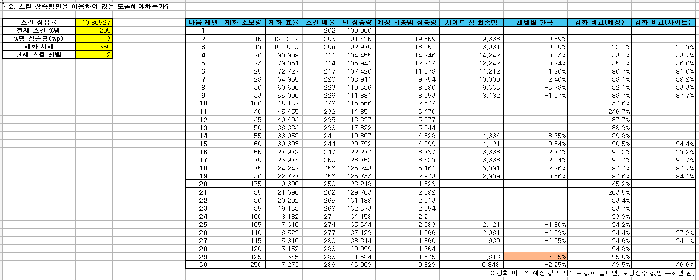
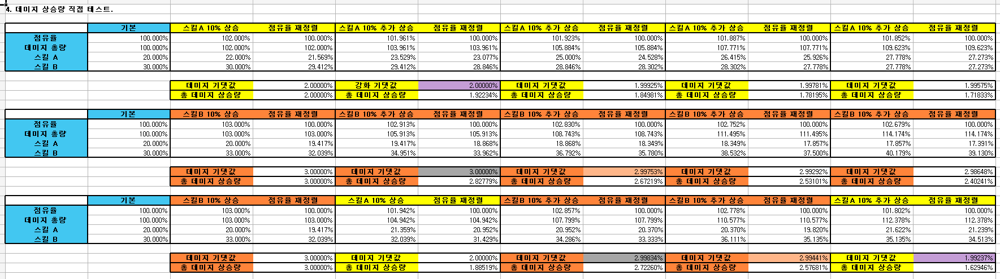
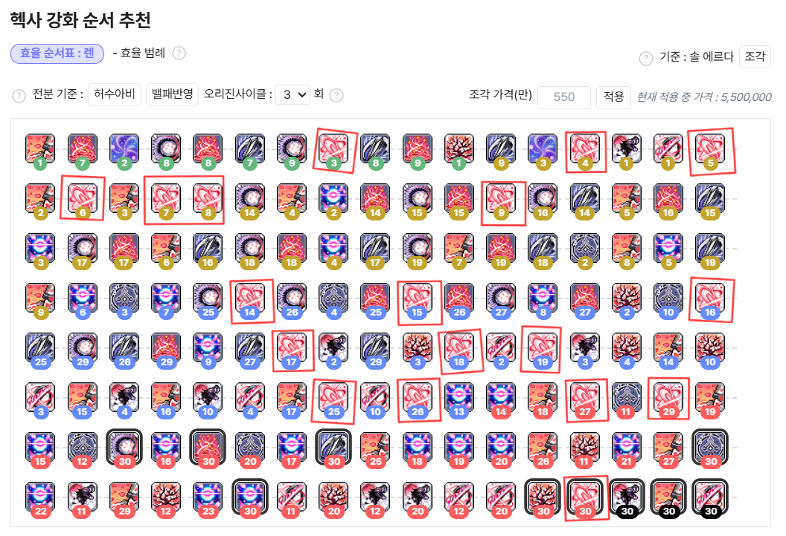

# my-calc-project

 

### 본 문서는 현재 작업 진행 중인 초안입니다.

### 목차에 포함된 항목만 정리되었으며, 내용은 지속적으로 추가 및 보완될 예정입니다. 특히 게임 관련 용어의 경우, 가독성을 위해 별도의 설명 없이 사용되었습니다.

### 프로젝트의 완전한 이해를 돕기 위한 상세한 게임 시스템 및 용어 설명은 추후 보충될 예정이니, 이 점 참고하여 주시기 바랍니다.

 

## 목차

[1. 기획 의도](#planning-intention) 
[2. 시제품 개발 전 시행착오](#trial-and-error-before-prototype-developmen) 
[3. 아키텍처 개선 과정](#architectural-improvement-process) 
4.&nbsp;시제품 
&emsp;[4-1) 시제품 제작](#prototype-development) 
&emsp;[4-2) 시제품 데이터 구조](#prototype-data-structure) 
&emsp;[4-3) 시제품 결과](#prototype-result) 
[5. 프로젝트 방향성](#project_direction) 
패치 분석 보고서(25.08.21) 추가 예정 
알파 프로젝트 제작 추가 예정 
알파 프로젝트 데이터 구조 추가 예정 
게임 시스템 설명 추가 예정 

   

<h2 id="planning-intention">1. 기획 의도</h2>

- 환산주스탯(=효율분석 사이트)의 특징 
  1.&nbsp;보편적 가이드라인. 
  &emsp;- 상위권 유저의 전투 데이터를 기반으로 제작한 헥사 코어 강화 순서를 제공하여 초보자에게 보편적 가이드라인을 제시합니다. 
  2.&nbsp;사용자의 강화 효율과 불일치. 
  &emsp;- 사용자의 전투 방식이 제공된 가이드라인과 다른 경우, 실제 강화 효율에 큰 차이가 발생할 수 있습니다. 
  3.&nbsp;개인별 최적화의 부재. 
  &emsp;- 개인별 '스킬 쿨타임 감소'나 '특수 스킬 반지' 같은 변수를 반영하지 못합니다. 
  4.&nbsp;고정된 강화 순서 제공. 
  &emsp;- 헥사 코어 레벨에 따라 달라지는 강화 효율을 고려하지 않고 고정된 강화 순서 및 강화 효율만을 제공합니다. 

위의 환산주스탯의 문제점을 개선하기 위해 개인별 분석 도구를 제작하였습니다. 

- 개인별 분석 도구의 특징 
  1.&nbsp;개인별 최적화. 
  &emsp;- 이 도구는 사용자에게 데이터를 직접 받아 가장 효율적인 강화 순서를 제공합니다. 

   

<h2 id="trial-and-error-before-prototype-development">2. 시제품 개발 전 시행착오</h2>

시행착오 기간: 25.07.02 ~ 25.08.13 
 
"환산주스탯에서 제공하는 헥사코어의 100억당 최종데미지 상승율 수치는 어떻게 제공될까?"라는 생각으로 시제품 개발 전에 해보았던 시행착오입니다. 
 
가설 1.&nbsp;제가 가지고 있는 스킬 %데미지 상승율을 활용하여 엑셀 시트를 만들었습니다. 
강화 효율 측정은 가장 단순한 코어 구성을 가진 렌의 '선참VI' 코어를 기준으로 삼아 진행했습니다.

분석 및 결론: 코어별 최대 레벨이 30레벨. 레벨별 간극이 최대 30% 벌어지므로, 이에 대해 '보정 상수가 존재하나?'라고 판단했습니다. 
 
가설 1-1.&nbsp;기존 엑셀 시트에 보정 상수(1레벨당 0.01% 감소)를 추가해 보았습니다.

분석 및 결론: 보정 상수를 넣어도 간극이 생기므로, "보정 상수를 제외하고, 스킬 %데미지에만 연관이 있나?"라고 가설을 세웠습니다. 
 
가설 2.&nbsp;'점유율(변동하지 않음) * 스킬 %데미지 상승율'을 활용하여 최종데미지 상승율을 산출해보았습니다.

분석 및 결론: 점유율이 고정되어도 간극이 생기므로, "스킬 %데미지 상승율은 또한 1레벨에서 2레벨로 상승 시의 상승율로 고정인가?"라고 가설을 세웠습니다. 
 
가설 3.&nbsp;'점유율(변동하지 않음) *스킬 %데미지 상승율(변동하지 않음)'을 활용하여 최종데미지 상승율을 산출해보았습니다.

분석 및 결론: 간극이 더 크게 벌어지므로, "코어별 강화 순서가 다르면 효율이 달라지나?" 라는 새로운 가설을 세웠습니다. 
 
가설 4.&nbsp;스킬 2가지를 번갈아 강화했을 때, 강화 효율이 어떻게 변화하는지 확인했습니다.

분석 및 결론: "강화 순서가 다르면, 강화 효율이 다르다."라는 결론에 도달했습니다. 
 
하지만, 메이플스토리에 코어들이 추가되면서 하나의 코어를 연속적으로 강화하는 것보다 다른 코어도 강화하는 것이 효율이 좋게 되어 검증에 난항을 겪게 되고, '선참VI'처럼 측정에 있어 단순한 코어를 찾기 또한 어려워 한동안 효율분석을 중지하였습니다. 
 
아래 이미지의 빨간색 영역은 렌의 '선참VI' 코어입니다. 하나의 코어가 연속적으로 강화하였을 때 효율적인 구조가 아님을 확인하실 수 있습니다.

> "어센트 스킬이 없었을 당시에 '선참VI' 코어를 5레벨에서 8레벨까지 연속적으로 강화하였을 때 효율적이지 않았냐?"라고 하실 수 있겠지만, 이 4레벨 구간만으로 전체 코어 강화 로직을 일반화하기 어렵다고 판단했습니다. 
 
25.07.17, 메이플스토리에 어센트 스킬이 추가되었습니다. 오리진 스킬 1회 사용 기준으로 효율을 측정하였을 때 2레벨에서 9레벨까지 연속적으로 강화하였을 때 효율적인 구조임을 확인하였고, 위 가설에 추가 테스트를 진행해 보았습니다. 
 
아래 이미지의 빨간색 영역은 렌의 어센트 스킬인 '창룡파천검 : 일매낙화 천비인적' 코어입니다. 하나의 코어가 연속적으로 강화하였을 때 효율적인 구조임을 확인하실 수 있습니다.

가설 5.&nbsp;어센트 스킬을 기준으로 가설 1을 추가 테스트하였습니다.

분석 및 결론: 계산 과정에서 발생한 '-0.044% ~ 0.081%'의 오차는 환산주스탯의 소수점 처리 방식의 차이라는 결론에 도달하였습니다. 

   

<h2 id="architectural-improvement-process">3. 아키텍처 개선 과정</h2>

### 아키텍처 1
- 설명
  - 강화 효율 측정에 필요한 모든 데이터(현재 레벨 기준 스킬 %데미지, 다음 레벨 기준 스킬 %데미지, 스킬 1회당 공격횟수, 측정된 공격횟수 등)를 입력받아 다음 스킬 강화를 추천하는 아키텍처.
- 이점 
  1.&nbsp;외부 요인에 영향받지 않는 분석 가능. 
  &emsp;- 밸런스 패치와 관계없이 효율 계산이 가능합니다.
- 문제점 
  1.&nbsp;많은 수동 입력. 
  &emsp;- 모든 스킬 정보를 직접 입력해야 하는 높은 입력 난이도가 존재합니다. 
  &emsp;- 특히 스킬별 1회당 공격횟수 같은 세부 정보를 모두 기억하기 어려워 잘못된 정보 기입 시 잘못된 효율이 측정되는 경우가 발생합니다.

### 아키텍처 2
- 설명
  - 스킬 정보는 데이터베이스에 저장되어 있으며, 사용자에게 필수 데이터(코어별 레벨, 해당 스킬 점유율, 재화 시세)만을 입력받아 다음 스킬 강화를 추천하는 아키텍처.
- 이점 
  1.&nbsp;낮은 수동 입력. 
  &emsp;- 모든 스킬 정보를 직접 입력해야 하는 기존과는 달리, 사용자에게 필수적인 데이터만을 요구합니다.
- 문제점 
  1.&nbsp;개발자의 관리 부담이 많음. 
  &emsp;- 밸런스 패치 마다 모든 스킬의 수치를 일일이 수정해야 하는 번거로움이 있습니다. 
  2.&nbsp;데이터의 부정확성. 
  &emsp;- 개발자가 업데이트를 늦추거나 누락하면, 사용자들은 구 버전의 데이터를 기반으로 잘못된 효율을 계산하게 됩니다.
- 아키텍처를 변경한 이유
  - 많은 수동 입력은 다수의 사용자들의 진입장벽이 될 것이기 때문에, 이를 개선하고자 데이터베이스에 스킬 정보를 저장하는 아키텍처로 변경하였습니다.

### 아키텍처 3-1
- 설명
  - 넥슨에서 제공하는 API(이하 넥슨 API)를 활용하여, 사용자에게 필수 데이터(코어별 레벨, 해당 스킬 점유율, 재화 시세)만을 입력받아 다음 스킬 강화를 추천하는 아키텍처.
- 이점 
  1.&nbsp;낮은 수동 입력. 
  &emsp;- 모든 스킬 정보를 직접 입력해야 하는 기존과는 달리, 사용자에게 필수적인 정보만을 요구합니다. 
  2.&nbsp;개발자의 관리 부담이 적어짐. 
  &emsp;- 넥슨 API에 모든 스킬 정보가 기재되어 있어, 개발자가 일일이 업데이트해야 하는 관리 부담이 줄어듭니다. 
  3.&nbsp;데이터의 신뢰성 확보. 
  &emsp;- 넥슨 API를 활용함으로써, 데이터의 신뢰성을 확보하고 분석 결과의 정확성을 높였습니다. 
  4.&nbsp;데이터베이스 관리 비용 절감. 
  &emsp;- 게임 데이터를 직접 관리하는 대신 넥슨 API를 활용함으로써, 데이터베이스에 직업별 스킬 정보를 저장할 필요가 없어 데이터베이스 관리 비용을 절감했습니다.
- 문제점 
  1.&nbsp;배포 및 접근성의 한계. 
  &emsp;- 현재 구상 중인 사용방식은 python 응용 프로그램에 넥슨 API를 사용하는 방식입니다. 
  &emsp;- 사용자는 python 실행 파일을 직접 설치해야 하고, 응용 프로그램 업데이트 시마다 매번 다운로드해야 하는 번거로움이 있어 접근성이 낮다는 한계가 있습니다.
- 아키텍처를 변경한 이유
  - '아키텍처 2'를 통해 사용자의 입력 부담은 해결했지만, 밸런스 패치마다 모든 스킬 정보를 수동으로 업데이트해야하는 비효율적인 문제가 남아있었습니다. 이는 도구의 신뢰성을 떨어뜨릴 수 있다고 판단했습니다. 따라서 직접 데이터를 관리하는 대신, 넥슨 API를 통해 최신 정보를 효율적으로 수집하고 관리 부담을 해결하고자 이 아키텍처를 구상했습니다.

### 아키텍처 3-2
- 설명
  - 스킬 정보를 표기 및 수정하는 웹 사이트를 구축하여, 사용자에게 필수 데이터(코어별 레벨, 해당 스킬 점유율, 재화 시세)만을 입력받아 다음 스킬 강화를 추천하는 아키텍처.
- 이점 
  1.&nbsp;낮은 수동 입력. 
  &emsp;- 모든 스킬 정보를 직접 입력해야 하는 기존과는 달리, 사용자에게 필수적인 정보만을 요구합니다. 
  2.&nbsp;배포 및 접근성이 용이함. 
  &emsp;- 웹 사이트로 제공되는 방식은 사용자가 직접 다운로드하고 설치해야 하는 방식에 비해 접근성이 높습니다. 
  3.&nbsp;높은 가시성. 
  &emsp;- 글로 제작된 python 응용 프로그램에 비해 웹 사이트에 이미지(스킬 이미지, 강화 효율표)를 넣어 가시성을 높힐 수 있습니다. 
  4.&nbsp;스킬 정보 변경 가능. 
  &emsp;- 밸런스 패치 때 수치적 변경만 있다면, 사용자가 직접 변경하여 효율을 측정할 수 있습니다.
- 문제점 
  1.&nbsp;개발자의 관리 부담이 많음. 
  &emsp;- 밸런스 패치마다 모든 스킬의 수치를 일일이 수정해야 하는 번거로움이 있습니다. 
  2.&nbsp;데이터의 부정확성. 
  &emsp;- 개발자가 업데이트를 늦추거나 누락하면, 사용자들은 구 버전의 데이터를 기반으로 잘못된 효율을 계산하게 됩니다. 
  3.&nbsp;데이터베이스 관리 비용 상승. 
  &emsp;- 모든 스킬 정보를 저장해야하므로 데이터베이스 관리 비용이 상승합니다.
- 아키텍처를 변경한 이유
  - 넥슨 API에서 모든 스킬 정보를 주는지 명확하지 않아, 웹사이트를 제작하여 사용자가 스킬 정보를 수정할 수 있는 아키텍처를 구상했습니다.

   

## 4. 시제품
<h2 id="prototype-development">4-1) 시제품 제작</h2>

### 테스트용 데이터는 최신화 됩니다. 각각의 제품 / 프로젝트의 기준 날짜를 확인해 주시길 바랍니다.

### 제작 기한
  - 예상 기간: 영업일 기준 8.5일. 
    (5일 + 4 * 8일 + 14일) / 6 = 8.5일.
  - 시작일: 25.08.14.
  - 기한일: 25.08.26.
  - 완성일: 25.09.05.(영업일 기준 16일)

### 본 프로젝트의 완성일은 개발자가 그 당시 보고서가 완성되었다고 판단한 시점으로 작성되었습니다. 보고서의 일관성을 위하여 보완된 내용은 완성일 이후에 수정되었습니다.

### 기능 요구사항

  
- 전제조건 
  1.&nbsp;테스트용 데이터는 25.08.14 기준 개발자의 코어 강화 상태와 점유율임. 
  2.&nbsp;기본 스킬의 %데미지는 '쓸만한 컴뱃 오더스'가 사용 중인 상태를 기준으로 작성함. 
  3.&nbsp;'어비스 차지드라이브 스펠VI'는 스킬 레벨에 따라 '대상에게 적중 시 보스 공격 시 데미지 증가'의 효과가 증가하지만, 시제품에선 스킬 %데미지만의 효율을 측정하기 때문에 제외하고 측정함. 
  4.&nbsp;분석의 범위를 명확히 설정하기 위해서 '다가오는 죽음'은 '인피니티 스펠' 사용 시에만 발생하는 경우를 기준으로 강화 효율을 측정함. 
  5.&nbsp;마스터리 코어 효율 계산에 영향을 미치는 '강화 코어의 인피니티 스펠 사용 시 다가오는 죽음 %p 상승'은 19레벨 기준으로 계산함. 
  
> &emsp;'쓸만한 컴뱃 오더스'는 '일부 스킬만' 최대 레벨이 30레벨에서 31레벨로 상승하는 버프 스킬임. 
> &emsp;'인피니티 스펠'은 50초간 '다가오는 죽음'이 3개 추가로 생성함. 이 스킬은 강화 코어의 효과를 받아 '다가오는 죽음'의 데미지를 133%p 추가로 상승하는 버프 스킬임.

- 입력되는 데이터 
  1.&nbsp;마스터리 코어별 현재 레벨. 
  2.&nbsp;스킬별 점유율.

- 출력되어야할 데이터 
  1.&nbsp;코어 종류. 
  2.&nbsp;코어 추천 레벨. 
  3.&nbsp;최종데미지 상승율. 
  4.&nbsp;100억당 최종데미지 상승율.

### 구현 요구사항

- 데이터 구조
  - 외부 데이터(불변)
    - 기본(4차 이하 및 하이퍼) 스킬(딕셔너리)
      - 스킬 이름(딕셔너리)
        - 최대 레벨 기준 %데미지(변수)
    - 마스터리 코어1(딕셔너리)
      - 스킬 이름(딕셔너리)
        - 30레벨 기준 %데미지(변수)
        - 1레벨 상승 시 %데미지 상승량(%p)(변수)
    - 마스터리 코어2(딕셔너리)
      - 스킬 이름(딕셔너리)
        - 30레벨 기준 %데미지(변수)
        - 1레벨 상승 시 %데미지 상승량(%p)(변수)
    - 마스터리 코어3(딕셔너리)
      - 스킬 이름(딕셔너리)
        - 30레벨 기준 %데미지(변수)
        - 1레벨 상승 시 %데미지 상승량(%p)(변수)
    - 마스터리 코어4(딕셔너리)
      - 스킬 이름(딕셔너리)
        - 30레벨 기준 %데미지(변수)
        - 1레벨 상승 시 %데미지 상승량(%p)(변수)
    - 마스터리 코어 1~30레벨 재화 소모량(리스트)
    - 마스터리 코어 리스트 = [마스터리 코어1, 마스터리 코어2, 마스터리 코어3, 마스터리 코어4]

  - 내부 데이터(사용자 캐릭터 정보, 변동)
    - 마스터리 코어1(딕셔너리)
      - 현재 레벨(변수)
      - 데미지 상승율(딕셔너리)
        - 1레벨 상승 시 최종데미지 상승율(변수)
        - 1레벨 상승 시 100억당 최종데미지 상승율(변수)
        - 5레벨 상승 시 평균 최종데미지 상승율(변수)
        - 5레벨 상승 시 100억당 평균 최종데미지 증가율(변수)
      - 스킬(딕셔너리)
        - 스킬 이름(딕셔너리)
          - 현재 레벨 기준 %데미지(변수)
          - 1레벨 상승 시 %데미지 상승량(%p)(변수)
          - 점유율(변수)
    - 마스터리 코어2(딕셔너리)
      - 현재 레벨(변수)
      - 데미지 상승율(딕셔너리)
        - 1레벨 상승 시 최종데미지 상승율(변수)
        - 1레벨 상승 시 100억당 최종데미지 상승율(변수)
        - 5레벨 상승 시 평균 최종데미지 상승율(변수)
        - 5레벨 상승 시 100억당 평균 최종데미지 증가율(변수)
      - 스킬(딕셔너리)
        - 스킬 이름(딕셔너리)
          - 현재 레벨 기준 %데미지(변수)
          - 1레벨 상승 시 %데미지 상승량(%p)(변수)
          - 점유율(변수)
    - 마스터리 코어3(딕셔너리)
      - 현재 레벨(변수)
      - 데미지 상승율(딕셔너리)
        - 1레벨 상승 시 최종데미지 상승율(변수)
        - 1레벨 상승 시 100억당 최종데미지 상승율(변수)
        - 5레벨 상승 시 평균 최종데미지 상승율(변수)
        - 5레벨 상승 시 100억당 평균 최종데미지 증가율(변수)
      - 스킬(딕셔너리)
        - 스킬 이름(딕셔너리)
          - 현재 레벨 기준 %데미지(변수)
          - 1레벨 상승 시 %데미지 상승량(%p)(변수)
          - 점유율(변수)
    - 마스터리 코어4(딕셔너리)
      - 현재 레벨(변수)
      - 데미지 상승율(딕셔너리)
        - 1레벨 상승 시 최종데미지 상승율(변수)
        - 1레벨 상승 시 100억당 최종데미지 상승율(변수)
        - 5레벨 상승 시 평균 최종데미지 상승율(변수)
        - 5레벨 상승 시 100억당 평균 최종데미지 증가율(변수)
      - 스킬(딕셔너리)
        - 스킬 이름(딕셔너리)
          - 현재 레벨 기준 %데미지(변수)
          - 1레벨 상승 시 %데미지 상승량(%p)(변수)
          - 점유율(변수)
    - 마스터리 코어 리스트 = [마스터리 코어1, 마스터리 코어2, 마스터리 코어3, 마스터리 코어4]  
    
     >&emsp;주의 사항1: 기본 스킬의 스킬 이름의 하위 항목에 30레벨 기준 %데미지라고 작성하지 않은 이유는 '쓸만한 컴뱃 오더스'를 사용 시 '일부 스킬만' 최대 레벨인 30레벨에서 31레벨로 상승하기 때문에 최대 레벨이라고 작성함. 
     >&emsp;주의 사항2: 5레벨 상승 시 측정하는 이유는 특정 구간에서 효율이 급격하게 감소했다가 효율이 다시 올라가는 구조이기 때문에 구간별 소모 재화량(평균) 중 가장 좋은 효율을 기준으로 평균을 내어 작성함.

    스킬 레벨별 재화 소모량
    | 스킬 레벨 | 재화 소모량 |
    |:---:|:---:|
    | 8 -> 9 | 33 |
    | 9 -> 10 | 100 |
    | 10 -> 11 | 40 |
    | 11 -> 12 | 45 |
    | 12 -> 13 | 50 |
    | 13 -> 14 | 55 |
    | 14 -> 15 | 60 |

    구간별 재화 소모량(평균)
    | 스킬 레벨 | 재화 소모량 |
    |:---:|:---:|
    | 9 -> 13 | 총합 235 평균 58.75 |
    | 9 -> 14 | 총합 290 평균 58.00 |
    | 9 -> 15 | 총합 350 평균 58.33 |

- 메인 함수 
  1.&nbsp;사용자로부터 입력받는 함수 실행. 
  2.&nbsp;현재 레벨 기준 스킬 %데미지 조정하는 함수 실행. 
  3.&nbsp;강화효율 산출하는 함수 실행. 
  4.&nbsp;강화 추천하는 함수 실행. 
  5.&nbsp;결과 출력하는 함수 실행. + if not 리턴값: break 
  6.&nbsp;점유율 재조정하는 함수 실행. 
  7.&nbsp;데미지 업데이트하는 함수 실행. 
  8.&nbsp;위의 3~7를 반복. 

- 정의할 함수 종류
  - 사용자로부터 입력받는 함수.
    - 매개변수
      - 마스터리 코어 리스트(리스트)
    - 처리과정
      - 사용자로부터 마스터리 코어별 현재 레벨, 스킬별 점유율을 입력받음.
      - 입력받은 데이터가 정상적인 데이터인지 확인함.
      - 검증된 데이터를 마스터리 코어 리스트(리스트)에 저장함. 
    - 처리사항
      - 마스터리 코어별 현재 레벨이 int 형식이 아니라면, 다시 입력.
        - try: except Value Error:를 활용.
      - 마스터리 코어별 현재 레벨이 0이하 또는 31이상이라면, 다시 입력.
      - 스킬별 점유율이 int 형식 또는 float 형식이 아니라면, 다시 입력.
        - try: except Value Error:를 활용.
      - 스킬별 점유율이 0미만이라면, 다시 입력.
      - 스킬별 점유율 합산이 100초과하면, 다시 입력.
    - 리턴값
      - 마스터리 코어 리스트(리스트)
  
  - 현재 레벨 기준 스킬 %데미지 조정하는 함수.
    - 매개변수
      - 마스터리 코어 리스트(리스트)
    - 처리과정
      - 마스터리 코어별 딕셔너리 중 중복된 스킬이 있다면, 현재 레벨 기준 스킬 %데미지, 점유율을 조정함.
      - 조정된 현재 레벨 기준 스킬 %데미지, 점유율을 마스터리 코어 리스트(리스트)에 저장함.
      >&emsp;ex) 마스터리 코어2인 차지드라이브 변형 인스팅트 아츠 VI의 패시브 효과: 돌아오는 증오 VI 2%p 상승 효과와 마스터리 코어3인 돌아오는 증오 VI: 7%p 상승 효과가 서로에게 직접적으로 영향을 미침. 
      >&emsp;마스터리 코어2인 차지드라이브 변형 인스팅트 아츠 VI의 패시브 효과: 돌아오는 증오 VI의 현재 레벨 기준 스킬 %데미지 = 마스터리 코어3인 차지드라이브 변형 인스팅트 아츠 VI의 패시브 효과 + 강화스킬2인 돌아오는 증오 VI 
      >&emsp;마스터리 코어3인 돌아오는 증오 VI의 현재 레벨 기준 스킬 %데미지 = 마스터리 코어2인 차지드라이브 변형 인스팅트 아츠 VI의 패시브 효과: 돌아오는 증오 VI + 마스터리 코어3인 돌아오는 증오 VI
    - 처리사항
      - 두 딕셔너리 내에 중복된 키가 있는지, keys() + 교집합을 이용하여 중복된 키를 추출함.
    - 리턴값
      - 마스터리 코어 리스트(리스트)
  
  - 강화효율 산출하는 함수.
    - 매개변수
      - 마스터리 코어 리스트(리스트)
    - 설명
      - 마스터리 코어별/스킬별 최종데미지 상승율을 산출하는 과정.
    - 처리과정
      - 재화 시세, 마스터리 코어 1~30레벨 재화 소모량, 마스터리 코어 리스트(리스트)를 이용하여, 재화 효율, 스킬 최종데미지 상승율을 산출함. 
      - 1레벨 상승 시 최종데미지 상승율, 1레벨 상승 시 100억당 최종데미지 상승율, 5레벨 상승 시 평균 최종데미지 상승율, 5레벨 상승 시 100억당 평균 최종데미지 상승율을 산출함.
      - 모든 최종데미지 상승율은 마스터리 코어 리스트(리스트)에 저장함.
    - 처리사항
      - 재화 시세는 성능 향상을 위해 550만 대신 550을 사용함.
      - 재화 소모량 = 마스터리 코어 1~30레벨 재화 소모량[마스터리 코어[현재 레벨]]
      - 평균 재화 소모량은 (마스터리 코어 1~30레벨 재화 소모량에서 '현재 레벨' 부터 '현재 레벨 + 4'까지를 합산된 수치) / 5임.
      - 재화 효율은 성능 향상을 위해 100억 대신 100만을 사용함.
      - (평균)재화 효율 = 100만 / (재화 시세 * (평균)재화 소모량)
      - 스킬 데미지 상승율 = 1레벨 상승 시 %데미지 상승량(%p) / 현재 레벨 기준 %데미지
      - 평균 스킬 데미지 상승율은 (이 마스터리 코어를 5레벨 연속으로 강화했을 경우, 스킬 데미지 상승율이 합산된 수치) / 5 임.
      - (평균)최종데미지 상승율 = (평균)점유율 * (평균)스킬 데미지 상승율
      - 100억당 (평균)최종데미지 상승율 = (평균)재화 효율 * 점유율 * (평균)스킬 데미지 상승율
    - 리턴값
      - 마스터리 코어 리스트(리스트)
     
  - 강화 추천하는 함수.
    - 매개변수
      - 마스터리 코어 리스트(리스트) 
    - 처리과정
      - 마스터리 코어별로 1레벨 상승 시 100억당 최종데미지 상승율, 5레벨 상승 시 100억당 평균 최종데미지 상승율을 한 리스트에 담음.
      - 그 리스트에서 인덱스와 최댓값으로 가장 효율 좋은 마스터리 코어 번호 및 강화 횟수를 유추함.
    - 처리사항
      - 가장 효율 좋은 마스터리 코어 번호 = 최댓값 인덱스 // 2 + 1
      - 최댓값이 0이면, 0, 0을 리턴함.
        - 모든 스킬이 최대 레벨을 달성함.
      - 최댓값 인덱스 % 2가 0이면, 가장 효율 좋은 마스터리 코어 번호, 1을 리턴함.
        - 최댓값 인덱스는 0, 2, 4, 6이므로 1레벨 상승 시 100억당 최종데미지 상승율 관련 데이터가 존재함.
      - 아니라면, 가장 효율 좋은 마스터리 코어 번호, 5를 리턴함.
        - 최댓값 인덱스는 1, 3, 5, 7이므로 5레벨 상승 시 100억당 평균 최종데미지 상승율 관련 데이터가 존재함.
    - 리턴값
      - 가장 효율 좋은 마스터리 코어 번호, 강화 횟수
      
  - 결과를 출력하는 함수.
    - 매개변수
      - 마스터리 코어 번호, 강화 횟수.
    - 처리과정
      - 강화할 스킬이 있다면, 스킬 이름 및 추천 레벨 및 최종데미지 상승율을 출력함.
    - 처리사항
      - 강화 횟수가 0이라면, False를 리턴함.
        - 모든 스킬이 최대 레벨을 달성함.
      - 아니라면, True를 리턴함.
    - 리턴값
      - bool형
        
  - 점유율 조정하는 함수.
    - 매개변수
      - 마스터리 코어 리스트(리스트), 마스터리 코어 번호, 강화 횟수
    - 처리과정
      - 가장 효율 좋은 마스터리 코어 번호 및 강화 횟수를 활용하여 마스터리 코어 스킬의 현재 레벨, 점유율, 현재 레벨 기준 스킬 %데미지를 상승시킴.
      - 나머지 마스터리 코어의 점유율을 상승된 최종데미지에 비례하여 낮춤.
    - 처리사항
      - 가장 효율 좋은 마스터리 코어라면, 새로운 점유율을 '점유율 * (1 + 데미지 상승율)/ (1 + 점유율 * 데미지 상승율 / 100)'로 처리함.
        - 데미지 상승율 = 데미지 상승량(%p) / 현재 레벨 기준 스킬 %데미지
      - 나머지 마스터리 코어라면, 새로운 점유율을 '현재 점유율 / (1 + 합산된 점유율 상승량 / 100)'로 처리함.
        - 점유율 상승량 = 새로운 점유율 - 기존 점유율
    - 리턴값
      - 마스터리 코어 리스트(리스트)

  - 데미지 갱신하는 함수.
    - 매개변수
      - 마스터리 코어 리스트(리스트)
    - 처리과정
      - 서로 다른 마스터리 코어이면서 동일한 스킬의 현재 레벨 기준 %데미지가 다르다면, 높은 쪽의 점유율을 기준으로 현재 레벨 기준 스킬 %데미지와 점유율을 갱신함.
      >&emsp;ex) 마스터리 코어2인 차지드라이브 변형 인스팅트 아츠 VI의 패시브 효과: 돌아오는 증오 VI 2%p 상승 효과와 마스터리 코어3인 돌아오는 증오 VI: 7%p 상승 효과가 서로에게 직접적으로 영향을 미침. 
      >&emsp;마스터리 코어2인 차지드라이브 변형 인스팅트 아츠 VI의 패시브 효과: 돌아오는 증오 VI의 현재 레벨 기준 스킬 %데미지 = 마스터리 코어3인 차지드라이브 변형 인스팅트 아츠 VI의 패시브 효과 + 강화스킬2인 돌아오는 증오 VI  
      >&emsp;마스터리 코어3인 돌아오는 증오 VI의 현재 레벨 기준 스킬 %데미지 = 마스터리 코어2인 차지드라이브 변형 인스팅트 아츠 VI의 패시브 효과: 돌아오는 증오 VI + 마스터리 코어3인 돌아오는 증오 VI
    - 처리사항
      - 두 딕셔너리 내에 키가 중복인 키가 있는지 set()함수 + 교집합을 이용하여 확인함.
    - 리턴값
      - 마스터리 코어 리스트(리스트)

   

<h2 id="prototype-data-structure">4-2) 시제품 데이터 구조</h2>

### 스킬 1회당 공격횟수를 포함한 "총합 %데미지"입니다. 데이터 구조 확인에 참고 바랍니다.
### 자세한 설명은 기능 요구사항 문서의 전제조건을 참조 바랍니다. [>> 전제조건 항목으로 이동](#prerequisites)

기본(4차 이하 및 하이퍼) 스킬
| 스킬 이름 | %데미지 |
|:---:|:---:|
| 플레인 차지드라이브 | 1839 |
| 플레인 스펠 | 373 |
| 스칼렛 차지드라이브 | 2118 |
| 스칼렛 스펠 | 1105 |
| 거스트 차지드라이브 | 2418 |
| 거스트 스펠 | 924 |
| 어비스 차지드라이브 | 3850 |
| 어비스 스펠 | 144 |
| 지워지지 않는 상처 | 2958 |
| 채워지지 않는 굶주림 | 3451 |
| 걷잡을 수 없는 혼돈 | 5316 |
| 멈출 수 없는 충동 | 2190 |
| 멈출 수 없는 본능 | 2778 |
| 돌아오는 증오 | 2898 |
| 황홀한 구속 | 36340 |
| 끝없는 고통 | 41400 |
| 끝나지 않는 악몽 | 2658 |
| 끝나지 않는 흉몽 | 2688 |
| 다가오는 죽음 | 906 + 266 |

> 다가오는 죽음에 추가된 '266'은 강화 코어인 인피니티 스펠의 효과로 인한 상승 수치입니다.

마스터리 코어1 스킬
| 스킬 이름 | 최대 %데미지 | %데미지 상승량(%p)|
|:---:|:---:|:---:|
| 플레인 차지드라이브VI | 3615 | 42 |
| 플레인 스펠VI | 1610 | 20 |
| 스칼렛 차지드라이브VI | 4530 | 54 |
| 스칼렛 스펠VI | 2375 | 30 |
| 거스트 차지드라이브VI | 5250 | 66 |
| 거스트 스펠VI | 1980 | 24 |
| 어비스 차지드라이브VI | 7894 | 102 |
| 어비스 스펠VI | 302 | 4 |
| 깨어난 심연(신규 패시브) | 4380 | 48 |

마스터리 코어2 스킬
| 스킬 이름 | 최대 %데미지 | %데미지 상승량(%p)|
|:---:|:---:|:---:|
| 지워지지 않는 상처VI | 8040 | 102 |
| 채워지지 않는 굶주림VI | 9268 | 112 |
| 걷잡을 수 없는 혼돈VI | 14220 | 168 |
| 멈출 수 없는 충동(패시브) | 2450 | 55 |
| 멈출 수 없는 본능(패시브) | 2940 | 66 |
| 돌아오는 증오VI(패시브) | 480 | 16 |

마스터리 코어3 스킬
| 스킬 이름 | 최대 %데미지 | %데미지 상승량(%p)|
|:---:|:---:|:---:|
| 돌아오는 증오VI | 8320 | 96 |
| 황홀한 구속VI | 82200 | 920 |
| 끝없는 고통VI | 66330 | 630 |

마스터리 코어4 스킬
| 스킬 이름 | 최대 %데미지 | %데미지 상승량(%p)|
|:---:|:---:|:---:|
| 잊혀지지 않는 악몽VI | 6685 | 84 |
| 잊혀지지 않는 흉몽VI | 797 | 84 |
| 다가오는 죽음 | 120 | 4 |

마스터리 코어 레벨별 재화 소모량
| 다음 레벨 | 재화 소모량 | 다음 레벨 | 재화 소모량 | 다음 레벨 | 재화 소모량 |
|:---:|:---:|:---:|:---:|:---:|:---:|
| 1 | 50 | 11 | 40 | 21 | 85 |
| 2 | 15 | 12 | 45 | 22 | 90 |
| 3 | 18 | 13 | 50 | 23 | 95 |
| 4 | 20 | 14 | 55 | 24 | 100 |
| 5 | 23 | 15 | 60 | 25 | 105 |
| 6 | 25 | 16 | 65 | 26 | 110 |
| 7 | 28 | 17 | 70 | 27 | 115 |
| 8 | 30 | 18 | 75 | 28 | 120 |
| 9 | 33 | 19 | 80 | 29 | 125 |
| 10 | 100 | 20 | 175 | 30 | 250 |

테스트용 데이터의 현재 마스터리 코어별 레벨
| 마스터리 코어 번호 | 1 | 2 | 3 | 4 |
|:---:|:---:|:---:|:---:|:---:|
| 현재 레벨 | 19 | 9 | 9 | 9 |

테스트용 데이터의 마스터리 코어1 점유율
| 스킬 이름 | 스킬별 점유율 |
|:---:|:---:|
| 플레인 차지드라이브VI | 3.84 |
| 플레인 스펠VI | 1.63 |
| 스칼렛 차지드라이브VI | 0.54 |
| 스칼렛 스펠VI | 0.27 |
| 거스트 차지드라이브VI | 0.89 |
| 거스트 스펠VI | 0.32 |
| 어비스 차지드라이브VI | 0.89 |
| 어비스 스펠VI | 0.35 |
| 깨어난 심연(신규 패시브) | 11.51 |

테스트용 데이터의 마스터리 코어2 점유율
| 스킬 이름 | 스킬별 점유율 |
|:---:|:---:|
| 지워지지 않는 상처VI | 1.61 |
| 채워지지 않는 굶주림VI | 1.93 |
| 걷잡을 수 없는 혼돈VI | 1.99 |
| 멈출 수 없는 충동(패시브) | 0.61 |
| 멈출 수 없는 본능(패시브) | 1.51 |
| 돌아오는 증오VI(패시브) | 12.14 |

테스트용 데이터의 마스터리 코어3 점유율
| 스킬 이름 | 스킬별 점유율 |
|:---:|:---:|
| 돌아오는 증오VI | 12.14 |
| 황홀한 구속VI | 2.32 |
| 끝없는 고통VI | 2.0 |

테스트용 데이터의 마스터리 코어4 점유율
| 스킬 이름 | 스킬별 점유율 |
|:---:|:---:|
| 잊혀지지 않는 악몽VI | 0.96 |
| 잊혀지지 않는 흉몽VI | 8.42 |
| 다가오는 죽음 | 27.1 |

   

<h2 id="prototype-result">4-3) 시제품 결과</h2>

1. 프로젝트 이름: 아크 마스터리 코어 효율 시뮬레이션(시제품 프로젝트).
2. 개발 목표: 아크 직업의 마스터리 코어 효율을 정밀하게 분석하여 최적의 스킬 강화 순서를 도출합니다.
3. 주요 기능: 현재 스킬 레벨과 점유율을 바탕으로 강화 효율을 측정하여, 어떤 코어를 강화하는 것이 가장 효율적인지 추천합니다.
4. 전제조건: 기능 요구사항 문서를 참조 바랍니다. [>> 전제조건 항목으로 이동](#prerequisites)
5. 사용한 언어: python.
6. 프로그램 구조: test_model_main.py은 메인 스크립트이며, 사용자가 입력한 데이터를 토대로 스킬 정보를 담고 있습니다. test_model.py은 데이터 처리 로직을 모듈화한 스크립트 및 아크 직업 스킬 정보를 담고 있습니다.
7. 핵심 로직 및 공식: 구현 요구사항 문서를 참조 바랍니다. [>> 핵심 로직 및 공식 항목으로 이동](#logic)
8. 시제품 사용 방법: 
   1.&nbsp;프로그램 실행을 위해 python 환경이 필요합니다. 
   2.&nbsp;시제품을 다운로드합니다. [>> 시제품 다운로드 하기](https://github.com/jji1442/my-calc-project/releases/download/ver.1.0/test_model.zip) 
   3.&nbsp;test_model_main을 실행합니다. 
     - 테스트용 데이터 사용 시: test_model_main 스크립트 내에 아래와 같이 수정하면 데이터를 입력하지 않아도 개발자의 테스트용 데이터가 자동으로 입력됩니다.
     >&emsp;mastery_core_list = test_model.input_data(mastery_core_list)  ->  #mastery_core_list = test_model.input_data(mastery_core_list) 
     >&emsp;#mastery_core_list = test_model.test_data(mastery_core_list)  ->  mastery_core_list = test_model.test_data(mastery_core_list)  
     >&emsp;주의사항: test_data(mastery_core_list) 함수에는 데이터 검증 기능이 없습니다.
     >                테스트용 데이터에 비정상적인 데이터 종류 또는 값을 넣을 경우, 정확하지 않은 효율 측정 또는 오류를 일으킬 수 있으니 데이터를 변경하시는 경우 이 점을 주의해 주시기 바랍니다.
9. 시제품 이미지: 
&emsp;아래의 시제품 이미지는 사용자가 데이터를 입력하는 과정을 보여줍니다. 첫 사진의 파란색 영역을 보시면, 입력 형식이 다르거나 원하는 범위를 벗어난 값을 입력하면 재입력을 요구하도록 설정하여 프로그램의 안정성을 높였습니다. 그 아래 빨간색 영역은 특정 구간에서 5레벨 상승 시 코어 효율이 크게 증가한다는 것을 나타냅니다. 마지막 사진의 초록색 영역은 각 코어의 현재 레벨부터 최대 레벨까지의 모든 효율을 측정하여 최종 결과를 도출한 것을 보여줍니다.

10. 시제품 제작 후기: 
&emsp;문서화 과정과 코드 최적화에 총 16일이 소요되었고, 그중 약 13일을 문서화에 할애했습니다. 저는 이 문서화 작업을 단순한 기록이 아닌 설명서라 생각하고, 다른 개발자가 프로젝트를 한눈에 이해할 수 있도록 만드는 데 집중했습니다. 

   

<h2 id="project_direction">7. 프로젝트 방향성</h2>

- 알파 버전: 기반 확장 - '합리적인 부분 내에서' 모든 스킬을 자동으로 강화 추천.
- 알파 버전: 기능 확장 - 다양한 기능 추가.
  - 개인 pc 내에 데이터 저장하는 기능.
  - 개발자가 코어를 추천해주는 기능.
  - 스킬별 상세보기 기능.
  - 원하는 스킬 강화 수준 까지 최종데미지 상승율 및 재화 소모량을 측정해주는 기능 등.
- 베타 버전: 정밀 분석 - '논리적인 부분 내에서' 모든 스킬의 효율을 재검토 및 기능 추가.
  - 간편 모드(합리적인 부분) / 상세 모드(논리적인 부분) 기능.
- 릴리즈 버전: 공식 출시 - 웹 사이트 및 데이터베이스를 이용하여 스크립트 재구축함. 웹 사이트용 이미지 추가.

> 합리적인 부분과 논리적인 부분의 차이. 
> 스킬A: 40초 동안 공격력 483 증가(쿨타임 120초) 
> 합리적인 부분: '가동율'을 기준으로 계산함. -> 공격력 * 지속 시간 / 쿨타임 = 483 * 40 / 120 = 161 
> 논리적인 부분: '시간적 딜 지분율'을 기준으로 계산함.(스킬A 가동 중 전체 딜량의 75%를 차지) 
> -> 공격력 * 가동시간 동안 전제 딜량 중 차지하는 비율 = 483 * 0.75 = 362.25

   

## 8. 패치 분석 보고서(25.08.21)

보고서 작성 기간: 25.09.09 ~  
게임사에서 전투 경험 개선 목적으로 아크에게 '링 익스체인지' 스킬과 '최종데미지 6% 증가' 패시브를 추가하였습니다. 
 
<변화된 강화 효율에 대한 평가> 
'링 익스체인지'로 인한 코어 강화 효율 변화를 보려고 합니다. 
'최종데미지 6% 증가' 패시브의 경우 모든 스킬에 동일하게 적용되는 상시로 증가하는 효과이므로, 스킬 간의 상대적인 효율을 측정하는 데에는 영향이 없습니다. 
25.09.13 기준으로 잊혀지지 않는 악몽VI/잊혀지지 않는 흉몽VI/다가오는 죽음의 코어가 기존 9레벨에서 19레벨로 변경되었습니다. 

### 측정해봐야하는 종류
전 직업 공용 스킬인 스인미, 크오솔 제외 / 허수아비형 보스에선 효용 가치가 없는 일리움 링크 제외 / 서버렉으로 인하여 편차가 심한 일격필살 제외
준극딜은 사용하였습니다.
총 3회 측정하고, 평균값 낸 수치를 작성하였습니다.
1. 허수아비형 보스 링 익스체인지 '없이' 오리진을 포함한 6분 사이클. 298조
2. 허수아비형 보스 링 익스체인지 '있이' 오리진을 포함한 6분 사이클. 303조

| 전투 횟수 | 1번 총 피해량 | 2번 총 피해량 |
|:---:|:---:|:---:|
| 1 | 298조 2823억 ||
| 2 | 298조 9943억 ||
| 3 | 298조 0762억 ||
| 평균 | 298조 4509억 | | |

웨폰퍼프 링 사용으로 인한 딜 상승량은 @%이며,
이로 인해, 아크의 메인 스킬들의 딜 점유율 변화는
다가오는 죽음: 26.89% ->
깨어난 심연: 11.98% ->
돌아오는 증오VI: 11.91% ->
잊혀지지 않는 흉몽VI: 9.57%->

이렇게 되었습니다.

<패치에 대한 평가> 
전투 경험 개선을 패치한 이유는 '최초의 대적자(이하 신규 보스)'에 의해 패치된 것으로 추정됩니다. 
 
패치 이전, 제 아크는 허수아비형 보스에게 2분 주기 2회 기준 @@조를 기록했습니다. 
하지만 패치 이후, 신규 보스에서 '링 익스체인지' 스킬 추가 및 최종데미지 6% 상승으로 측정된 보스 입장 후 2분 주기 2번 딜량은 패치 이전 두 딜량의 90% 수준인 @@조를 기록했습니다. 
 
이러한 데이터를 미루어 보았을 때, '링 익스체인지' 스킬 추가 및 '최종데미지 6% 증가' 패시브 추가는 신규 보스의 실전 딜량과 허수아비형 보스 딜량의 괴리율을 줄이기 위한 의도였을 가능성이 높습니다. 
아크는 실전에서 허수아비형 보스에게 입히는 피해량의 85 ~ 90%를 뽑아냈지만, 이번의 패치가 없었다면 신규 보스에서는 70 ~ 75%로 딜량이 크게 하락했을 것으로 추정됩니다. 
 
측정된 데이터를 기반으로 한 개인적인 분석임을 알려드립니다. 

측정 방식은 다음과 같습니다.
- 전제조건: 2분 주기 스킬은 측정 중 3회, 1분 주기 스킬은 측정 중 6회로 제한한다.
1. 허수아비형 보스(수련장)를 링 익스체인지 '사용하지 않고' 오리진 스킬을 포함한 6분 주기 + 최종데미지 6% 증가를 제외하여 계산
2. 노말 난이도의 신규 보스를 링 익스체인지 '사용하고' 오리진 스킬을 포함한 힘의 순환 3번(6분 주기)

3. 

2분 주기 기준으로 피해량 차이를 작성하려고 했으나, 보스 패턴 운에 치우치지 않은 평균적인 데이터를 얻기 위해서 6분 주기로 측정하였습니다.
추가적으로 신규 보스의 '힘의 순환' 주기가 2분 15초 마다 이므로, 메인 패턴(검 소나기 패턴, 본체 찾기 패턴)에는 공격하지 않는 것으로 시간에 의한 피해량 편차를 줄이도록 노력하였습니다.
'힘의 순환'의 1주기 당 공격이 가능한 시간은 약 1분 59초 입니다.
준극딜 때 사용하는 '끝없는 고통'은 보스 패턴을 맞을 위험(패턴 적중 시 최종데미지 감소)이 있어 해당 스킬은 사용하지 않았습니다.

[하이퍼 링크 종류]
힘의 순환
준극딜

위 '1번 데미지 총량의 90% = 2번 데미지 총량' 이라면, 전투 경험 개선을 패치한 이유는 신규 보스에 의한 것으로 추정됩니다.
이렇게 추정하는 이유는 아크가 실전에서 허수아비형 보스(수련장)에게 입히는 데미지의 85 ~ 90%를 보여줬지만, 이번의 패치가 없었다면 신규 보스에서는 70 ~ 75%로 데미지가 크게 하락했을 것으로 추정됩니다.

노말 대적자에서 측정할 것.

## 9. 패치 분석 보고서(25.09.11)

<게임 시스템 변화>

   

## 8. 알파 프로젝트 제작

- 용어 정리 해야함

### 기존 프로젝트 개선

1. 개선점.
기존: 19레벨 기준 5레벨 상승 시 기준으로 효율 측정 
변경: 19레벨 기준으로는 6레벨 상승 시 기준으로 효율 측정 
설명: 19레벨 기준 5레벨 상승 시 평균 재화 소모량 보다 6레벨 상승 시 평균 재화 소모량이 더 낮았습니다. 
 
2.  9레벨, 19레벨에서 5, 6레벨 상승 시 평균 최종데미지 상승율을 측정하면 
기존: 9레벨, 19레벨에서 5, 6레벨 상승 시 평균 최종데미지 상승율을 측정하면 기존보다 처리속도가 더 빨라졌습니다.
변경: 9레벨, 19레벨에서 5, 6레벨 상승 시 평균 최종데미지 상승율을 측정하도록 변경하였습니다.
최적화 결과: 아직 측정되지 않음

### 테스트용 데이터는 최신화 됩니다. 각각의 제품 / 프로젝트의 기준 날짜를 확인해 주시길 바랍니다.

### 제작 기한
  - 예상 기간: 영업일 기준 17.33일. 
    (13일 + 4 * 17일 + 23일) / 6 = 17.33일.
  - 시작일: 25.09.09. 일정 변경됨.
  - 기한일: 25.10.02.
  - 완성일:

### 기능 요구사항

  
- 전제조건 
  1.&nbsp; 
  2.&nbsp; 
  3.&nbsp; 
  4.&nbsp; 
  5.&nbsp; 
  
- 입력되는 데이터 
  1.&nbsp;모든 코어별 현재 레벨. 
  2.&nbsp;스킬별 점유율. 
  3.&nbsp;방어율 무시율. 
  4.&nbsp;데미지%. 
  5.&nbsp;보스 공격 시 데미지%.

- 출력되어야할 데이터 
  1.&nbsp;코어 종류. 
  2.&nbsp;코어 추천 레벨. 
  3.&nbsp;최종데미지 상승율. 
  4.&nbsp;100억당 최종데미지 상승율.

## 자세한 시스템 설명

- ['헥사코어' 및 '코어' 란?]
- ['특수 스킬 반지' 란?]
- ['최종데미지' 란?]
- ['점유율' 이란?]
- ['어센트 스킬' 이란?]
  - 어센트 스킬은 한 보스에서 '쿨타임과 상관없이 스킬을 최대 3번을 연속으로 사용 가능'합니다. 
- ['오리진 스킬' 이란?]
- ['링 익스체인지' 란?]
-  
'링 익스체인지' 스킬이 추가되기 전, 아크의 전투 방식. 
아크는 리스트레인트 링(특수 스킬 반지 중 하나) 단일로 사용했었습니다.
스킬 쿨타임 6% 감소(메르세데스의 유니온 효과, 먼저 적용) + 쿨타임 2초 감소 모자로 인해 쿨타임 60초인 스킬이 54.4초가 되어,
인피니티 스펠 지속시간인 50초 이후 웨폰퍼프 링(특수 스킬 반지 중 하나)으로 변경하기 위해서 5초 동안 공격하지 않는다고(게임적 시스템임) 가정해도 스킬 쿨타임이 밀리는 현상이 발생하므로 사용하지 않았습니다.
그리고 웨폰퍼프 링을 변경한다고 해도 높은 피해량 또는 생존적인 이점 없었기 때문에 변경하지 않았고, 인피니티 스펠(2분 주기 버프)의 효용가치(점유율 대략 27%)가 매우 높아 지속시간 중 웨폰퍼프 링으로 변경하지 않았습니다.
 
'링 익스체인지'의 사용 방식. 
리스트레인트 링을 착용된 상태에서 2분 및 1분 주기 버프(리스트레인트 링 포함)들을 전부 사용하고, 리스트레인트 링 지속시간 동안 보스에게 공격을 가합니다. 
이후, '링 익스체인지' 스킬 사용 시 리스트레인트 링에서 웨폰퍼프 링으로 변경되며 10초의 쿨타임이 생깁니다. 10초 뒤 웨폰퍼프 링을 사용하여 추가 공격을 가합니다. 
 
'링 익스체인지'라는 스킬 추가로 인해 아크는 2분 주기 버프의 지속시간 중에 특수 스킬 반지 2개를 사용할 수 있게 되어, 테스트용 데이터를 재측정하려고 합니다. 
